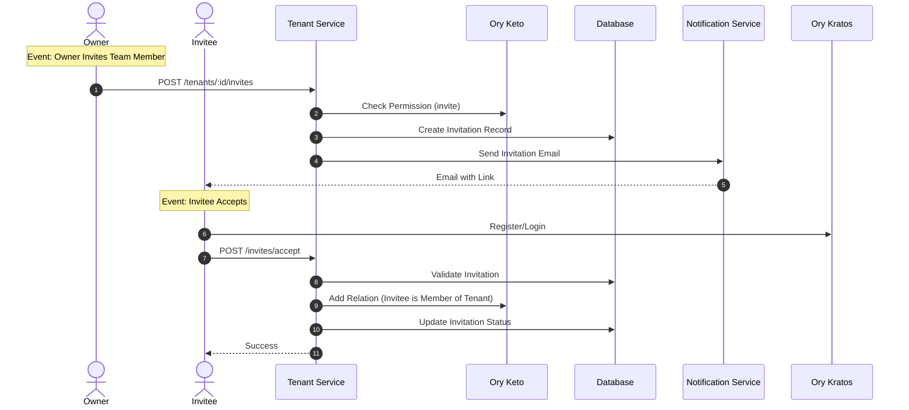
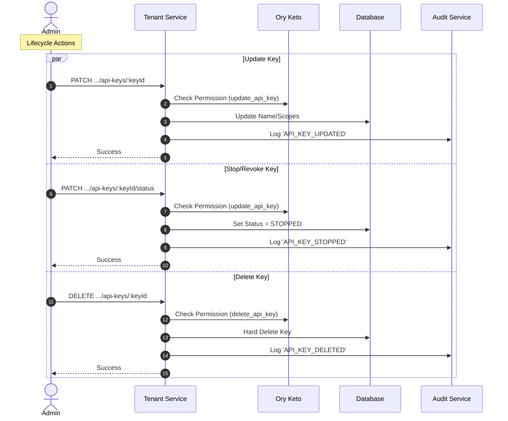
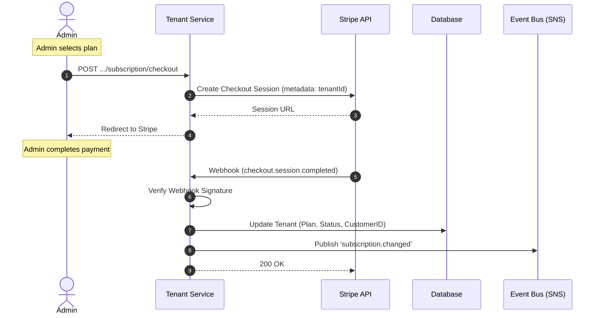
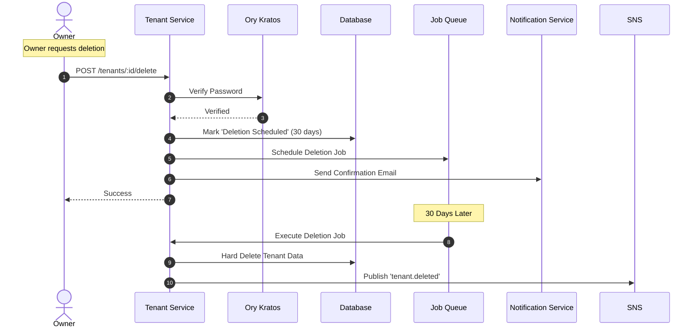

# Implement Tenant Service

## Summary

Implement the Tenant Service, a core microservice responsible for multi-tenancy, account management, team collaboration, and billing. This service acts as the foundation for the Referral Pulse platform, handling organization lifecycle and access control.

## Problem Statement

The platform requires a dedicated service to manage tenants (organizations), their settings, team members, and subscription status. Currently, this functionality is defined in the backlog and architecture documents but not yet implemented.

## Proposed Solution

Develop the Tenant Service using NestJS, TypeORM, and PostgreSQL, following the specifications outlined in `referral-pulse-svc-template/docs/backlogs/Tenant-service-backlog.md` and `referral-pulse-svc-template/docs/microservices-architecture.md`.

The implementation will be divided into 6 key capabilities corresponding to the defined Epics:

1. **Tenant Management**: Core organization lifecycle (create, read, update).
2. **Team & Access Management**: Member invitations, roles, and RBAC.
3. **Settings & Configuration**: General settings, branding, and API keys.
4. **Billing & Subscription**: Subscription management via Stripe.
5. **Plan Management**: Definition of plans and limits.
6. **Account Lifecycle**: Suspension, locking, data export, and deletion.

## Impact

- **Users**: Will be able to sign up, create organizations, invite team members, and manage their subscriptions.
- **System**: Establishes the multi-tenancy model used by all other services.
- **Security**: Centralizes authentication and authorization logic for tenant access.

## Workflows

### 1. User Authentication Flow (Epic 1)

Triggered when a user logs in via Ory Hydra and Kratos.

### 2. Tenant Creation (Epic 1)

Triggered when a user registers and creates a new organization. This flow assumes the user has successfully completed the **User Authentication Flow** and has a valid session/token.

**Endpoint**: `POST /tenants`
**Payload**: `CreateTenantDto` (multipart/form-data)

- `data`: JSON string of `CreateTenantDto`
- `file`: Optional image file for logo

**Implementation Steps**:

1.  **Validation**: Validate `CreateTenantDto`.
2.  **Slug Generation**: If not provided, generate a slug from the tenant name.
3.  **Uniqueness Check**: Ensure the slug is unique in the database.
4.  **File Upload**: If a file is provided, upload it via `FilesService` and set the `image` URL.
5.  **Persistence**: Save the new `TenantEntity` to the database with default settings.
6.  **Audit Log**: Log the `TENANT_CREATED` action via `AuditService`.
7.  **Event Publishing**: Publish a `tenant.created` event to SNS (`tenant-events` topic).

### 3. Tenant Update & Logo Upload (Epic 1)

Triggered when a user updates their organization profile or uploads a logo.

### 4. Team Member Invitation (Epic 2)

Triggered when an organization owner invites a new team member. The invitee must complete the **User Authentication Flow** (Register/Login via Kratos) to accept the invitation.

### 5. API Key Management (Epic 3)

This epic covers the lifecycle of API keys, allowing tenants to integrate with external systems securely. It includes generation, status management (stop/start), updates, and deletion. All actions are strictly gated by Ory Keto permissions.

#### 5.1 API Key Generation

Triggered when a tenant admin creates a new API key for external integration.

**Endpoint**: `POST /tenants/:tenantId/api-keys`
**Payload**: `{ name: string, scopes: string[] }`

**Implementation Steps**:

1.  **Permission Check**: Verify subject has `create_api_key` permission on the tenant via Keto.
2.  **Generation**: Generate a secure key (e.g., `sk_live_...`) using a cryptographically secure random generator.
3.  **Hashing**: Hash the key using `bcrypt` or `Argon2` before storage. **Never store raw keys.**
4.  **Persistence**: Save the hash, metadata (name, scopes), and owner ID to the database.
5.  **Audit**: Log `API_KEY_CREATED` action.
6.  **Response**: Return the **raw key** to the user. This is the only time it will be visible.

#### 5.2 API Key Lifecycle (Update, Stop, Delete)

Manages the state and properties of existing API keys.

- **Update**: Modify name or scopes.
- **Stop (Revoke)**: Immediately disable the key without deleting it.
- **Delete**: Permanently remove the key.

**Endpoints**:

- `PATCH /tenants/:tenantId/api-keys/:keyId` (Update details)
- `PATCH /tenants/:tenantId/api-keys/:keyId/status` (Change status: `ACTIVE` <-> `STOPPED`)
- `DELETE /tenants/:tenantId/api-keys/:keyId` (Delete)

**Implementation Steps**:

1.  **Permission Check**: Verify subject has `update_api_key` or `delete_api_key` permission via Keto.
2.  **Action**: Perform the requested database update or deletion.
3.  **Audit**: Log the specific action (`API_KEY_UPDATED`, `API_KEY_STOPPED`, `API_KEY_DELETED`).

### 6. Subscription Checkout (Epic 4)

Triggered when a tenant subscribes to a paid plan or upgrades their existing subscription. This flow utilizes Stripe Checkout for secure payment processing.

**Endpoints**:

- `POST /tenants/:tenantId/subscription/checkout` (Create Session)
- `POST /tenants/webhooks/stripe` (Handle Events)

**Implementation Steps**:

1.  **Plan Selection**: Admin selects a billing plan (Free, Starter, Growth, Enterprise).
2.  **Session Creation**: Tenant Service calls Stripe API to create a `checkout.session`.
    - Metadata includes `tenantId` and `planId`.
    - Success/Cancel URLs point back to the frontend application.
3.  **Redirection**: Service returns the `sessionId` or `url` to the frontend, which redirects the user to Stripe.
4.  **Payment Processing**: User completes payment on Stripe's hosted page.
5.  **Webhook Handling**: Stripe sends `checkout.session.completed` event to the webhook endpoint.
    - **Verify Signature**: Ensure request is from Stripe.
    - **Update Tenant**: Set `billing_plan`, `subscription_status`='active', and `stripe_customer_id`.
    - **Audit**: Log `SUBSCRIPTION_UPDATED`.
6.  **Event Publishing**: Publish `subscription.changed` to SNS.

### 7. Plan Limit Enforcement (Epic 5)

Triggered when a tenant attempts an action that consumes a limited resource (e.g., creating a campaign).

### 8. Tenant Deletion (Epic 6)

Triggered when a tenant owner requests account deletion.

