# SaaS Referral Platform - Architecture Documentation

## Table of Contents
1. [System Overview](#system-overview)
2. [Architecture Diagrams](#architecture-diagrams)
3. [Service Architecture (8 Services)](#service-architecture-8-services)
4. [SDK Event Tracking Schema](#sdk-event-tracking-schema)
5. [Campaign Workflow Journeys (All 9)](#campaign-workflow-journeys-all-9)
6. [Reward Types & Rules](#reward-types--rules)
7. [Key Architectural Flows](#key-architectural-flows)
8. [Inter-Service Communication](#inter-service-communication)
9. [Deployment Architecture](#deployment-architecture)

---

## System Overview

### Platform Actors

**The Client**
- Company members registered within the platform
- Each client has multiple members with role-based permissions
- Manages campaigns, analytics, and configurations

**The Client's Users (End Users)**
- End users of the client's application/website/mobile app
- Participate in referral programs (referrers and referred users)
- Not registered in the platform but tracked via SDK

**The Admin**
- Platform administrators with full system access
- Controls settings, billing, client access, and platform configurations

### Campaign Goals
- Grow feedback and ratings
- Grow signups and purchases
- Acquire first users or users from new countries
- Launch in new markets
- Grow newsletter subscriptions
- Encourage competitor switchups

### Technology Stack
- **Backend:** NestJS microservices
- **Databases:** PostgreSQL (transactional), ClickHouse (analytics)
- **Messaging:** AWS SQS/SNS (async), HTTP (sync)
- **Authentication:** Ory Stack
- **Workflow Engine:** Temporal.io
- **Infrastructure:** AWS EKS
- **CDN:** CloudFront for SDK
- **AI Service:** Extensible for AI features

---

## Architecture Diagrams

### 1. High-Level System Architecture

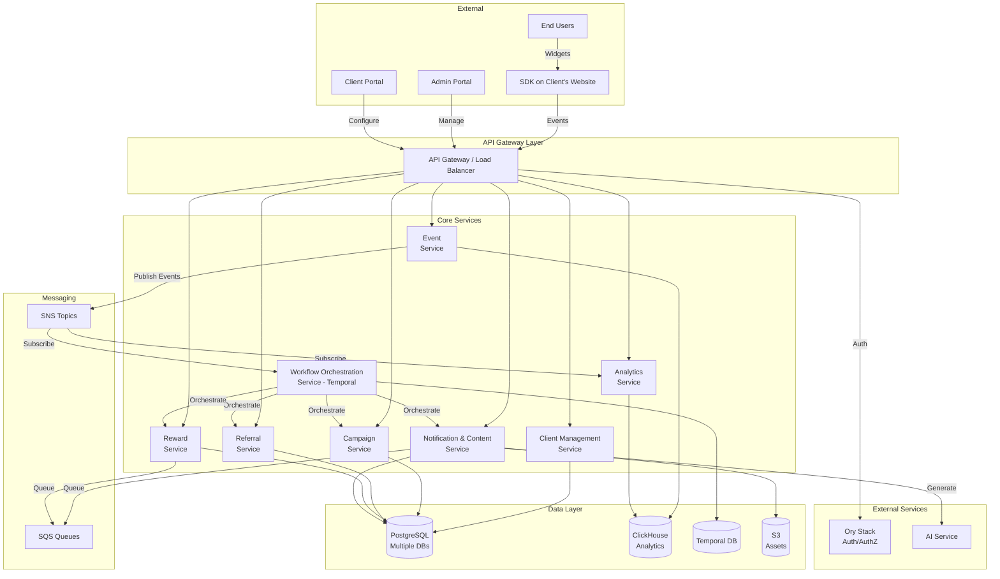

---

### 2. Service Interaction Matrix

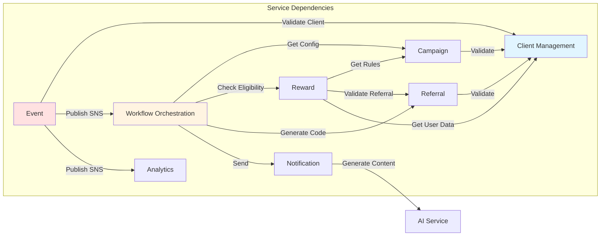

---

### 3. Complete Referral Journey Flow

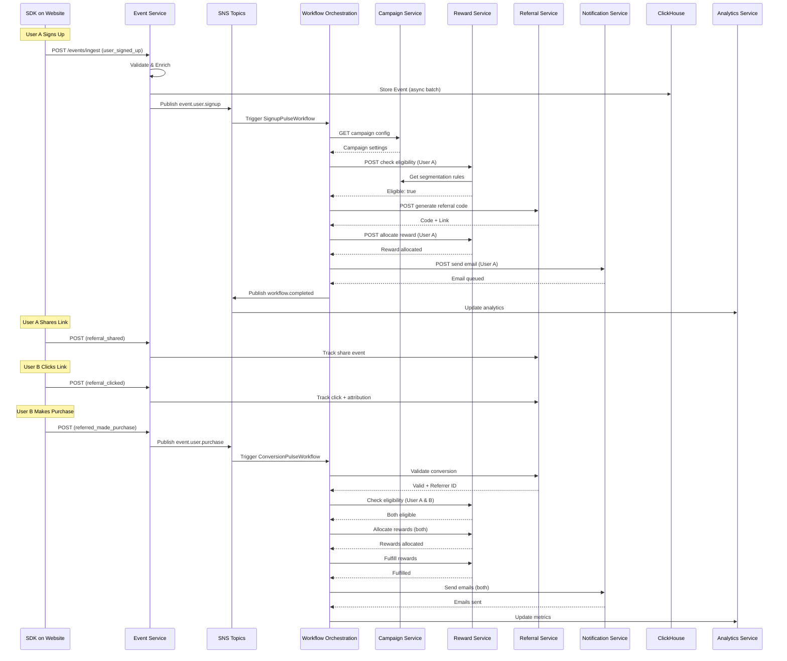

---

### 4. Event Ingestion & Processing Pipeline

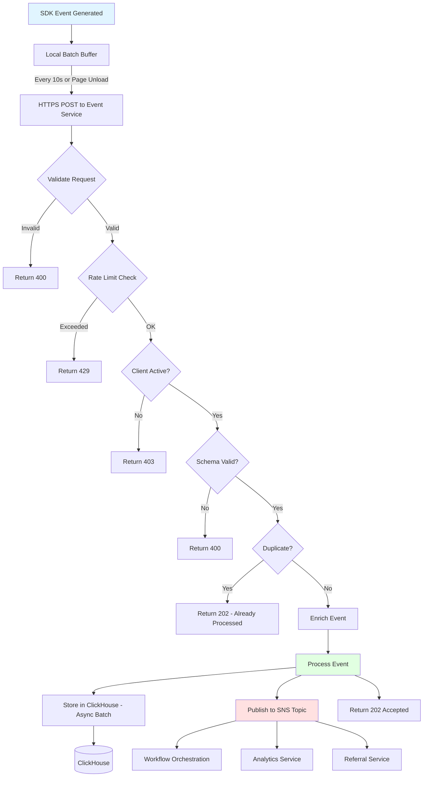

---

### 5. Workflow Orchestration Pattern (Temporal)

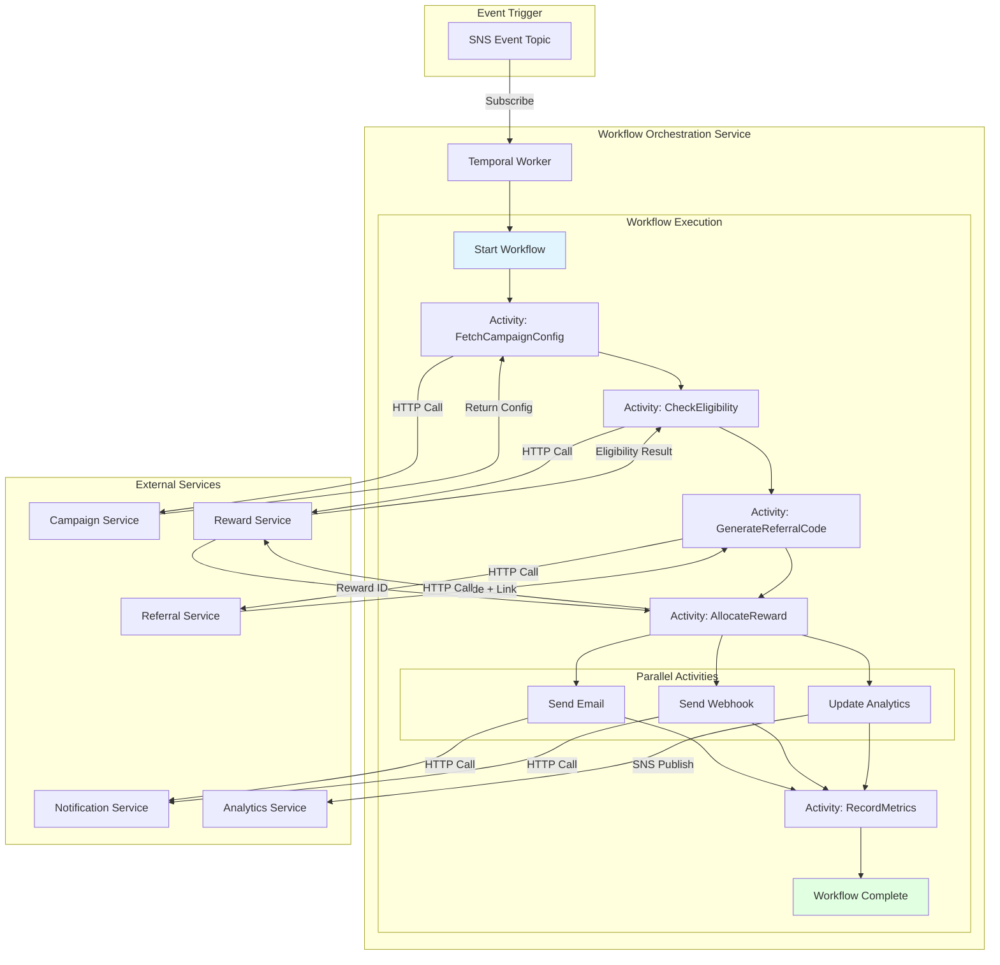

---

### 6. Reward State Machine

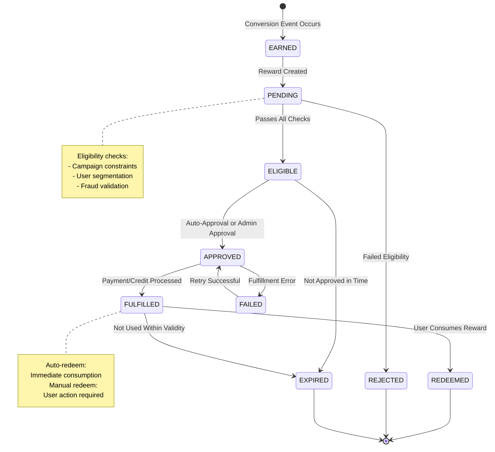

---

### 7. Campaign Workflow Types Overview

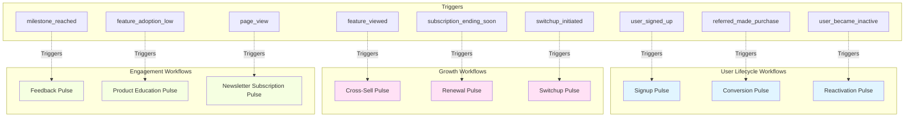

---

### 8. Reward Types Comparison

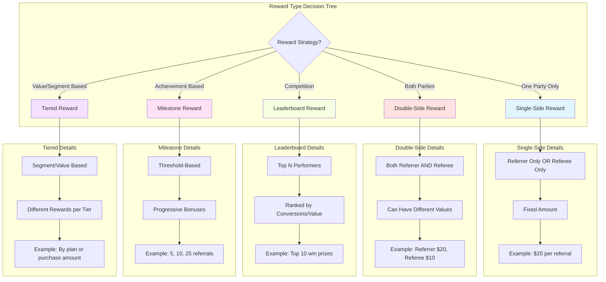

---

### 9. Synchronous vs Asynchronous Communication

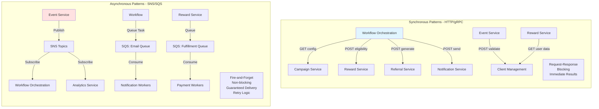

---

### 10. Deployment Architecture - AWS

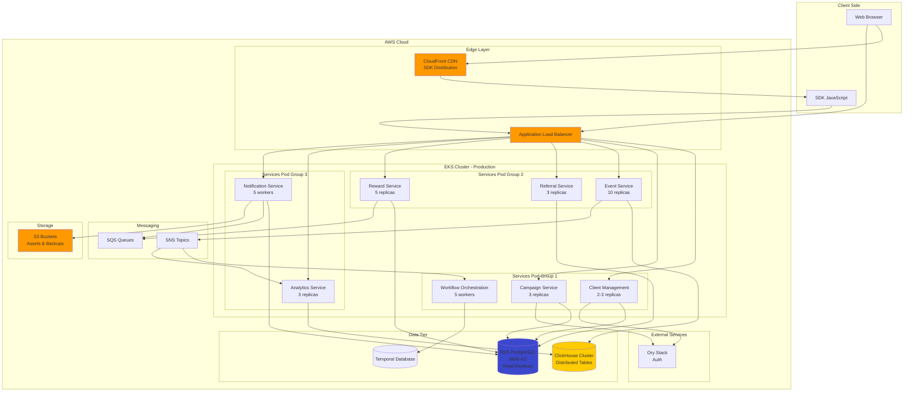

---

### 11. Eligibility Check Flow

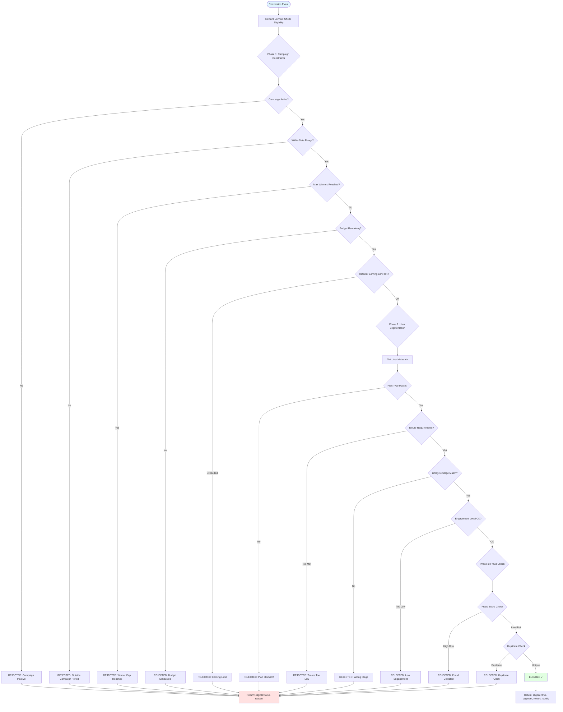

---

### 12. Analytics Data Flow

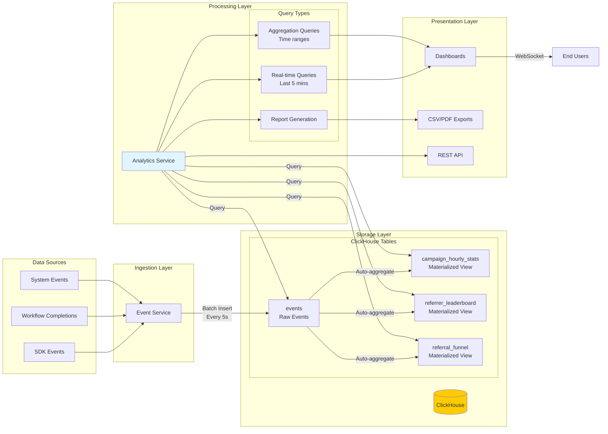

---

### 13. SDK Integration Flow

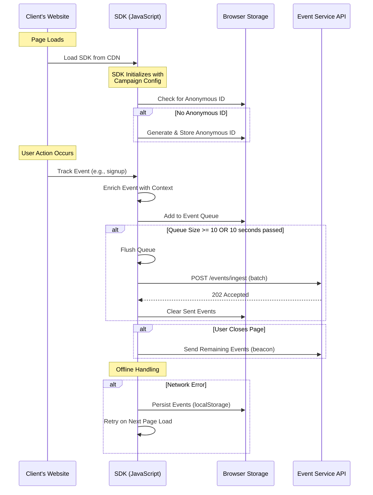

---

### 14. User Segmentation Rules Engine

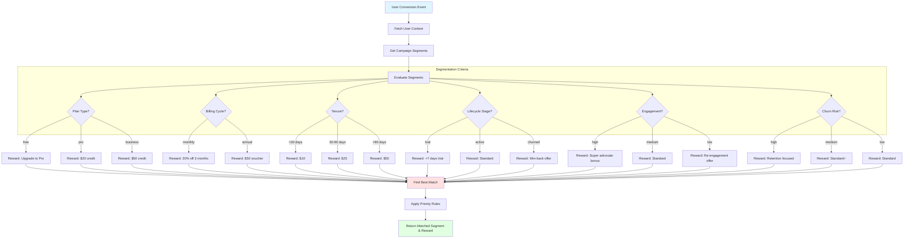

---

### 15. Multi-Campaign User Journey

```mermaid
graph TB
    User([User Lifecycle]) --> S1[Day 0: Signs Up]

    S1 -->|Signup Pulse| A1[Gets $10 Credit]
    A1 -->|Gets Referral Link| A2[User becomes Referrer]

    A2 --> S2[Day 1: Shares Link]
    S2 -->|Referral Shared Event| Track1[Track Share]

    Track1 --> S3[Day 3: Referred User Purchases]
    S3 -->|Conversion Pulse| A3[User gets $20]

    A3 --> S4[Day 30: Low Feature Usage]
    S4 -->|Product Education Pulse| A4[Invited to Tutorial]
    A4 --> A5[Completes Tutorial: +$5]

    A5 --> S5[Day 60: Inactive]
    S5 -->|Reactivation Pulse| A6[Gets Reactivation Offer]
    A6 -->|Returns| A7[Reward Fulfilled]

    A7 --> S6[Day 90: Views Premium Feature]
    S6 -->|Cross-Sell Pulse| A8[Gets Upgrade Discount]
    A8 -->|Upgrades| A9[20% Off Applied]

    A9 --> S7[Day 180: Happy Customer]
    S7 -->|Feedback Pulse| A10[Invited to Review]
    A10 -->|Reviews on G2| A11[$50 Gift Card]

    A11 --> S8[Day 335: Subscription Ending]
    S8 -->|Renewal Pulse| A12[10% Loyalty Discount]
    A12 -->|Renews| A13[Subscription Extended]

    style User fill:#e1f5ff
    style A1 fill:#ffe1e1
    style A3 fill:#ffe1e1
    style A5 fill:#ffe1e1
    style A7 fill:#ffe1e1
    style A9 fill:#ffe1e1
    style A11 fill:#ffe1e1
    style A13 fill:#e1ffe1
```

---

## Service Architecture (8 Services)

### 1. Client Management Service

**Purpose:** Manages organizations, members, billing, and access control

**Core Responsibilities:**
- Client organization CRUD
- Member management with RBAC
- Billing and subscription handling
- Account validation and status checks
- Admin operations and configurations
- API key management

**Exposed to Frontend:** Yes (Admin & Client portals)

**Database:** PostgreSQL

**Key Entities:**
- Clients (companies)
- Members (team members with roles)
- Billing records
- API keys

---

### 2. Campaign Service

**Purpose:** Campaign configuration and management (CRUD only, no execution)

**Core Responsibilities:**
- Campaign creation and configuration
- Campaign settings (dates, budgets, limits)
- SDK configuration code generation
- Campaign status management
- Segmentation rule definition
- Reward configuration storage
- Campaign templates

**Exposed to Frontend:** Yes (Client portal)

**Database:** PostgreSQL

**Key Entities:**
- Campaigns (configuration data)
- Campaign segments (targeting rules)
- Campaign rewards (reward configurations)
- SDK configurations

**Important:** This service does NOT execute workflows - only stores configurations

---

### 3. Workflow Orchestration Service

**Purpose:** Execute campaign workflows using Temporal.io

**Core Responsibilities:**
- Temporal workflow definitions for all 9 pulse types
- Workflow state management
- Event-to-workflow routing
- Activity coordination across services
- Retry and compensation logic
- Workflow versioning

**Exposed to Frontend:** Partially (status monitoring only)

**Database:** Temporal's database

**Workflow Types:**
1. Signup Pulse
2. Conversion Pulse
3. Reactivation Pulse
4. Cross-Sell Pulse
5. Renewal Pulse
6. Feedback Pulse
7. Product Education Pulse
8. Switchup Pulse
9. Newsletter Subscription Pulse

**Temporal Activities:**
- FetchCampaignConfig
- CheckUserEligibility
- GenerateReferralAssets
- AllocateReward
- FulfillReward
- RenderNotificationContent
- SendNotification
- RecordWorkflowMetrics
- ValidateConversion
- CheckFraud
- CalculateLeaderboard
- CheckMilestone

**Important:** This service orchestrates but doesn't own business logic - calls other services

---

### 4. Event Service

**Purpose:** High-throughput SDK event ingestion and routing

**Core Responsibilities:**
- Event ingestion from SDK
- Event validation (client status, rate limiting)
- Event normalization and enrichment
- Event routing via SNS
- Real-time streaming to ClickHouse
- Event deduplication
- Batch processing

**Exposed to Frontend:** Partially (SDK public API)

**Database:** PostgreSQL (metadata), ClickHouse (storage)

**Processing Pipeline:**
1. Receive event from SDK
2. Validate API key and client status
3. Rate limiting check
4. Schema validation
5. Deduplication
6. Enrichment (timestamps, geolocation)
7. Write to ClickHouse (async batched)
8. Publish to SNS topics

---

### 5. Referral Service

**Purpose:** Manage referral lifecycle and tracking

**Core Responsibilities:**
- Unique referral code generation
- Referral link building
- Share tracking (email, social media, hashtags)
- Click tracking and attribution
- Referrer-referee relationship management
- Referral chain tracking
- Fraud detection
- Leaderboard calculations

**Exposed to Frontend:** Yes (for end-users via SDK widgets)

**Database:** PostgreSQL

**Key Entities:**
- Referral codes
- Referral links
- Referral shares
- Referral clicks
- Referral conversions
- Referral relationships

**Fraud Detection:**
- IP-based duplicate detection
- Conversion time window validation
- Self-referral prevention
- Velocity checking
- Duplicate email/phone detection

---

### 6. Reward Service

**Purpose:** Eligibility, calculation, allocation, and redemption

**Core Responsibilities:**
- Eligibility engine (segmentation + constraints)
- Reward calculation for all types
- Reward allocation and tracking
- Auto vs manual fulfillment
- Earning limits enforcement
- Winner caps enforcement
- Reward state management
- Payment system integration

**Exposed to Frontend:** Yes (reward status and redemption)

**Database:** PostgreSQL

**Eligibility Checks:**
- Campaign constraints (active, budget, max winners)
- User segmentation (plan, tenure, lifecycle, engagement)
- Fraud validation
- Earning limits
- Historical participation

**Key Entities:**
- Rewards
- Reward fulfillments
- Reward milestones
- Reward leaderboards
- Budget tracking

**Reward State Machine:**
```
EARNED → PENDING → ELIGIBLE → APPROVED → FULFILLED → REDEEMED

Alternative paths:
PENDING → REJECTED
ELIGIBLE → EXPIRED
FULFILLED → EXPIRED
```

---

### 7. Analytics Service

**Purpose:** Real-time analytics and reporting

**Core Responsibilities:**
- Real-time dashboard aggregation
- Campaign performance metrics
- Referral funnel analytics
- Reward distribution analytics
- User segmentation insights
- Time-series data for trends
- Export functionality
- Custom report building

**Exposed to Frontend:** Yes (dashboards)

**Database:** ClickHouse (primary), PostgreSQL (configurations)

**Key Metrics:**
- Conversion rates and viral coefficient
- Cost per acquisition
- Reward ROI
- Top referrers (leaderboards)
- Campaign engagement
- Referral funnel (shared → clicked → converted)
- User lifetime value

**ClickHouse Tables:**
- Events (raw data)
- Campaign hourly stats (materialized view)
- Referrer leaderboard (materialized view)
- Referral funnel (materialized view)

---

### 8. Notification & Content Service

**Purpose:** Content management and outbound communications

**Core Responsibilities:**

**Content Management:**
- Email template CRUD
- Widget template management
- Landing page templates
- Survey templates
- AI content generation integration
- Template versioning
- Multi-language support
- Asset management

**Notification Delivery:**
- Email delivery (transactional & marketing)
- Template rendering
- Webhook notifications
- In-app notifications
- Push notifications
- Delivery tracking
- Retry logic
- Queue management

**Exposed to Frontend:** Yes

**Database:** PostgreSQL (templates/logs), S3 (assets)

**Template Variables:**
- User data (firstName, email, etc.)
- Referral data (code, link, etc.)
- Reward data (amount, type, etc.)
- Campaign data (name, dates, etc.)
- Custom client-defined fields

**AI Integration:**
- Generate email content
- Generate widget designs
- Generate landing pages
- User validates and edits

---

## SDK Event Tracking Schema

### Complete Event Structure

Every event sent from SDK includes:

**Core Event Data:**
- event (event name)
- event_id (unique identifier for idempotency)
- occurred_at (client timestamp)
- received_at (server timestamp)
- client_id
- campaign_id

**Participant Identification:**
- participant_id
- external_user_id_hash
- anonymous_id
- session_id

**Referral Attribution:**
- referral_id
- invite_id
- visit_id

**SDK & App Context:**
- SDK name and version
- App platform and version
- Build number

**Device Information:**
- OS and version
- Browser
- User agent
- Screen resolution
- Device model

**Locale:**
- Language
- Timezone

**Page Context:**
- URL
- Referrer
- Title
- Path

**Geolocation:**
- IP hash
- Country
- Region
- City

**Marketing Attribution:**
- UTM parameters (source, medium, campaign, term, content)
- gclid, fbclid
- First touch attribution (acquisition channel, first referrer, first landing page)

**Experiments:**
- A/B test variants

**User Traits (optional):**
- Plan type
- Country
- Language
- Customer tier
- Custom fields

**Participant Context:**
- Plan details
- Plan since date
- Tier since date
- Custom metadata

**Event-Specific Properties:**
- Varies by event type (purchase details, feedback ratings, etc.)

### Event Types Categories

**User Lifecycle:**
- user_signed_up
- user_logged_in
- user_updated_profile
- user_became_inactive
- user_reactivated
- subscription_started/upgraded/downgraded/ending_soon/renewed/cancelled

**Referral:**
- referral_generated
- referral_shared (platform-specific variants)
- referral_clicked
- referral_visit
- referred_signed_up
- referred_made_purchase

**Engagement:**
- widget_displayed/interacted/closed
- survey_displayed/started/completed
- feedback_submitted
- feature_viewed/adopted

**Purchase & Conversion:**
- product_viewed
- cart_updated
- checkout_started
- purchase_completed
- purchase_refunded

**Content:**
- newsletter_subscribed/unsubscribed
- content_downloaded
- webinar_registered/attended

**Competitive:**
- switchup_initiated
- switchup_data_imported
- switchup_completed

**Product Education:**
- tutorial_started/completed
- help_article_viewed
- support_ticket_created

---

## Campaign Workflow Journeys (All 9)

### Workflow Pattern Diagrams

#### General Workflow Structure (All Campaigns Follow This)

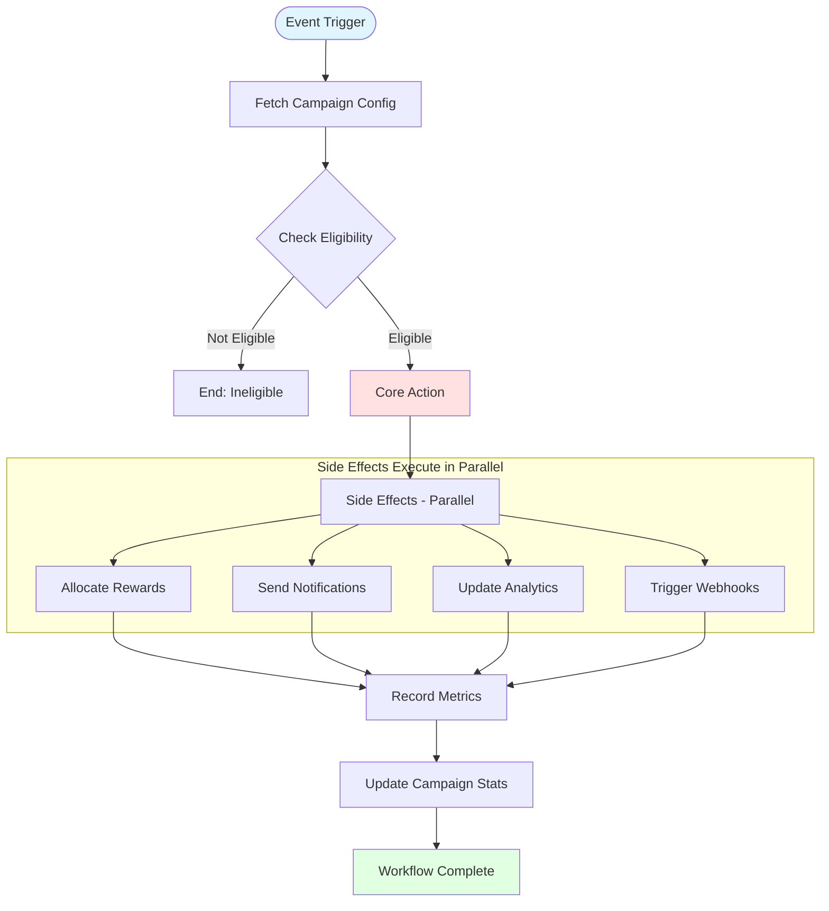

---

#### Signup Pulse Pattern

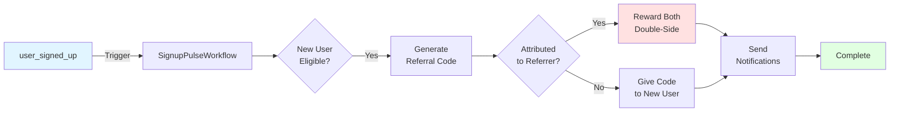

---

#### Conversion Pulse Pattern

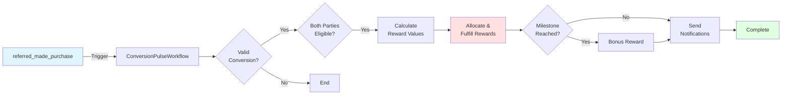

---

#### Reactivation Pulse Pattern

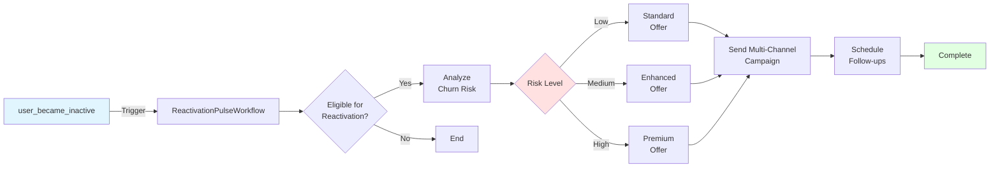

---

#### Milestone Reward Tracking Pattern

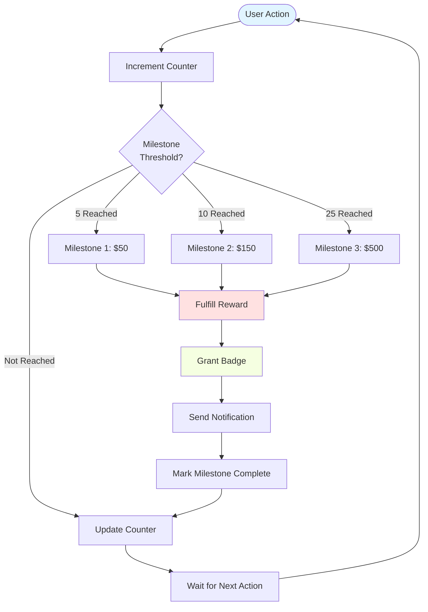

---

#### Leaderboard Calculation Pattern

```mermaid
graph TB
    Conv([Conversion Event]) --> Update[Update User Stats]
    Update --> Calc[Recalculate Leaderboard]

    Calc --> Rank[Rank All Users]
    Rank --> Top{User in<br/>Top N?}

    Top -->|Yes| Check{Previously<br/>in Top N?}
    Top -->|No| Dropped{Was in<br/>Top N?}

    Check -->|No| New[Send: You're now in top N!]
    Check -->|Yes| Moved{Rank<br/>Changed?}

    Moved -->|Yes| Position[Send: New position N]
    Moved -->|No| Silent[No notification]

    Dropped -->|Yes| Lost[Send: You dropped out]
    Dropped -->|No| Silent2[No notification]

    New --> Store[Store Rankings]
    Position --> Store
    Silent --> Store
    Lost --> Store
    Silent2 --> Store

    Store --> End([End])

    style Conv fill:#e1f5ff
    style Store fill:#e1ffe1
```

---

### General Workflow Pattern

All workflows follow:
1. **Event Trigger** → SDK event published to SNS
2. **Workflow Start** → Temporal workflow initiated
3. **Configuration Fetch** → Get campaign settings
4. **Eligibility Check** → Validate user eligibility
5. **Core Action** → Execute primary workflow logic
6. **Side Effects** → Parallel actions (notifications, webhooks, analytics)
7. **Completion** → Update stats and metrics

---

### 1. Signup Pulse Workflow

**Goal:** Encourage new user signups

**Trigger:** user_signed_up event

**Journey:**
1. User signs up on client's app
2. SDK sends signup event
3. Workflow starts
4. Fetch campaign config
5. Check new user eligibility
6. Validate referral attribution (if attributed)
7. Generate referral code for new user
8. Allocate rewards (double-sided if attributed)
9. Fulfill rewards if auto-redeem enabled
10. Render welcome email with referral link
11. Send notifications (email, in-app, webhooks)
12. Update analytics and campaign stats

**Reward Logic:**
- Single-sided: New user gets referral link only
- Double-sided: New user gets signup bonus + referral link; Referrer gets reward if attributed

---

### 2. Conversion Pulse Workflow

**Goal:** Encourage purchases

**Trigger:** referred_made_purchase or purchase_completed event

**Journey:**
1. User completes purchase
2. SDK sends purchase event with order details
3. Workflow starts
4. Fetch campaign config
5. Validate purchase conversion (amount, timing, fraud)
6. Check eligibility for both referrer and referee
7. Calculate dynamic reward values (percentage or fixed)
8. Allocate rewards for both parties
9. Fulfill referrer reward
10. Update referral tracking stats
11. Send notifications to both parties
12. Check milestone achievement (optional)
13. Update analytics (conversion funnel, revenue attribution, ROI)

**Reward Logic:**
- Percentage-based: Reward as % of purchase value
- Fixed amount: Flat reward per conversion
- Tiered: Different rewards by purchase amount
- Milestone: Bonus when referrer hits X conversions

---

### 3. Reactivation Pulse Workflow

**Goal:** Re-engage inactive users

**Trigger:** user_became_inactive (scheduled job detection)

**Journey:**
1. System detects user inactive for 30+ days
2. Workflow starts
3. Fetch campaign config
4. Check eligibility (inactivity period, churn risk, attempt limits)
5. Fetch user historical data (features used, engagement patterns)
6. Generate personalized reactivation offer based on segment
7. Allocate reactivation incentive
8. Render personalized re-engagement email
9. Send multi-channel campaign (email, push, SMS if high-value)
10. Track re-engagement funnel
11. Schedule follow-up if no response
12. Handle reactivation success separately when user returns

**Reward Logic:**
- Time-limited offers (expires in 30 days)
- Personalized by plan, usage history, churn risk
- Progressive attempts (increase offer with each attempt)
- Activation required (reward only when user returns)

---

### 4. Cross-Sell Pulse Workflow

**Goal:** Promote additional features/products to existing users

**Trigger:** feature_viewed (user browsing unadopted feature)

**Journey:**
1. User views premium feature they don't have
2. Analyze user intent (view count, time spent, engagement)
3. Check eligibility for cross-sell offer
4. Generate personalized upgrade offer
5. Allocate upgrade incentive (discount coupon)
6. Generate referral link for upgrade referrals
7. Render cross-sell email with feature showcase
8. Send targeted campaign (email, in-app modal)
9. Track upgrade funnel
10. Handle upgrade conversion when it occurs
11. Schedule follow-up if no upgrade

**Reward Logic:**
- Discount for upgrader
- Referral bonus for bringing other upgraders
- Time-limited (14-day expiry)
- Feature-specific offers

---

### 5. Renewal Pulse Workflow

**Goal:** Encourage subscription renewals

**Trigger:** subscription_ending_soon (30, 14, 7, 3 days before expiry)

**Journey:**
1. System detects subscription expiring soon
2. Analyze customer health and churn risk
3. Determine renewal strategy based on risk + timing
4. Check eligibility for renewal offer
5. Generate personalized renewal offer
6. Allocate renewal incentive (loyalty discount)
7. Generate referral program for renewals
8. Render renewal email
9. Send renewal campaign
10. Track renewal funnel
11. Schedule escalation reminders (increase offer over time)
12. Handle renewal success or churn

**Reward Logic:**
- Progressive discounts (increases as expiry approaches)
- Churn risk-based (higher risk gets better offers)
- Auto-apply discounts (reduce friction)
- Referral multiplier (refer renewals for free year)

---

### 6. Feedback Pulse Workflow

**Goal:** Collect premium feedback/reviews

**Trigger:** User reaches milestone qualifying for feedback request

**Journey:**
1. User reaches milestone (6 months tenure, high NPS, etc.)
2. Check eligibility (tenure, NPS score, previous reviews)
3. Determine optimal feedback platform (G2, Capterra, Trustpilot)
4. Generate feedback tracking record
5. Allocate potential rewards (pending verification)
6. Render feedback request email
7. Send feedback request
8. Track feedback submission
9. Handle review submission (separate event)
10. Verify review (URL check, rating validation)
11. Fulfill reward (gift card)
12. Send follow-up reminders if needed

**Reward Logic:**
- Tiered by platform (G2 > Capterra > Trustpilot)
- Verification required (must prove submission)
- Minimum quality (4-5 stars rewarded)
- Time-limited (14-day window)
- Ethical: Rewards effort, not positive reviews specifically

---

### 7. Product Education Pulse Workflow

**Goal:** Increase feature adoption

**Trigger:** user_logged_in with low feature adoption score

**Journey:**
1. User logs in with low feature adoption
2. Analyze feature adoption gap
3. Check eligibility for education campaign
4. Generate personalized learning path
5. Allocate milestone rewards (tutorial completion, first use, power user)
6. Create in-app education experience
7. Render education invitation email
8. Send education campaign
9. Track learning progress
10. Handle milestone completions as user progresses
11. Enable gamification and social sharing
12. Update analytics

**Reward Logic:**
- Progressive milestones (increasing rewards)
- Behavior-driven (tied to actual usage)
- Gamification (badges, leaderboards)
- Long-term benefits (power user status)

---

### 8. Switchup Pulse Workflow

**Goal:** Acquire users from competitors

**Trigger:** switchup_initiated (user indicates switching from competitor)

**Journey:**
1. User starts migration from competitor
2. Verify competitor user (proof required)
3. Check eligibility for switchup rewards
4. Create personalized migration plan
5. Allocate tiered migration rewards
6. Fulfill immediate welcome reward
7. Assign dedicated migration specialist
8. Render welcome and migration guide
9. Send switchup welcome campaign
10. Track migration progress
11. Handle migration milestones (data imported, team migrated, fully migrated)
12. Nurture and support cadence
13. Handle migration abandonment if stalled

**Reward Logic:**
- Tiered progression (rewards increase with completeness)
- Immediate gratification (upfront reward)
- Team incentives (bonus for bringing colleagues)
- White-glove support (high-touch assistance)
- Verification required (prove competitor cancellation)

---

### 9. Newsletter Subscription Pulse Workflow

**Goal:** Grow newsletter subscribers

**Trigger:** page_view on content pages or explicit newsletter signup

**Journey:**
1. User visits blog/content page (engaged visitor)
2. Determine popup strategy (exit intent, content upgrade)
3. Check eligibility for newsletter campaign
4. Generate newsletter offer (ebook + newsletter)
5. Allocate welcome incentive
6. Display newsletter popup/widget
7. Track popup interaction
8. Handle subscription (separate event)
9. Fulfill welcome reward (ebook delivery)
10. Generate referral link for newsletter referrals
11. Send welcome email
12. Track referral sharing
13. Handle referral subscriptions (reward original subscriber)
14. Check milestones (5, 10, 20 referrals)

**Reward Logic:**
- Content upgrade (ebook, guide)
- Referral rewards (per friend subscribed)
- Milestone bonuses (badges at 5, 10, 20 referrals)
- Time-limited offers

---

## Reward Types & Rules

### Reward Categories

**Monetary Rewards:**
- Cash payouts (bank transfer, PayPal)
- Discount coupons (percentage or fixed amount)
- Store credits (account balance)

**Non-Monetary Rewards:**
- Early feature access (beta features, exclusive tools)
- Premium membership periods (upgrade for X months)
- Recognition badges (displayed on profile, leaderboard)
- Event invitations (webinars, conferences, training)

**Partner Rewards:**
- Third-party discounts and coupons
- Free trials for partner SaaS products
- Merchandise from partners

---

### Reward Types

#### 1. Single-Side Reward

**Description:** Only one party (referrer OR referee) receives reward

**When Used:**
- Referrer-only programs (standard referral)
- Subscriber-only programs (newsletter content upgrade)
- Reactivation incentives (inactive user only)

**Configuration:**
- Which side receives reward (referrer or referee)
- Reward amount/type
- Earning limits

**Example:**
- Referrer gets $20 for each successful referral
- Referee gets nothing (or separate non-reward benefit)

---

#### 2. Double-Side Reward

**Description:** Both referrer and referee receive rewards

**When Used:**
- Signup campaigns (welcome both parties)
- Purchase conversions (reward both)
- Subscription renewals via referral

**Configuration:**
- Referrer reward amount/type
- Referee reward amount/type
- Different rewards for each side allowed
- Timing (immediate vs delayed)

**Example:**
- Referrer gets $20 credit
- Referee gets $10 credit
- Both rewards fulfilled upon conversion

**Rules:**
- Can have different reward values for each side
- Can have different reward categories (referrer: cash, referee: discount)
- Both must pass eligibility checks independently

---

#### 3. Leaderboard Reward

**Description:** Top N referrers receive rewards based on ranking

**When Used:**
- Competitive campaigns
- Limited-time contests
- Community-driven growth

**Configuration:**
- Leaderboard period (weekly, monthly, campaign duration)
- Number of winners (top 10, top 50, etc.)
- Reward tiers (1st place, 2nd-5th, 6th-10th)
- Ranking criteria (total conversions, conversion value, quality score)

**Example:**
- 1st place: $1000
- 2nd-5th: $500 each
- 6th-10th: $250 each
- Calculated at campaign end

**Rules:**
- Continuous calculation during campaign
- Final rewards distributed at end
- Ties handled by tiebreaker rules (timestamp, quality, etc.)
- Can combine with other reward types

---

#### 4. Milestone Reward

**Description:** Rewards triggered when user reaches specific thresholds

**When Used:**
- Product education (tutorial steps)
- Referral volume incentives
- Engagement achievements

**Configuration:**
- Milestone thresholds (5 referrals, 10 uses, etc.)
- Reward per milestone
- Can have multiple milestones
- Progressive or fixed rewards

**Example:**
- 5 referrals → $50 bonus
- 10 referrals → $150 bonus
- 25 referrals → $500 bonus

**Rules:**
- Track user progress toward milestones
- Reward triggered automatically when reached
- Can be cumulative (add to base rewards)
- Can reset periodically or be lifetime

**Tracking:**
- Counter table: user_id, campaign_id, current_count, milestones_reached

---

#### 5. Tiered Reward

**Description:** Reward amount varies based on conversion value, user segment, or other criteria

**When Used:**
- Purchase-based rewards (% of order value)
- Segmented campaigns (different rewards by plan)
- Switchup campaigns (reward by migration completeness)

**Configuration:**
- Tiers definition (criteria and thresholds)
- Reward per tier
- Tier evaluation logic

**Example - Purchase Value Tiers:**
- $0-$49: No reward
- $50-$99: $10 reward
- $100-$249: $25 reward
- $250+: $50 reward

**Example - User Segment Tiers:**
- Free plan users: $5 credit
- Pro plan users: $20 credit
- Business plan users: $50 credit

**Example - Migration Tiers:**
- Migration initiated: $100
- Data imported: +$200
- Fully migrated: +$300

**Rules:**
- Tiers are mutually exclusive or cumulative (configurable)
- Tier evaluation can be dynamic (at conversion time)
- Can combine with percentage-based calculations

---

### Reward Fulfillment Options

**Auto-Redemption:**
- Reward automatically fulfilled upon earning
- No user action required
- Immediate gratification
- Best for: Credits, feature access, discounts

**Manual Redemption:**
- User must claim reward
- Allows user choice of fulfillment method
- Can set expiration for unclaimed rewards
- Best for: Cash payouts, gift cards, physical goods

**Approval Required:**
- Admin or automated review before fulfillment
- Used for high-value rewards or fraud prevention
- Best for: Large cash amounts, competitive leaderboard rewards

---

### Reward Constraints

**Referrer Earning Limits:**
- Maximum times a referrer can earn rewards
- Can be per campaign or lifetime
- Prevents abuse

**Maximum Winners:**
- Campaign-wide cap on total reward recipients
- Budget control mechanism
- First-come-first-served or quality-based

**Budget Caps:**
- Total campaign spend limit
- Stops reward allocation when reached
- Tracks allocated vs fulfilled amounts

**Expiration:**
- Rewards expire if not redeemed within timeframe
- Encourages timely action
- Reduces liability

**Minimum Thresholds:**
- Minimum conversion value to earn reward
- Minimum rating for feedback rewards
- Quality controls

---

### Segmentation Rules for Rewards

Rewards can vary based on user segments:

**Plan Type:**
- Free plan → Upgrade incentive
- Pro plan → Account credit
- Business plan → Higher value rewards

**Billing Frequency:**
- Monthly users → Discount for X months
- Annual users → Cash/gift card

**Tenure:**
- New users (<30 days) → Smaller rewards
- Loyal users (12+ months) → Bigger rewards

**Lifecycle Stage:**
- Trial users → Extended trial
- Active paid → Cash/credits
- Churned → Win-back offers

**Engagement Level:**
- Highly active → Bigger rewards (super advocates)
- Dormant → Different incentives

**Churn Risk:**
- High risk → Retention-focused rewards
- Low risk → Standard referral rewards

---

## Key Architectural Flows

### Flow 1: Campaign Creation & SDK Setup

1. Client creates campaign in Campaign Service
2. Campaign Service generates SDK configuration snippet
3. Client embeds snippet on their website
4. SDK loads from CDN with campaign configuration
5. SDK starts tracking events for that campaign

---

### Flow 2: Complete Referral Journey

1. User A signs up on client's app
2. SDK sends user_signed_up event
3. Event Service ingests, validates, stores in ClickHouse
4. Event Service publishes to SNS
5. Workflow Orchestration Service receives event, starts SignupPulseWorkflow
6. Workflow checks eligibility via Reward Service
7. Workflow generates referral code via Referral Service
8. Workflow allocates rewards via Reward Service
9. Workflow renders email via Notification Service
10. Workflow sends notifications
11. User A shares link (SDK tracks share event)
12. User B clicks link (SDK tracks click with attribution)
13. User B signs up (SDK sends conversion event)
14. Workflow Orchestration starts ConversionPulseWorkflow
15. Workflow validates conversion via Referral Service
16. Workflow checks eligibility for both User A and User B
17. Workflow allocates and fulfills rewards
18. Analytics Service updates dashboards

---

### Flow 3: SDK Event Ingestion

1. SDK on client's website captures event
2. SDK batches events locally
3. SDK sends HTTPS POST to Event Service
4. Event Service validates API key and client status
5. Event Service applies rate limiting
6. Event Service validates event schema
7. Event Service checks for duplicates
8. Event Service enriches event with server-side data
9. Event Service writes to ClickHouse (async batched)
10. Event Service publishes to SNS topic
11. Subscribers (Workflow Orchestration, Analytics, Referral, Reward) receive event
12. Event Service returns 202 Accepted to SDK

---

### Flow 4: Reward Eligibility Check

1. Conversion event received by Workflow Orchestration
2. Workflow calls Reward Service eligibility check
3. Reward Service queries Campaign Service for campaign rules
4. Reward Service queries Referral Service for referral validation
5. Reward Service queries Client Management Service for user metadata
6. Reward Service evaluates all segmentation rules
7. Reward Service checks constraints (budget, max winners, earning limits)
8. Reward Service checks fraud indicators
9. Reward Service returns eligibility result with matched segment
10. If eligible, Workflow allocates reward
11. If auto-redeem, Workflow fulfills reward immediately

---

### Flow 5: Analytics Pipeline

1. Event Service writes events to ClickHouse every 5 seconds (batch)
2. ClickHouse materialized views pre-aggregate key metrics
3. Analytics Service queries ClickHouse for dashboard data
4. Analytics Service caches results for 10-30 seconds
5. Frontend dashboard subscribes via WebSocket
6. Analytics Service pushes updates to frontend
7. User requests custom report
8. Analytics Service generates report from ClickHouse
9. Report exported to CSV/PDF

---

### Flow 6: AI Content Generation

1. Client creates campaign in Campaign Service
2. Client clicks "Generate with AI" in Notification Service
3. Notification Service calls AI Service with campaign context
4. AI Service generates email/widget template
5. Notification Service displays draft for validation
6. Client edits and approves
7. Notification Service saves template to PostgreSQL
8. Template available for workflow rendering

---

## Inter-Service Communication

### Synchronous Communication (HTTP)

**When Used:** Real-time data retrieval, validation, coordination

**Patterns:**
- Campaign Service ← Workflow Orchestration (get campaign config)
- Reward Service ← Workflow Orchestration (check eligibility)
- Client Management Service ← Event Service (validate client)
- Referral Service ← Workflow Orchestration (generate code)
- Notification Service → AI Service (generate content)
- All Services → Client Management (auth validation via Ory)

**Characteristics:**
- Request-response
- Blocking
- Immediate results needed
- Short timeout windows

---

### Asynchronous Communication (SNS/SQS)

**When Used:** Event broadcasting, decoupling, resilience

**SNS Topics (Pub-Sub):**
- Event Service publishes: event.{type}.{client_id}.{campaign_id}
- Workflow Orchestration subscribes: All event types
- Analytics Service subscribes: All event types
- Campaign Service publishes: campaign.{action}.{campaign_id}

**SQS Queues (Task Queues):**
- Reward Service → SQS: reward.fulfillment.queue
- Notification Service: email.delivery.queue
- Notification Service: webhook.delivery.queue

**Characteristics:**
- Fire-and-forget
- Non-blocking
- Guaranteed delivery
- Retry mechanisms built-in

---

### Service Communication Matrix

**Client Management Service:**
- Called by: All services (auth validation, client status)
- Calls: None (leaf service)

**Campaign Service:**
- Called by: Workflow Orchestration (config), Frontend (CRUD)
- Calls: Client Management (validation)

**Workflow Orchestration Service:**
- Called by: SNS subscriptions (events), Frontend (status)
- Calls: All other services (orchestration)

**Event Service:**
- Called by: SDK (ingestion), Frontend (stats)
- Calls: Client Management (validation)
- Publishes to: SNS (all events)

**Referral Service:**
- Called by: Workflow Orchestration, Frontend, SDK widgets
- Calls: Client Management (validation)

**Reward Service:**
- Called by: Workflow Orchestration, Frontend
- Calls: Campaign Service (rules), Referral Service (validation), Client Management (user data)

**Analytics Service:**
- Called by: Frontend (dashboards)
- Calls: ClickHouse (queries)
- Subscribes to: SNS (all events, workflow completions)

**Notification & Content Service:**
- Called by: Workflow Orchestration (send), Frontend (templates)
- Calls: AI Service (content generation)
- Publishes to: SQS (email/webhook delivery queues)

---

## Deployment Architecture

### AWS EKS Cluster

**Namespace Organization:**
- production
- staging
- development

**Service Replicas (Production):**
- Client Management Service: 2-3 replicas
- Campaign Service: 3 replicas
- Workflow Orchestration Service: 5 worker replicas
- Event Service: 10 replicas (high throughput)
- Referral Service: 3 replicas
- Reward Service: 5 replicas (CPU intensive)
- Analytics Service: 3 replicas
- Notification Service: 5 replicas (queue workers)

---

### Database Deployment

**PostgreSQL:**
- Multi-AZ deployment
- Read replicas for analytics queries
- Automated backups
- One database per service (microservice pattern)

**ClickHouse:**
- Distributed tables with replicas
- Sharding for horizontal scaling
- Separate cluster for analytics workloads

**Temporal:**
- Separate deployment or managed service
- Own database (MySQL/PostgreSQL/Cassandra)
- Multiple worker pools by workflow type

---

### CDN & SDK

**CloudFront:**
- Global distribution for SDK JavaScript
- Versioned SDK releases
- Cache invalidation on updates

**SDK Characteristics:**
- Lightweight (~20KB gzipped)
- Configuration injected via script tag
- Batches events locally (flush every 10 seconds)
- Offline-first with localStorage fallback

---

### Monitoring & Observability

**Metrics:**
- Prometheus for service metrics
- Grafana dashboards
- Custom business metrics (conversions, rewards, etc.)

**Logging:**
- Centralized logging (ELK or CloudWatch)
- Structured JSON logs
- Correlation IDs for tracing

**Tracing:**
- Distributed tracing (Jaeger or X-Ray)
- End-to-end request tracking

---

### Scalability Considerations

**Event Service:**
- Horizontal scaling based on event throughput
- Load balancer with sticky sessions
- Rate limiting per client

**Workflow Orchestration:**
- Scale Temporal workers independently
- Separate worker pools for different workflow types
- Auto-scaling based on queue depth

**ClickHouse:**
- Add shards for more data volume
- Add replicas for more query throughput
- Tiered storage (hot/cold data)

**Caching:**
- Redis for hot data (campaign configs, user segments)
- Cache invalidation on updates
- TTL-based expiration

---

### Security

**Authentication:**
- Ory for OAuth2/OIDC
- API keys for SDK (rotatable)
- JWT tokens for service-to-service

**Authorization:**
- RBAC via Ory
- Fine-grained permissions per member
- API Gateway with rate limiting

**Data Security:**
- Encryption at rest (database, S3)
- Encryption in transit (TLS)
- PII hashing (external_user_id_hash)
- IP address hashing in events

**Fraud Prevention:**
- Event validation with HMAC signatures
- Rate limiting per client
- Duplicate detection
- Anomaly detection

---

### Disaster Recovery

**Backups:**
- PostgreSQL automated backups (daily)
- ClickHouse backups to S3
- Retention: 30 days

**Failover:**
- Multi-AZ database deployment
- Cross-region replication (optional)
- DNS failover for API

**Temporal Resilience:**
- Durable workflow execution
- Survives service restarts
- Automatic retry on failures

---

## Summary

This architecture provides:

✅ **Scalability:** Event-driven, horizontally scalable services
✅ **Reliability:** Durable workflows, message queues, retries
✅ **Flexibility:** 9 campaign types, 5 reward types, extensive segmentation
✅ **Performance:** ClickHouse for real-time analytics, cached configs
✅ **Maintainability:** Clear service boundaries, single responsibility
✅ **Observability:** Comprehensive logging, metrics, tracing
✅ **Security:** Ory authentication, encrypted data, fraud detection
✅ **Extensibility:** AI service integration, plugin architecture for new campaign types

