# ReferralAI — System Architecture Specification

## Version 1.3 — Production-Ready Architecture

> **Classification:** Internal — Architecture  
> **Last Updated:** February 2026  
> **Author:** Principal Software Architect  
> **Companion Documents:** Product Spec v3.2 (`referral_platform_product_spec.md`), API Contract v1.2 (`referralai_api_contract_v1_2.md`), Event Model v2.1 (`referralai_event_model_v2_1.md`), Responsibility Contract v2.0 (`referralai_responsibility_contract_v2.md`), Failure & Observability Model v2.0 (`referralai_failure_observability_model_v2.md`)  
> **Target Runtime:** 2-senior-engineer team, EU-hosted, cost-controlled  

---

## Table of Contents

1. [High-Level System Overview](#1-high-level-system-overview)
2. [Service Decomposition (9 Services)](#2-service-decomposition-9-services)
3. [Communication Flows](#3-communication-flows)
4. [AI & Agentic Architecture](#4-ai--agentic-architecture)
5. [Workflows & Temporal.io](#5-workflows--temporalio)
6. [Data & Analytics Architecture](#6-data--analytics-architecture)
7. [Observability & AI Traceability](#7-observability--ai-traceability)
8. [Security, Privacy & Trust Model](#8-security-privacy--trust-model)
9. [Overall Architecture Diagram](#9-overall-architecture-diagram)

---

# 1. High-Level System Overview

## 1.1 External Actors

The system interacts with five categories of external actors, each with distinct trust levels and integration surfaces:

**Client Operators** — Authenticated users (Owner, Admin, Operator, Viewer roles) who configure programs, campaigns, variants, and review AI recommendations via the dashboard. Authenticated via Ory Kratos sessions producing OAuth2 JWTs. All mutations are audited. They are the human-in-the-loop for medium- and high-risk AI decisions. API keys cannot access CRUD endpoints — all configuration requires OAuth2 JWT (API Contract v1.2 §2.2).

**Client Backend Systems** — Server-side integrations authenticated with secret API keys (`rai_live_`). They submit conversion events, revenue data, and manage referral programs via the public REST API. They are the trusted data source for money-moving events. API keys are restricted to event ingestion (`/v1/events`, `/v1/events/batch`) — CRUD operations require OAuth2 JWT. Two attribution methods are supported (Product Spec v3.2 §9): Method A (referee_id matching via conversion events) and Method B (payment provider metadata via billing webhooks from Stripe/Paddle/Chargebee).

**Participants & Referees (via JS SDK)** — Browser-based actors interacting through the JS SDK ("RefRev SDK"). Authenticated with publishable API keys (`rai_pub_`). Participants (formerly "Referrers" in earlier specs; the API retains `/v1/referrers` endpoints for backward compatibility) are external actors who refer others — they have NO platform login and interact only via referral links, widgets, emails, and magic links (Product Spec v3.2 §4). Referees are people who arrive via referral links. The SDK generates touch events, renders referral widgets, handles self-enrollment for `open` campaigns, and manages attribution context (cookies `_rr_ref`, `_rr_sess`, `_rr_vid`). All SDK traffic is explicitly untrusted — context fields (IP, user agent, geo) are derived server-side (Responsibility Contract v2.0 §1.2).

**Partners** — Elevated participants with formalized agreements accessing a partner micro-portal via magic links. Read-only access to their own aggregated performance data. Higher trust but larger fraud impact surface.

**Webhook Consumers** — Client-owned HTTP endpoints that receive outbound event notifications. The platform signs payloads (HMAC-SHA256) and retries with exponential backoff. Webhook consumers are passive — they cannot mutate platform state.

## 1.2 Internal Services

The platform is decomposed into exactly nine microservices. Each service owns its data, exposes a single REST API (OpenAPI/Swagger), and communicates via HTTP (synchronous) or SNS/SQS (asynchronous). There are no shared databases and no hidden internal APIs.

The most notable decomposition decision is the split between the **Event Ingestion Service** and the **Referral Workflow Service**. Event ingestion is the platform's most internet-exposed surface — it receives all SDK and backend events, validates them, and publishes to the event bus. It is stateless, horizontally scalable, and hardened against abuse. The Referral Workflow Service, by contrast, manages long-running Temporal workflows and referral state — it is heavier, stateful, and consumes events from the internal event bus rather than directly from external traffic. This split ensures that ingestion failures (DDoS, spike traffic, bugs in validation) do not affect running referral workflows, and vice versa.

The AI Intelligence Service occupies a deliberate architectural position: it consumes domain events selectively, not as a blanket real-time stream. Deterministic rules and statistical models (fraud velocity checks, propensity scoring) run as code within the AI service without invoking LLMs. LLM reasoning is reserved for batched, scheduled, or human-triggered workflows — campaign setup, daily optimization, daily insights, and fraud Layer 3 narrative analysis. This tiered processing model keeps LLM costs bounded while maintaining AI presence across the platform. Other services request AI decisions; they never embed LLM logic. This isolation is the primary control mechanism for AI cost, auditability, and safety.

## 1.3 Why This Architecture

**AI-first.** Every referral workflow has an AI touchpoint — campaign setup, optimization suggestions, fraud scoring, health computation, segmentation. The AI service processes domain events through three tiers: deterministic rules (zero LLM cost, real-time), statistical models (zero LLM cost, batch), and LLM reasoning (expensive, batched/triggered). LLM invocations are reserved for daily optimization, daily insight generation, fraud Layer 3 analysis, and client-triggered campaign setup — not for every event. The AI service produces scored, explainable outputs that feed back into operational services. AI is not a bolt-on; it is a first-class participant in every campaign lifecycle stage.

**API-first.** The public REST API is the single integration surface. The dashboard, JS SDK, client backends, and partner portals all consume the same contract. There is no separate internal API. Privilege separation is entirely via authentication mechanisms: API keys for event ingestion + SDK endpoints, OAuth2 JWT for all CRUD, and OAuth2 Client Credentials for service-to-service (API Contract v1.2 §2.1). Resource identifiers are opaque ULIDs (Universally Unique Lexicographically Sortable Identifiers) — time-ordered, lexicographically sortable, and encoded as 26-character Crockford Base32 strings (API Contract v1.2 §1.2).

**Event-driven.** The SNS/SQS event bus is the nervous system. Services emit domain events on state transitions. Downstream services (including AI) consume events asynchronously. This decouples service lifecycles, enables replay for recovery, and provides the immutable event stream that AI models require for training and inference (Event Model v2.1 §1.4). The event model distinguishes Tracked Events (external, ingested via API) from Domain Events (internal, produced by services) — this separation governs validation, trust enforcement, and processing pipelines (Event Model v2.1 §1.1).

**Cost-controlled scaling.** The architecture is sized for a 2-engineer team. Service count is capped at 9 — with the deliberate split of event ingestion and referral workflows as the only decomposition beyond the original 8-service target. AI inference uses a multi-model strategy via LangChain abstraction: a primary reasoning model, a verification model for high-stakes decisions (fraud, incentive optimization), and a fallback model for resilience. LLM costs are controlled by tiered processing — 95%+ of event-driven AI work runs as deterministic rules and statistical models with zero LLM cost, while LLM reasoning is batched daily per active program via ClickHouse materialized views. ClickHouse handles analytics without expensive real-time streaming infrastructure. Redis handles hot-path caching. SQS/SNS are fully managed with pay-per-use pricing. Temporal.io handles workflow orchestration without custom state machines. The entire stack is deployable on AWS `eu-central-1` with `eu-west-1` failover.

**Tradeoffs accepted:**

- 9-service cap means most services carry broader responsibilities than pure single-responsibility would dictate. Specifically, Program/Campaign and Segmentation/Eligibility are combined rather than split. The only split beyond the original 8 is Event Ingestion vs Referral Workflow — justified by their opposite scaling profiles and blast radius isolation requirements.
- REST over GraphQL sacrifices query flexibility for debugging simplicity, caching predictability, and wider client compatibility (solo creators using no-code tools).
- Multi-model AI adds operational complexity (three API keys, three cost dashboards, routing config) but eliminates single-vendor dependency and enables quality validation on high-stakes decisions. The verification model doubles LLM cost on fraud and incentive decisions specifically, not on all invocations.
- Single AI service means AI throughput scales vertically per model, not horizontally per domain. This is acceptable at current projected volume; it would need revisiting at ~10k AI inference requests/minute.
- ClickHouse analytics introduces eventual consistency (minutes, not seconds). Real-time dashboards for active campaigns use Redis counters as a bridge.

---

# 2. Service Decomposition (9 Services)

---

## 2.1 Tenant Service

| Aspect | Detail |
|--------|--------|
| **Service Name** | `tenant-service` |
| **Responsibilities** | Authentication (Ory Kratos), authorization (Ory Keto), tenant isolation, role management (Owner/Admin/Operator/Viewer), API key lifecycle (create/revoke/rotate), session management, OAuth2 token issuance (Ory Hydra), three-tier auth resolution (API keys → internal JWT exchange at gateway) |
| **Owns** | User accounts, roles, API keys, tenant records, OAuth2 clients, session tokens |
| **Does NOT own** | Participant identity (that belongs to Referral Workflow Service), program/campaign permissions (derived from roles at request time) |
| **Database** | AWS RDS PostgreSQL — `tenant_db`. Stores user profiles, key hashes, role assignments, tenant metadata |
| **Sync APIs** | `POST /v1/api-keys`, `DELETE /v1/api-keys/{id}`, `GET /v1/users/me`, `PUT /v1/users/{id}/roles`. Internal: `GET /internal/validate-token` (called by ALB + Traefik + NestJS Auth Guard on every inbound API call — resolves API keys and OAuth2 JWTs to a uniform internal JWT with `{ tenant_id, scopes, source, key_type, user_id }`, per API Contract v1.2 §2.1) |
| **Publishes Events** | `user.registered`, `user.logged_in`, `user.role_changed`, `api_key.created`, `api_key.revoked` |
| **Consumes Events** | None. The Tenant Service is a dependency of other services (token validation) but does not react to domain events. Client account suspension for TOS violations is an administrative action initiated by platform operations, not an event-driven process. |

**Design notes:** Ory Kratos handles identity storage and self-service flows (registration, password reset, MFA). Ory Keto provides relationship-based access control — tenant membership, role checks, and resource-level permissions are evaluated as Keto relation tuples. Ory Hydra issues OAuth2 tokens for the dashboard SPA and API clients. The Tenant Service wraps these Ory components behind a NestJS facade that enforces the platform's specific role hierarchy and API key scoping rules.

API keys are stored as bcrypt hashes. Full key values are returned once at creation and never again. Key IDs (last four characters) are the only identifier surfaced in logs, audit trails, and dashboards (API Contract v1.2 §7.7, Failure Model v2.0 §5). API keys — whether secret or publishable — cannot access CRUD endpoints (Programs, Campaigns, Variants, Rewards, Analytics, etc.). Any API key request to a non-ingestion endpoint returns `403 authorization_error` (API Contract v1.2 §2.2).

### Company Verification

The Tenant Service manages a `verification_status` on each Client Account: `unverified → pending_review → verified → rejected`.

**MVP (Phase 1): Payout-gated manual review.** Any user can sign up with a work email and explore the platform freely (low friction for growth). When upgrading to a paid plan or requesting the first payout, a verification workflow is triggered: the client must provide business name, VAT number (EU requirement), and website URL. The platform team manually reviews and confirms before enabling payout capabilities. This is feasible at MVP volume (low number of paying clients) and follows the same pattern used by payment platforms (e.g., Stripe).

**Lot 1 (Phase 2): Automated verification.** Integrate a third-party business verification API (e.g., EU business registry aggregator, Clearbit, or national trade register APIs) to auto-verify at signup or first payout. Manual review remains as a fallback for edge cases and rejections.

The verification workflow runs as a Temporal workflow (`account_verification`): create verification request → notify platform team → wait for human decision (approve/reject) → update `verification_status` → if approved, enable payout capabilities. The workflow has a 7-day SLA with auto-escalation.

**Important distinction:** Fraud signals in the referral pipeline concern referrers and referees — external actors in the referral workflow. They have no bearing on client account verification. Client account issues (TOS violations, non-payment, fraudulent signup) are handled through administrative processes, not the referral fraud detection system.

---

## 2.2 Program & Campaign Service

| Aspect | Detail |
|--------|--------|
| **Service Name** | `campaign-service` |
| **Responsibilities** | Program CRUD, Campaign lifecycle (Draft → Scheduled → Active → Paused → Completed → Archived), Variant configuration (including Default Variant auto-creation), Pulse selection, Playbook instantiation, scheduling, campaign state machine enforcement, enrollment model management (`open`/`selective`), variant resolution at enrollment time |
| **Owns** | Programs, Campaigns, Campaign Variants (including Default Variant, Reward Configuration, `is_default`, `priority`, `allocation_weight` on each Variant), Pulses, Playbook templates |
| **Does NOT own** | Runtime Referrals (Referral Workflow Service), Reward instances (Reward Service), Segments (Segmentation Service), AI recommendations (AI Service) |
| **Database** | AWS RDS PostgreSQL — `campaign_db`. Stores program/campaign/variant/pulse/playbook configuration |
| **Sync APIs** | Full CRUD on `/v1/programs`, `/v1/programs/{id}/campaigns`, `/v1/programs/{id}/campaigns/{id}/variants`. Action endpoints: `/v1/campaigns/{id}/activate`, `/v1/campaigns/{id}/pause`, `/v1/campaigns/{id}/complete`. Playbook browsing: `GET /v1/playbooks` |
| **Publishes Events** | `program.created`, `program.updated`, `campaign.activated`, `campaign.paused`, `campaign.completed`, `campaign.archived`, `variant.created`, `variant.updated` |
| **Consumes Events** | `ai.recommendation_generated` (to store AI proposals linked to campaigns), `analytics.goal_reached` (to trigger auto-completion when campaign KPIs are met) |

**Design notes:** The Campaign State Machine (Product Spec v3.2 §2) is enforced as a finite state machine in the service layer. Invalid transitions return `409 Conflict`. The `campaign.activated` event is the trigger that tells the Event Ingestion Service to begin accepting referrals for that campaign (via its local campaign availability cache) and the Referral Workflow Service to begin processing referral workflows.

**Enrollment Model (API Contract v1.2 §3.2).** Each Campaign has an `enrollment_model`: `open` (self-enrollment via SDK widget available to all users) or `selective` (only pre-enrolled participants via API/CSV/CRM see the widget). This affects SDK widget behavior — `open` campaigns show an enrollment CTA; `selective` campaigns hide the widget for non-enrolled users.

**Default Variant (Product Spec v3.2 §2).** Every Campaign auto-creates a Default Variant at creation time. In single-variant campaigns, it holds all configuration. In multi-variant campaigns, one variant is marked `is_default: true` as the catch-all for participants who don't match any other variant's segment. Variants have `priority` (evaluation order) and `allocation_weight` (traffic split for same-segment comparisons).

**Variant Resolution Timing (API Contract v1.2 §3.3).** Variant resolution happens at participant enrollment (link generation time), not at referee click. When a participant is enrolled in a campaign, the platform evaluates segment matching → assigns a variant → generates a link bound to that variant. This ensures the participant knows their exact reward when sharing ("Share and earn €50"). The Segmentation Service is called during link generation, not during referee touch processing.

Variant-level Reward Configuration defines the reward rules. Supported reward types (API Contract v1.2 §3.3): `flat_cash`, `percentage`, `tiered`, `milestone`, `revenue_share` (Lot 1), `leaderboard` (Lot 2). Approval modes: `auto`, `manual`, `auto_below_threshold`, `ai_assisted`. The Reward Service reads this configuration at reward creation time but does not own or modify it.

Playbooks are pre-built templates stored as JSON configurations. Playbook instantiation requires `enrollment_model` and produces a Campaign in `draft` state with Default Variant populated (API Contract v1.2 §3.11).

---

## 2.3 Segmentation & Eligibility Service

| Aspect | Detail |
|--------|--------|
| **Service Name** | `segmentation-service` |
| **Responsibilities** | Segment definition (rule-based, AI-generated, random, behavioral, temporal, composite), segment evaluation (real-time and batch), eligibility rule engine (6-step chain), A/B variant assignment (hash-based random allocation), audience computation |
| **Owns** | Segment definitions, segment membership records, eligibility rules, A/B allocation state |
| **Does NOT own** | Actor profiles (derived from events), campaign/variant definitions (Campaign Service), fraud scores (AI Service) |
| **Database** | AWS RDS PostgreSQL — `segmentation_db`. Stores segment definitions, evaluation rules, cached memberships. Redis (ElastiCache) for real-time eligibility checks and hash-based variant assignment |
| **Sync APIs** | `POST /v1/segments`, `GET /v1/segments`, `GET /v1/segments/{id}/members`, `POST /v1/eligibility/evaluate` (internal — called by Referral Workflow Service during referral creation) |
| **Publishes Events** | `segment.member_added`, `segment.member_removed`, `eligibility.evaluated`, `eligibility.denied` |
| **Consumes Events** | `touch.recorded`, `conversion.recorded`, `referrer.trust_updated`, `fraud.signal_raised`, `ai.segment_suggestion` (to create AI-generated segments) |

**Design notes:** The Eligibility Chain (Product Spec v3.2 §5) evaluates at five checkpoints throughout the referral lifecycle: Campaign Entry, Referral Creation, Conversion Validation, Reward Approval, and Payout. Each checkpoint applies relevant rules and short-circuits on failure. Evaluation results are cached in Redis for 5 minutes for repeat checks within the same referral workflow.

A/B testing is random segmentation (Product Spec v3.2 §5). The hash function is `SHA256(actor_id + campaign_id) mod 100` — deterministic, stable, and requires no coordination across services. The `allocation_weight` on each Variant determines the hash range boundaries.

Batch segment evaluation (AI-generated, behavioral) runs hourly via a Temporal scheduled workflow that queries ClickHouse for aggregate data and updates membership records.

---

## 2.4 Event Ingestion Service

| Aspect | Detail |
|--------|--------|
| **Service Name** | `ingestion-service` |
| **Responsibilities** | Receive touch/conversion events from SDK and client backends, schema validation, rate limiting, campaign availability check, event deduplication, consent gating, context derivation (IP, user agent, geo), publish validated events to SNS |
| **Owns** | Nothing persistent. This is a stateless gateway. Redis is used only for deduplication cache and rate limiting counters. |
| **Does NOT own** | Referral records, participant profiles, referral links (Referral Workflow Service), campaign configuration (Campaign Service), eligibility decisions (Segmentation Service) |
| **Database** | No RDS. Redis (ElastiCache) only — deduplication cache (`tenant_id + external_id`, 90-day TTL), rate limit counters, active campaign cache (refreshed on `campaign.activated/paused/completed` events) |
| **Sync APIs** | `POST /v1/events` (event ingestion — touch from publishable keys, all types from secret keys). `GET /v1/sdk/widget-config` (widget initialization — returns enrollment status and widget mode). `POST /v1/sdk/enroll` (self-enrollment for `open` campaigns). `GET /v1/sdk/resolve-link` (resolve referral code to campaign context, cookie TTL, reward preview). `POST /v1/sdk/attribution` (server-validated attribution context for frontend-to-backend handoff). SDK endpoints are publishable-key-only (API Contract v1.2 §4). |
| **Publishes Events** | `touch.recorded` (with typed subtypes per Event Model v2.1 §3.3: `touch.link_clicked`, `touch.link_shared`, `touch.widget_viewed`, `touch.page_viewed`), `conversion.received`, `custom.recorded` (behavioral signals for segmentation — Event Model v2.1 §3.5), `participant.enrolled` (when self-enrollment via SDK succeeds) |
| **Consumes Events** | `campaign.activated`, `campaign.paused`, `campaign.completed` (to maintain local campaign availability cache in Redis) |

**Design notes:** The Event Ingestion Service is the platform's most internet-exposed surface. It is the entry point for all SDK traffic (publishable keys) and backend event submissions (secret keys). Its design priorities are availability, throughput, and security hardening.

**Stateless by design.** The service has no PostgreSQL database. All state is transient: Redis deduplication cache, rate limit counters, and a campaign availability cache. If Redis is temporarily unavailable, the service falls back to accepting events without dedup (downstream consumers are idempotent) and without rate limiting (SQS absorbs the burst).

**Scaling profile.** Horizontally scalable to 5+ replicas. Each replica is CPU-light and I/O-heavy (validate → derive context → publish to SNS). No Temporal dependency, no database writes, no heavy computation. This is the service most likely to need auto-scaling under traffic spikes.

**Validation pipeline (Event Model v2.1 §3.6).** Each incoming event passes through:
1. **Authentication** — API key validation via Tenant Service (`GET /internal/validate-token`). Extracts `tenant_id` and key type (publishable vs secret). Mints internal JWT.
2. **Schema validation** — Event payload validated against Event Model v2.1 schema. Invalid events rejected with `400 Bad Request`.
3. **Trust boundary enforcement** — Publishable keys restricted to touch events only. Conversion and custom events from publishable keys rejected with `403` (API Contract v1.2 §7.4).
4. **Business Rules Guard (API Contract v1.2 §5.7)** — Resolves `referral_code` → `campaign_id`, `participant_id`. Checks: campaign archived (`410 Gone`), campaign completed (`410`), campaign scheduled (`422`), link expired (`410`), link revoked (`403`). Per-referral-code and per-IP business-level rate limiting.
5. **Deduplication** — `tenant_id + external_id` checked in Redis (90-day window). Duplicate events return `200 OK` with `processing_status: "duplicate"` (API Contract v1.2 §1.4). Touch events: secondary dedup via `referral_code + session_id + timestamp_bucket(5min)`.
6. **Context derivation** — For publishable key events: IP, user agent, and geo derived server-side from HTTP request. SDK-claimed values discarded (Responsibility Contract v2.0 §1.2). For secret key events: client-provided context trusted.
7. **Enrichment** — Attach Attribution Context (`campaign_id`, `program_id`, `participant_id`), set attribution window, geo resolution, assign `ingested_at` and `event_id` (ULID).
8. **Consent check** — Events without valid consent markers tagged `consent_status: unknown` and published (downstream decides).
9. **Publish** — Validated event published to appropriate SNS topic. Return `202 Accepted`.

**SDK endpoints** serve the participant-facing widget surface. `GET /v1/sdk/widget-config` checks enrollment status and returns one of four widget modes: `active_referrer` (enrolled — shows link, stats), `enrollment_cta` (not enrolled, campaign `open` — shows CTA), `hidden` (not enrolled, campaign `selective`), `hidden` (blocked/suspended). `POST /v1/sdk/enroll` registers the user as a participant, resolves variant (via Segmentation Service), generates link, and returns active-referrer widget config (API Contract v1.2 §4.2–4.3). `GET /v1/sdk/resolve-link` validates a referral code and returns campaign context + cookie TTL for the SDK to set up attribution cookies (API Contract v1.2 §4.4).

**Blast radius isolation.** If the ingestion service is DDoS'd, rate-limited, or crashes, the Referral Workflow Service continues processing existing workflows unaffected. Events buffered in SQS are processed when ingestion recovers. Conversely, if Temporal is down, ingestion still accepts and publishes events — they accumulate in SQS queues for the Referral Workflow Service to process when it recovers.

---

## 2.5 Referral Workflow Service

| Aspect | Detail |
|--------|--------|
| **Service Name** | `referral-service` |
| **Responsibilities** | Referral link generation, referral workflow instantiation (as Temporal workflows), referral state machine management, variant resolution, identity stitching (session-based, code-based, email-based), participant/referee profile management, participant lifecycle state machine (`Candidate → Active → Dormant → Reactivated | Suspended | Banned` — Product Spec v3.2 §2), participant trust tier tracking, **attribution computation** (six models: `first_touch`, `last_touch`, `linear`, `time_decay`, `position_based`, `ai_weighted` — Product Spec v3.2 §10), billing webhook attribution (Method B) |
| **Owns** | Referral links, Referral records (runtime workflow instances), Participant profiles (including trust tier: `unknown → new → trusted → ambassador → flagged → blocked` — API Contract v1.2 §3.5), Referee profiles, Tracking sessions, identity stitching state, **Attribution records** (immutable computation linking participant → referral → conversion → revenue) |
| **Does NOT own** | Event ingestion (Event Ingestion Service), Campaign configuration (Campaign Service), Segment evaluation (Segmentation Service), Reward creation (Reward Service) |
| **Database** | AWS RDS PostgreSQL — `referral_db`. Stores referral links, referral records (state machine), referrer/referee profiles, session mappings. Redis for hot referral state lookup |
| **Sync APIs** | `GET /v1/referrals`, `GET /v1/referrals/{id}`, `POST /v1/referral-links/generate`, `GET /v1/referrers/{id}`, `POST /v1/referrers/{id}/block` |
| **Publishes Events** | `referral.created`, `referral.qualified`, `referral.converted`, `referral.expired`, `referral.rejected`, `attribution.computed`, `participant.state_changed`, `participant.trust_tier_changed` (Event Model v2.1 §4.6) |
| **Consumes Events** | `touch.recorded`, `conversion.received` (from Event Ingestion Service via SNS/SQS), `campaign.activated`, `campaign.paused`, `campaign.completed`, `consent.granted`, `consent.revoked`, `eligibility.evaluated`, `fraud.signal_raised` |

**Design notes:** This service is the operational core for referral lifecycle management. It consumes validated events from the internal event bus (not directly from HTTP) and orchestrates referral workflows via Temporal.

Each Referral is a Temporal workflow instance (Product Spec v3.2 §2, "Referral" definition). The Pulse defines the workflow template; the Referral is the execution. The Referral state machine (Created → Qualified → Converted → Rewarded, with rejection/expiry/clawback branches — API Contract v1.2 §3.6) is managed by Temporal, not by application-level state tracking.

**Participant Lifecycle.** Participants progress through states: `Candidate → Active → Dormant → Reactivated | Suspended | Banned` (Product Spec v3.2 §2). State transitions are published as `participant.state_changed` events. Trust tiers (`unknown → new → trusted → ambassador → flagged → blocked`) are computed by the AI Service and stored on the participant profile (API Contract v1.2 §3.5).

**Scaling profile.** Heavier than the ingestion service — runs Temporal workflow workers, manages PostgreSQL state, performs identity stitching. 2 replicas are sufficient for current projected volume. The Temporal worker pool can be scaled independently.

**Event consumption.** When a `touch.recorded` or `conversion.received` event arrives via SQS, the service determines whether to: create a new referral (if touch matches an active campaign and passes eligibility), advance an existing referral (if conversion event matches a pending referral), or discard (if no matching campaign or referral).

Identity stitching follows the priority order in Event Model v2.1 §6: referral-code-based (highest confidence), session-based (cross-page), email-based (fallback). Probabilistic stitching is explicitly not performed.

**Security boundary.** This service never handles raw browser traffic. Events arrive via the internal event bus, pre-validated and de-duplicated by the Event Ingestion Service. This reduces its attack surface significantly compared to the ingestion layer.

**Attribution Computation.** Attribution is computed as a step in the Temporal referral workflow, between conversion validation and reward creation. This placement is deliberate: attribution sits in the critical path before money moves (`converted → attribution → reward.earned`). Keeping it in the Referral Workflow Service avoids resource contention with dashboard queries in the Analytics Service — ClickHouse aggregations for reporting should never delay reward payouts.

For MVP models (`first_touch`, `last_touch`), attribution is computed from data already in `referral_db` — the touch chain is on the referral record. No ClickHouse query needed; latency < 100ms. For V2 multi-touch models (`linear`, `time_decay`, `position_based`, `ai_weighted`), the workflow issues a targeted ClickHouse read for the specific referral's touch sequence. This is a point query (not a wide aggregation), so it completes in 1–5s even under Analytics dashboard load.

**Method B Attribution (Product Spec v3.2 §9).** For clients using payment provider integration (Stripe, Paddle, Chargebee), the platform reads `refrev_ref_code` from customer metadata in billing webhooks and computes attribution without requiring explicit conversion events. Unattributed payments from connected billing providers surface as a warning in the integration health dashboard.

Attribution results are published as `attribution.computed` events. Analytics Service consumes these for dashboards and KPI reporting. The Reward Service consumes them to trigger `reward.earned`.

**Magic Link Micro-Portal (API Contract v1.2 §3.15).** The portal endpoints (`GET /v1/portal/summary`, `GET /v1/portal/rewards`, `GET /v1/portal/links`) serve read-only participant data authenticated via short-lived signed tokens (24h, HMAC-SHA256). Tokens are generated when sending emails to participants. The portal surfaces referral stats, reward status, and sharing tools — no write operations.

---

## 2.6 Reward & Payout Service

| Aspect | Detail |
|--------|--------|
| **Service Name** | `reward-service` |
| **Responsibilities** | Reward instance creation (from Variant's Reward Configuration), approval workflows (auto/manual/AI), cap enforcement (per-referrer, per-campaign, per-program), fulfillment orchestration, clawback processing, payout batching |
| **Owns** | Reward records (lifecycle: Earned → Pending Approval → Approved/Rejected → Fulfillment Initiated → Fulfilled/Clawed Back), Payout batches, Cap ledgers, Clawback records |
| **Does NOT own** | Reward Configuration (Campaign Service — lives on Variant), Referral lifecycle (Referral Workflow Service), Fraud verdicts (AI Service) |
| **Database** | AWS RDS PostgreSQL — `reward_db`. Stores reward instances, payout batches, cap counters, clawback audit records |
| **Sync APIs** | `GET /v1/rewards`, `GET /v1/rewards/{id}`, `POST /v1/rewards/{id}/approve`, `POST /v1/rewards/{id}/reject`, `POST /v1/rewards/{id}/clawback` (requires `reason` field — audited), `POST /v1/payouts`, `POST /v1/payouts/{id}/confirm` |
| **Publishes Events** | `reward.earned`, `reward.approved`, `reward.rejected`, `reward.fulfilled`, `reward.clawed_back`, `payout.created`, `payout.confirmed` |
| **Consumes Events** | `referral.converted` (triggers reward creation), `fraud.signal_raised` (puts reward on hold), `eligibility.evaluated` (gates reward approval) |

**Design notes:** Reward creation is triggered by `referral.converted` events. The service reads the Variant's Reward Configuration from the Campaign Service (sync HTTP call) to determine reward type, amount, and approval mode.

Clawbacks are immutable correction events, not deletions — they produce `reward.clawed_back` events that coexist with the original `reward.earned` event (Event Model v2.1 §1.4, correction model). Payouts require two-step confirmation: `POST /v1/payouts` creates the batch; `POST /v1/payouts/{id}/confirm` disburses funds (API Contract v1.2 §3.10).

Cap enforcement is atomic — the service uses PostgreSQL advisory locks on the cap counter to prevent race conditions when multiple concurrent referrals trigger reward creation for the same referrer or campaign.

---

## 2.7 Analytics Service

| Aspect | Detail |
|--------|--------|
| **Service Name** | `analytics-service` |
| **Responsibilities** | Funnel analytics, KPI computation (Business → Program → Campaign → Variant → Participant hierarchy), variant performance comparison, statistical significance testing, dashboard data serving, revenue analytics (MRR/ARR/LTV), read-only attribution record serving |
| **Owns** | Computed KPIs, funnel data, experiment statistical results, ClickHouse materialized views. Does NOT own attribution records (those are owned by Referral Workflow Service and replicated to ClickHouse for reporting). |
| **Does NOT own** | Raw events (Event Ingestion Service publishes them; this service consumes copies via SNS/SQS), Campaign configuration (Campaign Service), AI models (AI Service) |
| **Database** | ClickHouse (primary analytics store), AWS RDS PostgreSQL — `analytics_db` (attribution records, KPI snapshots). Redis for real-time counters on active campaigns |
| **Sync APIs** | `GET /v1/analytics/programs/{id}/kpis`, `GET /v1/analytics/campaigns/{id}/funnel`, `GET /v1/analytics/campaigns/{id}/variants/compare`, `GET /v1/analytics/referrers/{id}/performance`, `GET /v1/attributions` (read-only, queries ClickHouse replicated records) |
| **Publishes Events** | `kpi.computed`, `analytics.goal_reached`, `analytics.anomaly_detected` |
| **Consumes Events** | `touch.recorded`, `referral.created`, `referral.converted`, `reward.earned`, `reward.fulfilled`, `reward.clawed_back`, `attribution.computed` — all events are ingested into ClickHouse for OLAP |

**Design notes:** The Analytics Service is a pure reporting and aggregation engine. It consumes domain events from the bus, stores them in ClickHouse, and serves dashboard queries. It does NOT compute attribution — that is the Referral Workflow Service's responsibility (attribution sits in the critical path before reward payout and must not compete with dashboard query load). When `attribution.computed` events arrive, the Analytics Service stores attribution records in ClickHouse for dashboard querying, funnel visualization, and KPI aggregation.

Revenue analytics tracks MRR, ARR, and LTV estimates from conversion events (Event Model v2.1 §3.4). These feed into the AI service for incentive optimization.

ClickHouse ingestion is via a dedicated SQS consumer that batch-inserts events every 5 seconds. This introduces 5–30 seconds of analytics lag — acceptable for dashboards, not acceptable for real-time eligibility (which uses Redis counters instead).

Variant comparison uses sequential testing (α=0.05, power=0.80) with early stopping when significance is reached. The experiment conclusion criteria from Product Spec v3.2 §10 are enforced here.

---

## 2.8 Notification & Webhook Service

| Aspect | Detail |
|--------|--------|
| **Service Name** | `notification-service` |
| **Responsibilities** | Outbound webhook delivery, email notifications (transactional), in-app notification dispatch, webhook signing (HMAC-SHA256), delivery retry with exponential backoff, endpoint health monitoring, event filtering per webhook configuration |
| **Owns** | Webhook endpoint configurations, delivery logs, notification templates, delivery state |
| **Does NOT own** | Event content (consumed from SNS topics), user preferences (Tenant Service) |
| **Database** | AWS RDS PostgreSQL — `notification_db`. Stores webhook configurations, delivery logs, notification templates, endpoint health state |
| **Sync APIs** | `POST /v1/webhooks`, `GET /v1/webhooks`, `PUT /v1/webhooks/{id}`, `DELETE /v1/webhooks/{id}`, `GET /v1/webhooks/{id}/deliveries` |
| **Publishes Events** | `webhook.delivered`, `webhook.failed`, `notification.sent` |
| **Consumes Events** | All domain events (subscribed to SNS topics via filtered SQS queues). Filters events per webhook configuration (event type filters) before delivery. |

**Design notes:** Webhook signing follows API Contract v1.2 §6.6: `HMAC-SHA256(secret, "{timestamp}.{raw_request_body}")`, with header `X-ReferralAI-Signature: t=...,v1=...`. Retry schedule: 1min → 5min → 30min → 2h → 12h → 24h (7 total attempts). Endpoints with 50 consecutive failures are auto-disabled with owner notification.

Webhook payload schema is locked to the `api_version` on the webhook configuration (API Contract v1.2 §6.7). This prevents API evolution from breaking existing webhook consumers. Wildcard subscriptions supported: `referral.*`, `reward.*`, `*` (API Contract v1.2 §6.2).

This service also handles email notifications for referrer reward updates, campaign alerts, and account security events. Email delivery is via AWS SES (managed SMTP within `eu-central-1`).

---

## 2.9 AI Intelligence Service

| Aspect | Detail |
|--------|--------|
| **Service Name** | `ai-service` |
| **Responsibilities** | All LLM-based reasoning, agent orchestration, fraud scoring (rule-based + ML), propensity scoring, campaign optimization recommendations, incentive optimization, segmentation suggestions, program health score computation, insight generation, playbook-level AI customization |
| **Owns** | AI decision logs, prompt templates (versioned), agent configurations, fraud detection models, propensity models, Tool Registry, recommendation records (with accept/reject outcomes) |
| **Does NOT own** | Operational data (reads via LangChain tools from other services), campaign/reward/referral state (owned by their respective services) |
| **Database** | AWS RDS PostgreSQL — `ai_db`. Stores AI decision logs, prompt versions, recommendation records, model metadata, fraud rule configurations. Redis for inference caching (e.g., cached fraud scores per referrer, TTL 5 min) |
| **Sync APIs** | `POST /internal/ai/fraud-score` (called by Tracking and Reward services), `POST /internal/ai/recommendations/{type}` (campaign-setup, optimization, segmentation), `GET /v1/ai/recommendations` (dashboard — view pending recommendations), `POST /v1/ai/recommendations/{id}/accept`, `POST /v1/ai/recommendations/{id}/reject`, `GET /v1/ai/insights/{program_id}` |
| **Publishes Events** | `ai.recommendation_generated`, `ai.fraud_score_updated`, `ai.health_score_computed`, `ai.insight_generated`, `ai.segment_suggestion`, `fraud.signal_raised` |
| **Consumes Events** | Selective event consumption via filtered SQS queues — not a blanket full-stream subscriber. **Tier A (deterministic, real-time):** `touch.recorded` + `referral.created` → rule-based fraud scoring (velocity checks, IP clustering, self-referral detection). No LLM involved. **Tier B (statistical, batch):** Daily ClickHouse queries for propensity scoring, behavioral anomaly detection. No LLM involved. **Tier C (LLM, batched/triggered):** `analytics.anomaly_detected` → Optimization Agent. `ai.recommendation_generated` + `variant.updated` → feedback loop tracking. Daily scheduled batch → Optimization + Insight agents. Client-triggered → Campaign Setup Agent. |

### AI Processing Tiers

The AI service processes work through three cost tiers. This distinction is the primary mechanism for keeping LLM costs bounded.

**Tier A — Deterministic Rules (zero LLM cost, real-time).** Fraud Layer 1: velocity checks (Redis sliding window counters), IP clustering (Redis sets), self-referral detection (email/device matching), disposable email detection (static list), geographic impossibility checks. These run as pure NestJS code — no LLM, no ML model. They handle 95%+ of event-driven AI work and execute in < 100ms. Triggered by every `touch.recorded` and `referral.created` event.

**Tier B — Statistical Models (zero LLM cost, batch/near-real-time).** Fraud Layer 2: behavioral anomaly detection (gradient boosting model). Propensity scoring: likelihood to refer/convert (logistic regression). Health score component computation (ClickHouse aggregate queries). These models are trained offline on anonymized data by the engineering team. They run on daily batch schedules or on threshold crossings. No LLM involved.

**Tier C — LLM Reasoning (expensive, batched/triggered).** Campaign Setup Agent: invoked on client request (dashboard "AI Setup"). Optimization Agent: daily scheduled batch per active program, querying ClickHouse materialized views. Insight Generation Agent: daily batch per active program. Fraud Layer 3: narrative explanation of aggregate fraud patterns (batch, not per-event). At early scale, this is approximately 50–200 LLM calls/day, not 50,000.

### Multi-Model Strategy

The AI service uses three LLM providers via LangChain's `ChatModel` abstraction, routed by purpose:

**Primary model** (e.g., Claude Sonnet class) — The main reasoning model for all Tier C agents. Handles campaign setup, optimization recommendations, insight generation, fraud Layer 3 narrative analysis. Selected for reasoning quality and structured output reliability.

**Verification model** (e.g., GPT-4o class, different provider) — Used for high-stakes decisions where a second opinion justifies the cost. Specifically: fraud Layer 3 analysis (where false negatives cost real money) and incentive optimization recommendations (where incorrect reward suggestions affect budget). Pattern: primary generates recommendation → verification model scores/validates → if they disagree beyond a configurable threshold, the recommendation is flagged for human review instead of auto-publishing. The verification model does not run on every Tier C call — only on fraud and incentive decisions.

**Fallback model** (e.g., lighter/cheaper model or different region endpoint) — Activates only when the primary model is unavailable (rate limit, outage, latency > 10s). Provides degraded-but-functional responses. The fallback model is never used for verification — it exists solely for resilience.

**Routing implementation:** LangChain `ChatModel` with a router/fallback chain configured via environment variables. Model selection per agent type and decision criticality is defined in `ai_db` agent configuration. Switching providers requires a config change, not a code change. Cost dashboards track spend per model per tenant per day.

### Agent Types

The AI service implements four agent types, orchestrated via LangChain agent framework. Each agent is a LangChain `AgentExecutor` with a defined toolset (LangChain `StructuredTool` classes wrapping internal HTTP calls), system prompt (versioned), and decision boundary.

**Campaign Setup Agent**

- **Triggered by:** Client request (via dashboard "AI Setup" flow) or Playbook customization request.
- **Can suggest:** Complete campaign proposals — Pulse selection, Variant configuration, Segment definitions, Reward Configuration, scheduling.
- **Cannot do:** Activate campaigns, commit configurations, approve budgets, modify live campaigns.
- **Tools (read-only):** `read_programs` (client's existing programs), `read_playbooks` (template library), `read_analytics_benchmarks` (anonymized cross-client benchmarks), `read_industry_data` (vertical-specific defaults).
- **Output:** A structured JSON recommendation attached to the program, visible in the dashboard for client review (Product Spec v3.2 §13).

**Optimization Agent**

- **Triggered by:** Scheduled (daily per active campaign) and on `analytics.anomaly_detected` events.
- **Can suggest:** Reward amount adjustments, timing changes, variant promotion (when experiment concludes), segment refinement, budget reallocation.
- **Cannot do:** Modify campaigns directly, change reward amounts, pause or stop campaigns, approve payouts.
- **Tools (read-only):** `read_campaign_kpis`, `read_variant_comparison`, `read_funnel_data`, `read_reward_costs`, `read_referrer_performance`.
- **Output:** Typed recommendations with `risk_level` (🟢/🟡/🔴), `confidence_score`, `expected_impact`, `reasoning_chain`. All logged and versioned.

**Fraud Detection Agent**

- **Triggered by:** Tier A (deterministic rules): real-time on every `touch.recorded` and `referral.created` event — no LLM involved. Tier B (ML models): daily batch for behavioral anomaly detection — no LLM involved. Tier C (LLM): batch analysis for aggregate fraud pattern narrative, and on-demand for human-escalated fraud reviews.
- **Can suggest (and auto-execute for 🟢):** Fraud scores (0–1), fraud signal types (velocity_check, ip_clustering, self_referral, geographic_impossibility, disposable_email). Can auto-hold rewards (🟢). Can flag referrers for review (🟡).
- **Cannot do:** Ban referrers (🔴 — human only), auto-clawback rewards (🔴), modify fraud rules without approval.
- **Tools (read-only):** `read_touch_events`, `read_referrer_history`, `read_ip_cluster_data`, `read_device_fingerprints`, `read_velocity_metrics`. **Write tool (guarded):** `hold_reward` (auto-execute, reversible, logged).
- **Layers:** Layer 1 (rule-based, real-time, Tier A) → Layer 2 (ML-based, daily batch, Tier B) → Layer 3 (LLM narrative analysis, batch + on-demand, Tier C). Product Spec v3.2 §13.

**Insight Generation Agent**

- **Triggered by:** Scheduled (daily per program) and on significant threshold crossings (health score change > 10 points).
- **Can suggest:** Actionable insights (anomalies, opportunities, quick wins, benchmarks, risks, trends). Product Spec v3.2 §13.
- **Cannot do:** Anything. This agent is purely informational. No write tools.
- **Tools (read-only):** `read_program_health`, `read_campaign_kpis`, `read_benchmarks`, `read_trend_data`, `read_fraud_rates`.
- **Output:** Categorized insights (Anomaly, Opportunity, Quick Win, Benchmark, Risk, Trend) with severity, explanation, and recommended action (as text, not executable).

### Models Used

The architecture uses a multi-model strategy (see §2.9, "Multi-Model Strategy") via LangChain's `ChatModel` abstraction:

- **Primary reasoning model:** A high-capability chat model (e.g., Claude Sonnet class) for Campaign Setup Agent, Optimization Agent, and Insight Generation Agent. Invoked via LangChain's `ChatModel` interface. Selected for reasoning quality and structured output reliability.
- **Verification model:** A second provider (e.g., GPT-4o class) for high-stakes validation on fraud Layer 3 analysis and incentive optimization. Runs only on decisions where the cost of a wrong answer justifies the additional LLM call.
- **Fallback model:** A lighter/cheaper model (e.g., different provider or region endpoint) that activates only when the primary is unavailable. Provides degraded-but-functional responses for resilience.
- **Fraud scoring (Layers 1–2):** A combination of deterministic rules (no LLM, Tier A) and a lightweight classification model (no LLM, Tier B). The LLM (Tier C) is used only in Layer 3 for narrative explanation of aggregate patterns.
- **Propensity scoring:** Deterministic feature-based scoring using ClickHouse queries — not LLM-based. The models are statistical (logistic regression or gradient boosting), not generative.

This separation is deliberate: LLMs are expensive per-call. Using them for high-frequency scoring (fraud on every touch, propensity daily for all referrers) would be cost-prohibitive. LLMs are reserved for reasoning tasks where explainability and creative synthesis are needed. The three-tier processing model (§2.9) ensures 95%+ of AI workload incurs zero LLM cost.

---

# 3. Communication Flows

## 3.1 Synchronous (HTTP)

### Service-to-Service Calls

Synchronous HTTP calls are used only when the caller needs the response before it can proceed. The platform minimizes sync calls to reduce coupling and latency chains.

| Caller | Callee | Path | Purpose |
|--------|--------|------|---------|
| All services | Tenant Service | `GET /internal/validate-token` | Request authentication. Called on every inbound API request via ALB/gateway integration. |
| Event Ingestion Service | Tenant Service | `GET /internal/validate-token` | API key validation on every incoming event. Extracts `tenant_id` and key type. |
| Referral Workflow Service | Segmentation Service | `POST /internal/eligibility/evaluate` | Eligibility check during referral creation. Blocking — the referral cannot proceed without an eligibility verdict. |
| Reward Service | Campaign Service | `GET /internal/variants/{id}/reward-config` | Read Variant's Reward Configuration when creating a reward instance. Blocking — reward amount depends on the config. |
| Referral Workflow Service | AI Service | `POST /internal/ai/fraud-score` | Fraud scoring during referral creation. Semi-blocking — if AI is unavailable, the referral proceeds with `fraud_score: null` and is queued for async re-scoring. Note: this calls the AI service's Tier A deterministic rules, not an LLM. |
| Analytics Service | AI Service | `POST /internal/ai/health-score` | Health score computation when triggered by analytics anomaly. Non-critical — failures produce stale health scores. |

### Timeout & Retry Policy

| Call Type | Timeout | Retries | Circuit Breaker |
|-----------|---------|---------|-----------------|
| Token validation | 500ms | 1 retry, 100ms backoff | Open after 5 failures in 10s. Fallback: reject request (fail-closed). |
| Eligibility evaluation | 2s | 2 retries, 200ms exponential backoff | Open after 10 failures in 30s. Fallback: reject referral with `eligibility_unavailable`. |
| Reward config read | 1s | 2 retries, 100ms exponential backoff | Open after 5 failures in 10s. Fallback: fail reward creation, retry via SQS. |
| AI fraud scoring | 3s | 0 retries (fire-and-forget if slow) | Open after 5 failures in 10s. Fallback: proceed without score, queue for async scoring. |
| AI health score | 5s | 1 retry | No circuit breaker (non-critical). Fallback: serve cached score. |

All sync calls propagate the OpenTelemetry trace context via `traceparent` / `tracestate` headers. Caller service, callee service, and latency are recorded as span attributes.

### AI Request Patterns (Synchronous)

The only synchronous AI call in the critical path is fraud scoring during referral creation (called by the Referral Workflow Service). Critically, this sync call invokes Tier A deterministic rules (Redis velocity checks, IP clustering, self-referral detection) — not an LLM. The response is a numerical fraud score computed from rules and cached ML scores, returned in < 100ms.

The fallback is graceful degradation:
1. AI returns fraud score within 3s → used immediately.
2. AI does not respond within 3s → referral proceeds with `fraud_score: null`, flagged for async re-scoring.
3. Async re-scoring via SQS → if score > threshold after the fact, `fraud.signal_raised` event pauses the reward.

This ensures referral creation latency is bounded at 3s even when the AI service is slow, while maintaining fraud protection via the async path. LLM-based fraud analysis (Tier C, Layer 3) runs only in daily batch mode on aggregate patterns — never in the synchronous request path.

## 3.2 Asynchronous (SQS / SNS)

### Event Fan-Out Architecture

SNS topics act as the event bus. Each service publishes events to a single SNS topic per event category. Each consuming service has exactly one inbound FIFO SQS queue, named by destination service. SNS subscription filters route the right events to the right queue. FIFO guarantees ordering within a message group and exactly-once delivery (deduplication by `MessageDeduplicationId`).

```
┌──────────────┐     ┌───────────────────────┐     ┌───────────────────────────────┐
│   Publisher   │────▶│  SNS Topic            │────▶│  SQS FIFO Queue               │
│   Service     │     │  (e.g., referral.*)   │     │  (per destination service)    │
└──────────────┘     └───────────────────────┘     └───────────────────────────────┘
                            │
                            ├────▶ referral-workflow-svc.fifo
                            ├────▶ reward-svc.fifo
                            ├────▶ analytics-svc.fifo
                            ├────▶ ai-intelligence-svc.fifo
                            ├────▶ segmentation-svc.fifo
                            ├────▶ campaign-svc.fifo
                            ├────▶ notification-webhook-svc.fifo
                            ├────▶ tenant-svc.fifo
                            └────▶ audit-trail.fifo (sink)
```

**Per-Destination SQS FIFO Queues:**

| Queue Name | Destination Service | Subscribes To | Purpose |
|------------|---------------------|---------------|---------|
| `tenant-svc.fifo` | Tenant Service | (Internal async only) | Self-initiated async operations |
| `reward-svc.fifo` | Reward Service | `referral-events` (`attribution.computed`), `ai-events` | Reward creation triggered by attribution, fraud holds |
| `campaign-svc.fifo` | Campaign Service | `analytics-events`, `ai-events` | Goal-reached auto-complete, AI recommendations |
| `analytics-svc.fifo` | Analytics Service | `ingestion-events`, `referral-events`, `participant-events`, `campaign-events`, `reward-events` | ClickHouse ingestion for all reporting (including attribution records) |
| `segmentation-svc.fifo` | Segmentation Service | `ingestion-events` (`custom.recorded`), `referral-events`, `participant-events` | Segment rule evaluation, membership updates |
| `referral-workflow-svc.fifo` | Referral Workflow Service | `ingestion-events`, `campaign-events`, `ai-events`, `segmentation-events` | Referral lifecycle: touch processing, conversion matching, attribution computation, fraud signals |
| `notification-webhook-svc.fifo` | Notification Service | `referral-events`, `reward-events`, `ai-events`, `analytics-events`, `tenant-events` | Outbound webhooks, email notifications |
| `ai-intelligence-svc.fifo` | AI Service | `ingestion-events`, `referral-events`, `campaign-events`, `analytics-events` | Tier A fraud rules, Tier B/C batch processing |
| `audit-trail.fifo` | Lambda → Firehose → S3 (not a service) | All SNS topics | Immutable compliance sink — every state-mutating event across all services is fanned out here for audit storage. No service logic, no consumers. Lambda transforms → Firehose batches → S3 (partitioned by date + tenant) + ClickHouse audit table. Retained for tenant lifetime + 12 months per API Contract v1.2 §7.7. |

**Queue naming convention:** `{destination-service-name}.fifo`. The Event Ingestion Service has no inbound queue — it is a pure publisher that receives HTTP and pushes to SNS. The audit trail queue is the sole exception to the service-naming pattern — it is a cross-cutting compliance sink, not a service.

**SNS Topics:**

| Topic | Events | Publishers | Key Subscribers |
|-------|--------|-----------|-----------------|
| `ingestion-events` | `touch.recorded` (subtypes: `link_clicked`, `link_shared`, `widget_viewed`, `page_viewed`), `conversion.received`, `custom.recorded` | Event Ingestion Service | Referral Workflow Service, AI Service (Tier A fraud rules), Analytics Service, Segmentation Service (`custom.recorded` for rule evaluation) |
| `referral-events` | `referral.created`, `referral.qualified`, `referral.converted`, `referral.expired`, `referral.rejected`, `attribution.computed` | Referral Workflow Service | AI Service, Analytics Service (attribution records for dashboards), Reward Service (`attribution.computed` triggers reward evaluation), Segmentation Service |
| `participant-events` | `participant.enrolled`, `participant.state_changed`, `participant.trust_tier_changed`, `participant.blocked`, `participant.unblocked` | Referral Workflow Service (lifecycle), Event Ingestion Service (`enrolled` via SDK), AI Service (`trust_tier_changed`) | Analytics Service, Notification Service, Segmentation Service |
| `campaign-events` | `campaign.activated`, `campaign.paused`, `campaign.completed`, `variant.created`, `variant.updated` | Campaign Service | Event Ingestion Service (campaign cache), Referral Workflow Service, AI Service, Analytics Service |
| `reward-events` | `reward.earned`, `reward.approved`, `reward.rejected`, `reward.fulfilled`, `reward.clawed_back` | Reward Service | AI Service, Analytics Service, Notification Service |
| `tenant-events` | `user.registered`, `api_key.created`, `api_key.revoked` | Tenant Service | Notification Service |
| `ai-events` | `ai.recommendation_generated`, `ai.fraud_score_updated`, `fraud.signal_raised` (with `detection_layer`: `rule_based`/`ml_model`/`llm_reasoning` — Event Model v2.1 §4.5), `ai.health_score_computed` | AI Service | Campaign Service, Referral Workflow Service, Reward Service, Notification Service |
| `segmentation-events` | `segment.member_added`, `eligibility.evaluated`, `eligibility.denied` | Segmentation Service | Referral Workflow Service, AI Service |
| `analytics-events` | `kpi.computed`, `analytics.goal_reached`, `analytics.anomaly_detected` | Analytics Service | Campaign Service, AI Service, Notification Service |

### Events Consumed by AI Service (Tiered Processing)

The AI Service does NOT subscribe to all SNS topics as a blanket full-stream subscriber. It subscribes selectively, routing events to the appropriate processing tier:

| Event | Processing Tier | Agent / Module | Action |
|-------|----------------|----------------|--------|
| `touch.recorded` | **Tier A** (deterministic, real-time) | Fraud Rules Engine | Velocity check, IP clustering, self-referral detection. No LLM. |
| `referral.created` | **Tier A** (deterministic, real-time) | Fraud Rules Engine | Full rule-based fraud scoring (all Layer 1 checks). No LLM. |
| `analytics.anomaly_detected` | **Tier C** (LLM, triggered) | Optimization Agent | Diagnosis and recommendation. LLM invoked. |
| `ai.recommendation_generated` + `variant.updated` | **Tier A** (deterministic) | Feedback Tracker | Was the recommendation accepted? Track acceptance rate. No LLM. |
| *Daily scheduled batch* | **Tier B** (statistical) | Fraud ML + Propensity Models | Behavioral anomaly detection, propensity scoring via ClickHouse. No LLM. |
| *Daily scheduled batch* | **Tier C** (LLM, batched) | Optimization Agent | Daily optimization per active program. Queries ClickHouse materialized views. LLM invoked. |
| *Daily scheduled batch* | **Tier C** (LLM, batched) | Insight Generation Agent | Daily insights per active program. LLM invoked. |
| *Client request* | **Tier C** (LLM, triggered) | Campaign Setup Agent | Campaign proposal generation. LLM invoked. |

**Cost implication:** At early scale (100 active programs, 10k events/day), this produces approximately: 10,000 Tier A rule evaluations/day (zero LLM cost), 100 Tier B model runs/day (zero LLM cost), and 100–300 Tier C LLM calls/day (the only billable LLM usage).

### Feedback Loops (AI Insights → Humans)

1. AI generates recommendation → publishes `ai.recommendation_generated` → Notification Service delivers to dashboard + email.
2. Client Operator reviews in dashboard → accepts or rejects → Campaign Service records outcome.
3. Outcome event flows back to AI → Optimization Agent updates its recommendation model.
4. Monthly: AI aggregates acceptance rates per recommendation type. Low acceptance rates trigger prompt tuning (manual process by the 2-engineer team, informed by logged prompt versions and outcomes).

### Idempotency Strategy

All SQS consumers are idempotent. Strategy per consumer:

| Consumer | Idempotency Mechanism |
|----------|-----------------------|
| Event Ingestion Service | `tenant_id + external_id` deduplication in Redis (90-day TTL). Touch events: secondary dedup via `referral_code + session_id + timestamp_bucket(5min)`. Duplicate events return `200 OK` without re-publishing. |
| Referral Workflow Service | `referral_id + event_type` composite key. Creating the same referral twice for the same event returns the existing referral. |
| AI Service | `event_id` deduplication in Redis (TTL 24h). If `event_id` already processed, skip. |
| Analytics Service (ClickHouse) | ClickHouse `ReplacingMergeTree` with `event_id` as dedup key. Duplicate inserts are merged. |
| Reward Service | `referral_id + event_type` composite key. Reward creation is idempotent — creating the same reward twice for the same referral returns the existing reward. |
| Notification Service | `event_id + webhook_id` composite key in delivery log. Duplicate deliveries are suppressed. |
| Segmentation Service | Segment membership is a set operation — adding an already-present member is a no-op. |

SQS visibility timeout is set to 6x the expected processing time per message. If a consumer crashes mid-processing, the message becomes visible again and is reprocessed safely due to idempotency.

Dead Letter Queues (DLQs) are configured on all SQS queues with `maxReceiveCount: 5`. Messages that fail 5 times are moved to the DLQ for manual investigation (Failure Model v2.0 §4).

---

# 4. AI & Agentic Architecture

## 4.1 AI Service Design

### Why AI Is Isolated

The AI Intelligence Service exists as a single, dedicated service for five reasons:

1. **Cost control.** LLM inference is the most expensive per-call operation in the platform. Isolating it in one service allows a single cost monitoring point, a single rate limiter, and a single budget alarm. The three-tier processing model (Tier A deterministic, Tier B statistical, Tier C LLM) ensures only high-value reasoning tasks incur LLM cost. If AI costs spike, one service is throttled — the rest of the platform is unaffected.

2. **Auditability.** All AI decisions — prompts, responses, tool calls, reasoning chains — are logged in one database. There is no need to correlate AI decision logs across multiple services. The `ai_db` is the single source of truth for "what did AI do, when, and why."

3. **Safety boundary.** AI outputs are suggestions, not commands. By routing all AI interactions through one service, the platform enforces a uniform pattern: other services call the AI service, receive a structured recommendation, and decide independently whether to act on it. No service embeds LLM calls that could bypass safety rails.

4. **Model management.** Prompt versioning, model selection (primary/verification/fallback routing), context construction, and fallback behavior are all managed in one codebase. Switching LLM providers, upgrading model versions, adjusting verification thresholds, or A/B testing prompts requires changes in one service.

5. **Operational simplicity.** A 2-engineer team cannot debug AI behavior spread across 7 services. One service, one log stream, one set of dashboards.

### How LangChain Is Used

LangChain serves as the abstraction layer between the AI service's business logic and the underlying LLM providers. The architecture uses:

**`ChatModel` interface** — Abstracts the LLM provider. The AI service configures multiple `ChatModel` instances (primary, verification, fallback) via environment variables, routed by agent type and decision criticality (see §2.9, "Multi-Model Strategy"). Switching providers requires a config change, not a code change.

**`AgentExecutor`** — Each of the four agent types (Campaign Setup, Optimization, Fraud Detection, Insight Generation) is a LangChain `AgentExecutor` with:
- A system prompt (versioned, stored in `ai_db`, loaded at startup).
- A toolset (defined in the Tool Registry — see §4.2).
- A memory strategy: stateless per invocation. Context is constructed from the event payload and tool call results, not from persistent conversation memory. This avoids context contamination across tenants.

**`StructuredTool` classes** — Each tool in the Tool Registry is a LangChain `StructuredTool` with: a name (for agent tool selection), a description (for the LLM to understand when to use it), a Zod input schema (validated before execution), and an implementation function that makes an authenticated HTTP call to the target service's internal API. Read tools call `GET` endpoints; write tools call `POST` endpoints with additional audit logging.

**`OutputParser`** — Recommendations are parsed into typed structures (JSON schema enforced) so downstream services receive structured data, not free-text. If the LLM output fails schema validation, the response is retried once with a correction prompt, then logged as a failed inference.

### Agent Orchestration Strategy

Agents are invoked, not continuously running. There is no persistent agent loop. The orchestration model is:

1. **Event arrives** (via SQS) or **sync request arrives** (via HTTP).
2. **Router** examines the event/request type and dispatches to the appropriate agent.
3. **Context builder** constructs the agent's input: relevant data from the event payload, plus any data fetched via tool calls.
4. **Agent executes** — LangChain runs the agent with the constructed context. The agent may call tools (registered `StructuredTool` instances) to gather additional data. Tool calls are bounded: max 5 tool calls per agent invocation (hard limit to prevent runaway LLM loops).
5. **Output parser** validates the structured response.
6. **Decision logger** records the full decision (prompt version, model, input context, tool calls, output, latency, token count, cost estimate).
7. **Event publisher** emits the appropriate `ai.*` event with the result.

This is a single-turn, stateless invocation model. There is no multi-turn conversation between agent invocations. State between invocations (e.g., "what did the Optimization Agent recommend last time?") is reconstructed from the `ai_db` at invocation time.

### Prompt Versioning

Prompts are stored in the `ai_db` as versioned records:

```
prompt_id: uuid
agent_type: enum (campaign_setup | optimization | fraud_detection | insight_generation)
version: integer (monotonically increasing)
template: text (with {{placeholders}} for context injection)
active: boolean (only one active version per agent_type at a time)
created_at: timestamp
created_by: string (engineer who deployed)
notes: text (what changed and why)
```

Switching prompt versions is a database update (set `active: false` on old, `active: true` on new). Rollback is the reverse. All AI decision logs reference the `prompt_id + version` used, enabling full reproducibility.

### Context Construction

Context is built per-invocation from three sources:

1. **Event payload** — The triggering event's data (e.g., referral details, touch sequence, revenue).
2. **Tool results** — Data fetched by the agent during execution via `StructuredTool` calls (e.g., campaign KPIs, referrer history).
3. **Tenant context** — The client's industry, geography, and program configuration. Fetched once per invocation via `read_programs` tool.

Context is bounded: max 8,000 tokens of input context per invocation (configurable). If the data exceeds this, the context builder applies relevance scoring (most recent events first, highest-impact KPIs first) and truncates.

No cross-tenant data is ever included in context. The Tool Registry enforces tenant isolation — all data reads are scoped by `tenant_id`.

## 4.2 Tool Registry

### Design Rationale: LangChain-Native, Not MCP

The Tool Registry is implemented using LangChain's native `StructuredTool` abstraction — not the Model Context Protocol (MCP). MCP is a standardized protocol for connecting LLMs to external tool servers, designed for ecosystems where tools are hosted by separate processes, need discovery, or require interoperability between different AI systems and tool hosts. None of those conditions apply here: a single `ai-service` calls 6 other internal microservices via HTTP, we control all 9 services, we define all contracts, and we own both sides of every call. There is no tool discovery problem.

LangChain's `StructuredTool` already provides everything we need: typed input/output schemas (Zod validation), name and description for LLM tool selection, execution functions that wrap HTTP calls, and integration with `AgentExecutor` for budgeting, retries, and output parsing. Adding MCP would introduce protocol-level complexity (server lifecycle, transport negotiation, capability discovery) with no benefit at our current architecture.

**When MCP would become relevant (future):** If we expose tools to external AI systems (Lot 2+), allow clients to bring their own tools (e.g., connect their CRM to our AI agents), or split the AI service into multiple processes. At that point, the same tool definitions can be wrapped in MCP servers without rearchitecting.

### Tool Catalog

The Tool Registry defines the boundary between what the AI can see and what it can do. Every tool is registered with explicit read/write classification, data scope, and audit requirements.

**Read-Only Tools (the AI can see):**

| Tool Name | Source Service | Data Returned | Tenant-Scoped |
|-----------|---------------|---------------|---------------|
| `read_programs` | Campaign Service | Program config, active campaigns | Yes |
| `read_campaign_kpis` | Analytics Service | Conversion rates, revenue, reward costs per campaign | Yes |
| `read_variant_comparison` | Analytics Service | A/B test results, statistical significance | Yes |
| `read_funnel_data` | Analytics Service | Referral funnel stages with drop-off | Yes |
| `read_referrer_history` | Referral Workflow Service | Participant's referral count, conversion rate, attribution records, fraud signals | Yes |
| `read_touch_events` | Referral Workflow Service | Recent touches for a referral (last 50) | Yes |
| `read_ip_cluster_data` | Referral Workflow Service | IP clustering results for fraud analysis | Yes |
| `read_velocity_metrics` | Referral Workflow Service | Event velocity per referrer/IP (sliding window) | Yes |
| `read_reward_costs` | Reward Service | Reward spend per campaign, per referrer | Yes |
| `read_program_health` | Analytics Service | Composite health score + components | Yes |
| `read_benchmarks` | Analytics Service | Anonymized cross-client benchmarks (no tenant data leaked) | No (aggregated) |
| `read_playbooks` | Campaign Service | Available playbook templates | No (platform-wide) |
| `read_segment_definitions` | Segmentation Service | Segment rules and membership counts | Yes |

**Write Tools (the AI can act — guarded):**

| Tool Name | Target Service | Action | Risk Level | Guard |
|-----------|---------------|--------|------------|-------|
| `hold_reward` | Reward Service | Put a reward on hold pending fraud review | 🟢 Low | Auto-execute. Reversible. Logged. |
| `create_segment_suggestion` | Segmentation Service | Create an AI-suggested segment (flagged as AI-created) | 🟢 Low | Auto-execute. Does not affect existing segments. |
| `generate_recommendation` | AI Service (self) | Persist a recommendation for human review | 🟢 Low | Always auto-execute — recommendations are advisory. |
| `flag_referrer` | Referral Workflow Service | Add a fraud flag to a referrer for review | 🟡 Medium | Auto-execute, but does not block the referrer. Human must review. |

**No write tools exist for:**
- Modifying campaigns, variants, or reward configurations.
- Approving or rejecting rewards.
- Banning referrers.
- Executing clawbacks.
- Confirming payouts.
- Any irreversible action.

### Data Boundaries

- All read tools are scoped by `tenant_id`. The Tool Registry enforces this — every `StructuredTool` implementation injects the tenant context into the HTTP call, and the target service's API validates tenant membership.
- Cross-tenant reads are impossible. Even `read_benchmarks` returns pre-aggregated anonymized data; it cannot be decomposed into individual tenant data.
- Raw PII is never returned by tools. Referrer names and emails are returned as `referrer_id` + `email_hash`. The AI reasons about referrer behavior patterns, not about named individuals.

### Safety Rails

1. **Tool call budget:** Max 5 tool calls per agent invocation. Prevents runaway loops.
2. **Read:write ratio enforcement:** Write tools can only be called after at least one read tool has been called. The agent must gather evidence before acting.
3. **Write confirmation logging:** Every write tool call is logged with: agent type, prompt version, reasoning chain (LLM output before the tool call), tool input, tool output, timestamp. This log is the primary audit artifact.
4. **Human escalation trigger:** If the Fraud Detection Agent's `fraud_score > 0.8` for a referrer with more than 10 referrals, the agent cannot auto-hold. It must generate a `recommendation` for human review (🔴 path).
5. **Cost circuit breaker:** If AI inference cost exceeds the per-tenant daily budget (configurable, default €5/day), non-critical agents (Optimization, Insight) are throttled. Fraud Detection continues (safety-critical).

### Auditability

Every tool invocation produces an audit record:

```
tool_call_id: uuid
agent_invocation_id: uuid (links to the decision log)
tool_name: string
tool_input: json (sanitized — no raw PII)
tool_output: json (sanitized)
tenant_id: uuid
timestamp: iso8601
latency_ms: integer
```

These records enable post-hoc review: "why did the AI hold this reward?" → find the `agent_invocation_id` → read the decision log → see the prompt, context, tool calls, and reasoning chain.

## 4.3 Agent Decision Boundaries (Summary)

| Agent | 🟢 Auto-Execute | 🟡 Recommend (Human Review) | 🔴 Cannot Do |
|-------|-----------------|----------------------------|-------------|
| **Campaign Setup** | — | Campaign proposals, Playbook customizations | Activate campaigns, approve budgets |
| **Optimization** | — | Reward adjustments, variant promotion, timing changes | Modify live campaigns, change rewards, approve payouts |
| **Fraud Detection** | Hold rewards, create fraud flags, score referrals | Referrer flagging for review | Ban referrers, execute clawbacks, auto-reject referrals |
| **Insight Generation** | Publish insights to dashboard | — | Any write action |

---

# 5. Workflows & Temporal.io

## 5.1 Temporal Workflow Strategy

Temporal.io orchestrates all long-running, stateful processes. Workflows are durable — they survive service restarts, network failures, and deployment rollouts. Activities within workflows are retried with configurable policies.

Each Pulse (workflow type) from the Product Spec v3.2 §6 maps to a Temporal workflow definition. Each Referral (runtime instance) is a Temporal workflow execution. The Referral Workflow Service starts workflows; other services interact with them via Temporal signals and queries. Attribution computation is a step within the Temporal workflow (between conversion validation and reward creation), ensuring it never blocks on or competes with Analytics dashboard queries.

### Workflows Involving AI

| Workflow | AI Role | Advisory vs Decisive |
|----------|---------|----------------------|
| **Referral Lifecycle** (all Pulses) | Fraud Detection Agent scores the referral at creation and conversion. Advisory — the workflow proceeds with or without the score (degraded mode if AI is unavailable). If AI returns `fraud_score > threshold`, the workflow transitions to `HELD` state and waits for human review signal. |
| **Campaign Optimization** (scheduled) | Optimization Agent generates daily recommendations for active campaigns. Purely advisory — recommendations are published as events and displayed in the dashboard. The workflow never modifies campaigns directly. |
| **Delayed Reward Approval** | Reward approval workflows wait for fraud scoring before auto-approving. If `approval_mode: auto` and fraud score is clean → auto-approve (AI decisive within guardrails). If `approval_mode: manual` → always wait for human signal regardless of AI score. |
| **Fraud Review Escalation** | When Fraud Detection Agent flags a referral, a fraud review workflow is started. It waits for human decision (approve/reject/ban). If no human action within 72h, the workflow sends a reminder notification. After 7 days, it auto-escalates to the account owner. AI is advisory — it surfaces the evidence and recommendation, but the human decides. |
| **Health Score Computation** (scheduled) | A daily scheduled workflow triggers the Insight Generation Agent for each active program. The agent computes health scores and generates insights. Purely informational — no state mutations. |

### Example: Campaign Optimization Workflow

```
Temporal Scheduled Workflow: campaign_optimization
  Trigger: Daily at 02:00 UTC
  
  Activity 1: list_active_campaigns()
    → Returns campaign IDs with status=ACTIVE
  
  For each campaign:
    Activity 2: fetch_campaign_kpis(campaign_id)
      → Read from Analytics Service
    
    Activity 3: invoke_optimization_agent(campaign_id, kpis)
      → AI Service: Optimization Agent runs with campaign context
      → Returns: recommendations[] (typed JSON)
    
    Activity 4: persist_recommendations(campaign_id, recommendations)
      → AI Service: Store in ai_db
    
    Activity 5: publish_recommendation_events(recommendations)
      → SNS: ai.recommendation_generated events
  
  Retry policy per activity: 3 retries, 30s backoff, non-retryable on 4xx errors
  Workflow timeout: 1 hour (handles up to ~1000 active campaigns)
```

### Example: Delayed Reward Approval Workflow

```
Temporal Workflow: reward_approval
  Trigger: referral.converted event
  
  Activity 1: create_reward_instance(referral_id, variant_reward_config)
    → Reward Service: Creates reward in EARNED state
  
  Activity 2: request_fraud_score(referral_id)
    → AI Service: Fraud Detection Agent
    → Timeout: 30s. If timeout → proceed with null score.
  
  Decision point:
    IF approval_mode == "auto" AND fraud_score < 0.3:
      Activity 3a: auto_approve_reward(reward_id)
        → Reward Service: Transition to APPROVED
    ELIF approval_mode == "auto" AND fraud_score >= 0.3:
      Activity 3b: hold_reward_for_review(reward_id, fraud_score)
        → Reward Service: Transition to HELD
        → Signal wait: human_decision (approve | reject)
        → Timeout: 7 days → auto-escalate
    ELIF approval_mode == "manual":
      Activity 3c: queue_for_manual_approval(reward_id)
        → Signal wait: human_decision
        → No timeout (client decides cadence)
  
  Activity 4: publish_reward_event(reward_id, new_state)
    → SNS: reward.approved or reward.rejected
```

### Example: Fraud Review Escalation Workflow

```
Temporal Workflow: fraud_review
  Trigger: fraud.signal_raised event (from AI Service)
  
  Activity 1: gather_fraud_evidence(referrer_id, signal_type)
    → Referral Workflow Service: Recent referrals, touch patterns
    → AI Service: Full fraud report (reasoning chain)
  
  Activity 2: create_review_ticket(referrer_id, evidence)
    → Store in ai_db (review queue)
  
  Activity 3: notify_operator(review_ticket_id)
    → Notification Service: Dashboard notification + email
  
  Signal wait: operator_decision (approve | reject | ban)
    Timeout: 72 hours → Activity 4: send_reminder()
    Timeout: 7 days → Activity 5: escalate_to_owner()
  
  On signal received:
    IF approve: Activity 6: clear_fraud_flag(referrer_id)
    IF reject: Activity 6: reject_pending_rewards(referrer_id)
    IF ban: Activity 6: block_referrer(referrer_id)
      → Only humans can ban. AI cannot reach this code path.
```

---

# 6. Data & Analytics Architecture

## 6.1 Operational Data vs Analytics Data

The platform maintains a strict separation between operational data (used to run the business in real time) and analytics data (used to measure, optimize, and report).

**Operational data** — Stored in per-service PostgreSQL databases (RDS). This is the source of truth for current state: active campaigns, referral status, reward lifecycle, eligibility, fraud flags. Queries are point lookups and small-range scans. Schema is normalized. Consistency is ACID.

**Analytics data** — Stored in ClickHouse. This is the source of truth for historical analysis: KPI trends, attribution chains, funnel drop-offs, variant comparisons, revenue attribution. Queries are wide aggregations over millions of events. Schema is denormalized (wide event tables). Consistency is eventual (5–30 seconds behind real time).

**Redis (ElastiCache)** — Bridges the gap. Real-time counters for active campaigns (conversion count, reward spend, referrer activity) are maintained in Redis via event-driven increments. These power the "live" indicators in dashboards while ClickHouse catches up.

```
                    Operational Path             Analytics Path
                    ───────────────              ──────────────
Source:             Service PostgreSQL DBs       ClickHouse
Latency:            < 50ms (point lookups)       5-30s (eventual)
Query pattern:      WHERE id = X                 GROUP BY campaign_id, date
Use for:            Eligibility, fraud gates     KPIs, funnels, A/B results
Consistency:        Strong (ACID)                Eventual
Bridge:             Redis (real-time counters)
```

## 6.2 ClickHouse Ingestion

All domain events flow into ClickHouse via a dedicated pipeline:

1. **SNS → SQS** — The Analytics Service has a dedicated FIFO queue (`analytics-svc.fifo`) subscribed to all SNS topics (including `referral-events` for `attribution.computed` records).
2. **SQS Consumer** — A NestJS worker pulls batches of events from SQS.
3. **Batch Insert** — Events are buffered in memory (max 1000 events or 5 seconds, whichever comes first) and inserted into ClickHouse via batch `INSERT`.
4. **Table engine** — `ReplacingMergeTree` ordered by `(tenant_id, event_type, event_id)`. The `event_id` column deduplicates replayed events during ClickHouse background merges.

**ClickHouse schema (simplified):**

```sql
CREATE TABLE events (
    event_id         String,         -- ULID
    external_id      String,
    tenant_id        String,
    event_type       String,         -- e.g., 'referral.converted'
    schema_version   UInt8,
    occurred_at      DateTime64(3),
    ingested_at      DateTime64(3),
    -- Actor fields (flattened)
    actor_type       String,
    actor_id         String,
    actor_email_hash String,
    -- Attribution context (flattened)
    campaign_id      Nullable(String),
    variant_id       Nullable(String),
    referrer_id      Nullable(String),
    referral_id      Nullable(String),
    -- Revenue (flattened, from conversion events)
    revenue_amount   Nullable(Int64),     -- minor currency units
    revenue_currency Nullable(String),
    revenue_mrr      Nullable(Int64),
    revenue_arr      Nullable(Int64),
    -- Properties (stored as JSON string for flexibility)
    properties       String,
    -- Metadata
    source           String,
    trust_level      String
) ENGINE = ReplacingMergeTree()
ORDER BY (tenant_id, event_type, occurred_at, event_id)
PARTITION BY toYYYYMM(occurred_at)
TTL occurred_at + INTERVAL 24 MONTH;
```

The flat structure (no nested JSON for core fields) is deliberate: ClickHouse performs best on flat columns, and the Event Model v2.1 explicitly designed the event schema with flat `properties` for ML feature extraction and analytics performance.

## 6.3 AI Feature Inputs

The AI service reads from ClickHouse for batch analysis and from Redis for real-time signals:

| AI Feature | Data Source | Query Pattern |
|------------|------------|---------------|
| Fraud velocity scoring | Redis | `GET referrer:{id}:touch_count_5min` (sliding window counter) |
| Fraud IP clustering | ClickHouse | `SELECT ip_hash, count() ... GROUP BY ip_hash HAVING count() > threshold` |
| Propensity to refer | ClickHouse | Behavioral features: referral count, conversion rate, last activity, product usage patterns |
| Campaign optimization | ClickHouse | Campaign KPIs: conversion rate, revenue per referral, reward ROI, trend |
| Health score | ClickHouse + Redis | ClickHouse for component scores (batch). Redis for real-time fraud rate counter. |
| Incentive optimization | ClickHouse | Reward amount vs conversion rate correlation, CPA, LTV |

## 6.4 Latency vs Accuracy Tradeoffs

| Decision Type | Latency Budget | Source | Accuracy Implication |
|---------------|---------------|--------|---------------------|
| Fraud score (real-time) | < 3s | Redis counters + rule engine + cached ML score | Velocity and rule checks are immediate. ML score may be up to 5 minutes stale (cached). Acceptable — Layer 3 batch analysis catches what real-time misses. |
| Eligibility check | < 500ms | Redis (cached segment memberships) | Segment memberships are refreshed hourly (batch) or on relevant events (real-time for rule-based segments). A referrer who became ineligible 10 minutes ago may still pass eligibility until the cache expires. Acceptable — rewards have a separate approval gate. |
| Attribution | < 5s (on conversion) | `referral_db` + ClickHouse (V2 multi-touch only) | Attribution is computed as a Temporal workflow step after `referral.converted`. For MVP models (first/last touch), data is in `referral_db` — no ClickHouse query needed (< 100ms). For V2 multi-touch models, a targeted ClickHouse point query on the touch sequence takes 1–5s. Never blocked by dashboard query load. |
| Dashboard KPIs | 5-30s staleness | ClickHouse | Active campaign counters use Redis (real-time). Historical KPIs use ClickHouse (eventual). The dashboard indicates data freshness via a "last updated" timestamp. |
| AI recommendations | Minutes to hours | ClickHouse (batch) | Optimization and insight agents run daily. Their recommendations are based on data up to the last ClickHouse ingestion. This is acceptable — campaign optimization operates on daily/weekly trends, not second-by-second fluctuations. |

---

# 7. Observability & AI Traceability

## 7.1 Trace Propagation

OpenTelemetry is deployed across all services, queues, and Temporal workflows. Traces are propagated via:

**HTTP calls** — `traceparent` and `tracestate` headers on all service-to-service HTTP requests. The ALB injects a root trace on inbound requests if none exists.

**SQS/SNS** — Trace context is serialized into SQS message attributes (`traceparent`, `tracestate`). Consumers extract and continue the trace. This enables end-to-end tracing from "SDK touch event ingested" through "SQS consumed by AI Service" through "fraud score computed" through "reward held."

**Temporal** — Temporal's OpenTelemetry interceptor propagates trace context across workflow executions and activity invocations. A referral workflow's trace spans from `referral.created` through every activity (eligibility check, fraud scoring, reward creation, approval) to `reward.fulfilled`.

**ClickHouse** — Ingestion spans are recorded (event received → batch inserted). ClickHouse queries from the Analytics Service carry their own spans for dashboard latency visibility.

**Trace destinations:** All spans are exported to Grafana Cloud (via OpenTelemetry Collector deployed as a sidecar). Grafana Tempo stores traces. Grafana Loki stores correlated logs. Grafana dashboards provide service maps, latency histograms, and error rate panels.

## 7.2 AI Decision Logs

Every AI agent invocation produces a decision log entry in `ai_db`:

```
decision_id:          uuid
agent_type:           enum
prompt_id:            uuid
prompt_version:       integer
model_identifier:     string (e.g., "claude-sonnet-4-5-20250929")
model_role:           enum (primary | verification | fallback)
verification_result:  json (null if no verification. Otherwise: {verification_model, verification_output, agreement: boolean, disagreement_reason})
tenant_id:            uuid
trigger_event_id:     uuid (the event that triggered this invocation)
input_context:        json (sanitized — no raw PII)
tool_calls:           json[] (ordered list of tool invocations with inputs/outputs)
llm_raw_response:     text (full model output, stored for audit)
parsed_output:        json (structured recommendation/score)
output_valid:         boolean (did schema validation pass?)
total_tokens:         integer
estimated_cost_eur:   decimal
latency_ms:           integer
trace_id:             string (OpenTelemetry trace ID for cross-service correlation)
created_at:           timestamp
```

This log enables:
- **Reproducibility:** Given the same `prompt_version`, `model_identifier`, and `input_context`, the decision can be re-run.
- **Dispute resolution:** "Why was my reward held?" → Find the `decision_id` via `trigger_event_id` → Read the `tool_calls` and `parsed_output` → See the fraud signals that caused the hold.
- **Prompt improvement:** Query decisions where `output_valid: false` (schema validation failures) to identify prompt weaknesses.
- **Cost accounting:** Aggregate `estimated_cost_eur` per tenant, per agent type, per day.

## 7.3 Prompt + Response Versioning

Prompts are versioned in `ai_db` (see §4.1). Every decision log entry references the exact prompt version used. When a prompt is updated:

1. New version is inserted with `active: false`.
2. Engineer tests with sample inputs (stored in a test suite in the repo).
3. Prompt is activated (`active: true`; old version set to `active: false`).
4. All subsequent decisions reference the new version.
5. If quality degrades (monitored via acceptance rate, schema validation failure rate), rollback to previous version.

Prompt A/B testing is not automated. At the current scale (2-engineer team), prompt changes are manual deployments with before/after monitoring.

## 7.4 Metrics

### AI-Specific Metrics (Grafana Dashboards)

| Metric | Computation | Alert Threshold |
|--------|-------------|-----------------|
| **Cost per AI decision** | `sum(estimated_cost_eur) / count(decision_id)` per agent type, per model, per day | > €0.05/decision (campaign setup/optimization). > €0.005/decision (fraud scoring). |
| **Cost per model provider** | `sum(estimated_cost_eur)` per model (primary/verification/fallback), per day | Primary > €10/day, Verification > €5/day, Fallback > €3/day (triggers investigation). |
| **Suggestion acceptance rate** | `count(accepted) / count(generated)` per recommendation type, rolling 30 days | < 20% (indicates recommendations are not useful; trigger prompt review). |
| **False-positive fraud flags** | `count(fraud_flags where human_verdict = 'approved') / count(fraud_flags)` rolling 30 days | > 30% (indicates fraud model is too aggressive; tune thresholds). |
| **AI latency P95** | P95 of `latency_ms` per agent type | > 5s (fraud scoring), > 30s (optimization), > 60s (insight generation). |
| **Schema validation failure rate** | `count(output_valid = false) / count(*)` per agent type | > 5% (indicates prompt degradation or model behavior change). |
| **Verification model disagreement rate** | `count(primary_vs_verification_disagree) / count(verification_invocations)` per decision type, rolling 30 days | > 40% (models diverging too often — review primary model quality or verification thresholds). |
| **Token usage per invocation** | `avg(total_tokens)` per agent type | > 4000 tokens/invocation (indicates context bloat; review context construction). |
| **AI availability** | Successful invocations / total invocations per minute | < 99% triggers page. |

### Platform-Wide Observability Metrics

| Metric | Source | Dashboard |
|--------|--------|-----------|
| Event ingestion rate (events/sec) | Event Ingestion Service + SQS message count | Platform Health |
| Ingestion validation rejection rate | Event Ingestion Service (4xx responses) | Platform Health |
| Ingestion-to-ClickHouse latency | OTel spans (ingestion publish → ClickHouse insert) | Platform Health |
| SQS DLQ depth per queue | CloudWatch | Platform Health (alert if > 0) |
| Temporal workflow failure rate | Temporal metrics export | Workflow Health |
| Referral Workflow processing lag | SQS age of oldest message on referral-service queue | Workflow Health |
| API error rate (4xx, 5xx) per service | ALB access logs + OTel | API Health |
| Per-tenant API request volume | Redis counters | Tenant Dashboard |
| ClickHouse query latency P95 | ClickHouse system tables | Analytics Health |
| Redis memory utilization | ElastiCache metrics | Infrastructure |
| RDS connection pool utilization | RDS metrics | Infrastructure |

---

# 8. Security, Privacy & Trust Model

## 8.1 AI Access Control via Tool Registry

The Tool Registry is the access control layer for AI. Every tool call is authenticated, tenant-scoped, and audited.

**Authentication:** The AI service authenticates to other services using a service-to-service JWT issued by the Tenant Service. This JWT carries `service_id: ai-service` and `scope: internal_read` or `scope: internal_write`. Target services validate the JWT and enforce scope.

**Tenant scoping:** Every tool call includes `tenant_id` as a mandatory parameter (injected by the `StructuredTool` implementation). The target service validates that the requested data belongs to the tenant. Cross-tenant access returns `403 Forbidden`.

**Write authorization:** Write tools (`hold_reward`, `flag_referrer`, `create_segment_suggestion`) require `scope: internal_write`. The AI service's JWT includes this scope, but the scope is further gated by the tool's risk level: 🟢 tools execute directly, 🟡 tools execute but generate a notification for human review, 🔴 actions are not exposed as tools at all. The `flag_referrer` tool targets the Referral Workflow Service, while `hold_reward` targets the Reward Service.

**Rate limiting:** Tool calls are rate-limited at 100 calls/minute per tenant. This prevents a runaway agent from saturating other services.

## 8.2 Tenant Isolation

Tenant isolation is enforced at every layer:

| Layer | Mechanism |
|-------|-----------|
| **API Gateway (ALB)** | API key validation extracts `tenant_id`. All downstream requests carry `tenant_id` in headers. |
| **Service Layer** | Every database query includes `WHERE tenant_id = ?`. No query can omit this predicate — enforced by a NestJS middleware that rejects queries without tenant context. |
| **Database** | Per-service databases. Rows are partitioned by `tenant_id` (RDS row-level). No separate database per tenant (cost-prohibitive at this stage), but the application layer guarantees isolation. |
| **ClickHouse** | Queries include `tenant_id` in all `WHERE` clauses. Materialized views are per-tenant where needed. |
| **SQS/SNS** | Events carry `tenant_id` in the envelope. Consumers filter by tenant when applicable. |
| **AI Service** | Tool Registry always passes `tenant_id`. Context construction never includes cross-tenant data. LLM prompts never contain data from other tenants. |
| **Redis** | Keys are prefixed with `tenant:{tenant_id}:`. No global keys store per-tenant data. |

## 8.3 GDPR Considerations for AI

**Data minimization for AI.** The AI service receives only the data it needs for the current invocation. Tools return summary data (KPI aggregates, scores, counts), not raw event streams. When raw events are needed (fraud analysis), they are filtered to the specific referrer/referral under investigation.

**Right to erasure.** When a GDPR erasure request is processed, the platform anonymizes PII in events (replacing with hashed tokens) as described in Event Model v2.1 §1.4. The AI decision logs are also anonymized: `input_context` and `tool_calls` have PII fields replaced with anonymized tokens. The decision structure (prompt, reasoning, outcome) is preserved for audit compliance.

**No model training on tenant data.** The platform does not use tenant data to train or fine-tune LLM models. All AI inference uses pre-trained models via API. Tenant data enters the model's context window during inference but is not persisted by the model provider (enforced via provider data processing agreements).

**Consent for AI processing.** AI processing of referral data is covered by the platform's data processing agreement with each client. The platform does not process data from referees who have revoked consent — the consent gate in the event pipeline (Event Model v2.1 §2.1, `consent` section) ensures that events without valid consent are not routed to the AI service for individual-level analysis. Aggregate, anonymized analytics (cross-client benchmarks) do not require individual consent.

**AI explainability.** All AI decisions are explainable via the decision log. The `parsed_output` includes a `reasoning` field — a human-readable explanation of why the AI made the decision. This supports the GDPR Article 22 right to meaningful information about automated decision-making logic. Importantly, AI decisions in this platform are not fully automated — high-risk actions always require human confirmation, and even auto-executed 🟢 actions are logged, auditable, and reversible.

## 8.4 Model Training vs Inference Boundaries

| Concern | Boundary |
|---------|----------|
| **Model training** | No. The platform does not train models. It uses pre-trained LLMs via API (LangChain `ChatModel`). Fraud scoring ML models (Layer 2) are trained offline on anonymized, aggregated historical data by the engineering team, not in production. |
| **Model fine-tuning** | No. No fine-tuning is performed. Prompt engineering (versioned prompts) is the primary customization mechanism. |
| **Inference** | Yes. All AI operations are inference-only. Tenant data enters the model's context window for the duration of the API call and is not retained. |
| **Training data for statistical models** | Fraud ML models (Layer 2) and propensity models are trained on anonymized, aggregated event data. No PII is used in training features. Features are derived from behavioral patterns (velocity, conversion rate, timing distributions), not from identifiable attributes. |
| **Data retention for AI** | AI decision logs are retained for 24 months (matching event retention). Prompt versions are retained indefinitely. Statistical model artifacts (trained weights) are versioned in S3 with metadata tracking the training dataset characteristics. |

---

# 9. Overall Architecture Diagram

```mermaid
graph TB
    subgraph External Actors
        CO[Client Operators<br/>Dashboard]
        CB[Client Backend<br/>Secret Key API]
        SDK[JS SDK / Referrers<br/>Publishable Key]
        WH[Webhook Consumers]
        PP[Partners<br/>Magic Link Portal]
    end

    ALB[AWS ALB<br/>+ Traefik<br/>+ NestJS Auth Guard]

    CO --> ALB
    CB --> ALB
    SDK --> ALB
    PP --> ALB

    subgraph Services
        TS[Tenant Service<br/>─────────<br/>Ory Kratos/Keto/Hydra<br/>Company Verification<br/>RDS: tenant_db]
        CS[Program &<br/>Campaign Service<br/>─────────<br/>Campaigns, Variants,<br/>Pulses, Playbooks<br/>RDS: campaign_db]
        SS[Segmentation &<br/>Eligibility Service<br/>─────────<br/>Segments, A/B,<br/>Eligibility Chain<br/>RDS: segmentation_db]
        EI[Event Ingestion<br/>Service<br/>─────────<br/>Validation, Dedup,<br/>Context Derivation<br/>Redis only - no RDS]
        RW[Referral Workflow<br/>Service<br/>─────────<br/>Referrals, Attribution,<br/>Links, Profiles, Stitching<br/>RDS: referral_db]
        RS[Reward &<br/>Payout Service<br/>─────────<br/>Rewards, Payouts,<br/>Caps, Clawbacks<br/>RDS: reward_db]
        AS[Analytics Service<br/>─────────<br/>KPIs, Funnels,<br/>A/B Stats, Revenue<br/>RDS: analytics_db]
        NS[Notification &<br/>Webhook Service<br/>─────────<br/>Webhooks, Email,<br/>Delivery, Retry<br/>RDS: notification_db]
        AI[AI Intelligence<br/>Service<br/>─────────<br/>Tier A: Rules Engine<br/>Tier B: ML Models<br/>Tier C: LangChain Agents<br/>RDS: ai_db]
    end

    ALB --> TS
    ALB --> CS
    ALB --> SS
    ALB --> EI
    ALB --> RW
    ALB --> RS
    ALB --> AS
    ALB --> NS
    ALB --> AI

    subgraph Event Bus - SNS/SQS
        SNS_ING[SNS: ingestion-events]
        SNS_REF[SNS: referral-events]
        SNS_PRT[SNS: participant-events]
        SNS_CMP[SNS: campaign-events]
        SNS_RWD[SNS: reward-events]
        SNS_AI[SNS: ai-events]
        SNS_SEG[SNS: segmentation-events]
        SNS_ANA[SNS: analytics-events]
        SNS_TNT[SNS: tenant-events]
    end

    EI -->|publish| SNS_ING
    RW -->|publish| SNS_REF
    RW -->|publish| SNS_PRT
    EI -->|publish| SNS_PRT
    AI -->|publish| SNS_PRT
    CS -->|publish| SNS_CMP
    RS -->|publish| SNS_RWD
    AI -->|publish| SNS_AI
    SS -->|publish| SNS_SEG
    AS -->|publish| SNS_ANA
    TS -->|publish| SNS_TNT

    SNS_ING -->|subscribe| RW
    SNS_ING -->|subscribe| AI
    SNS_ING -->|subscribe| AS
    SNS_REF -->|subscribe| AI
    SNS_REF -->|subscribe| AS
    SNS_REF -->|subscribe| RS
    SNS_REF -->|subscribe| SS
    SNS_CMP -->|subscribe| EI
    SNS_CMP -->|subscribe| RW
    SNS_CMP -->|subscribe| AI
    SNS_RWD -->|subscribe| AI
    SNS_RWD -->|subscribe| AS
    SNS_RWD -->|subscribe| NS
    SNS_AI -->|subscribe| CS
    SNS_AI -->|subscribe| RW
    SNS_AI -->|subscribe| RS
    SNS_AI -->|subscribe| NS
    SNS_ANA -->|subscribe| CS
    SNS_ANA -->|subscribe| AI
    SNS_ANA -->|subscribe| NS
    SNS_TNT -->|subscribe| NS
    SNS_PRT -->|subscribe| AS
    SNS_PRT -->|subscribe| NS
    SNS_PRT -->|subscribe| SS

    subgraph Data Stores
        CH[ClickHouse<br/>Analytics OLAP]
        RC[Redis ElastiCache<br/>Cache + Counters]
        S3[AWS S3<br/>Assets, Archives,<br/>Model Artifacts]
    end

    AS -->|batch insert| CH
    AI -->|read| CH
    EI -->|dedup + cache| RC
    RW -->|hot state| RC
    SS -->|cache| RC
    AS -->|counters| RC
    AI -->|cache| RC

    subgraph Workflow Engine
        TMP[Temporal.io<br/>─────────<br/>Referral Workflows<br/>Reward Approval<br/>Fraud Review<br/>Optimization Jobs<br/>Account Verification]
    end

    RW -->|start workflow| TMP
    RS -->|signal workflow| TMP
    AI -->|signal workflow| TMP
    TS -->|start verification WF| TMP
    TMP -->|call activities| RW
    TMP -->|call activities| RS
    TMP -->|call activities| AI
    TMP -->|call activities| SS

    subgraph AI Internals
        TR[Tool Registry<br/>─────────<br/>Read: 14 tools<br/>Write: 4 tools<br/>Tenant-scoped<br/>LangChain StructuredTool]
        TIERS[Processing Tiers<br/>─────────<br/>Tier A: Rules Engine<br/>Tier B: ML Models<br/>Tier C: LLM Agents]
        MODELS[Multi-Model Router<br/>─────────<br/>Primary Model<br/>Verification Model<br/>Fallback Model]
    end

    AI --- TR
    AI --- TIERS
    AI --- MODELS
    TR -->|read tools| CS
    TR -->|read tools| RW
    TR -->|read tools| RS
    TR -->|read tools| AS
    TR -->|read tools| SS
    TR -->|write tools| RS
    TR -->|write tools| RW
    TR -->|write tools| SS

    subgraph Observability
        OTEL[OpenTelemetry<br/>Collector]
        GC[Grafana Cloud<br/>─────────<br/>Tempo: Traces<br/>Loki: Logs<br/>Dashboards: Metrics]
    end

    TS --> OTEL
    CS --> OTEL
    SS --> OTEL
    EI --> OTEL
    RW --> OTEL
    RS --> OTEL
    AS --> OTEL
    NS --> OTEL
    AI --> OTEL
    TMP --> OTEL
    OTEL --> GC

    NS -->|deliver| WH
```



### ASCII Text Diagram (for non-Mermaid renderers)

```
                    ┌─────────────────────────────────────────────────────────┐
                    │                 EXTERNAL ACTORS                         │
                    │  Dashboard   Client Backend   JS SDK   Partners  WHooks │
                    └─────────┬───────────┬──────────┬────────┬──────────┬───┘
                              │           │          │        │          │
                              └─────────┬─┴──────────┴────────┘          │
                                        ▼                                │
                           ┌────────────────────────┐                    │
                           │   ALB + Traefik + Auth   │                    │
                           └───────────┬────────────┘                    │
              ┌────────────────────────┼──────────────────────┐          │
              ▼                        ▼                      ▼          │
 ┌──────────────────┐  ┌──────────────────┐  ┌──────────────────┐       │
 │ Tenant Service   │  │ Campaign Service │  │ Event Ingestion  │       │
 │ (Ory stack,      │  │ (Programs,       │  │ Service          │       │
 │  Company Verif.) │  │  Variants, etc.) │  │ (Validation,     │       │
 │ RDS: identity    │  │ RDS: campaign    │  │  Dedup, Context) │       │
 └────────┬─────────┘  └────────┬─────────┘  │ Redis only       │       │
          │                     │            └────────┬─────────┘       │
          │                     │                     │ publishes to    │
          │                     │                     │ SNS (ingestion) │
          │                     │                     ▼                 │
 ┌────────┴─────────┐  ┌────────┴─────────┐  ┌──────────────────┐      │
 │ Segmentation Svc │  │ Referral Workflow│  │ Reward Service   │      │
 │ (Segments, A/B,  │  │ Service          │  │ (Rewards, Caps,  │      │
 │  Eligibility)    │  │ (Referrals,      │  │  Payouts, Claw)  │      │
 │ RDS: segment     │  │  Profiles, WFs)  │  │ RDS: reward      │      │
 └────────┬─────────┘  │ RDS: referral    │  └────────┬─────────┘      │
          │            └────────┬─────────┘           │                │
          │                     │                     │                │
 ┌────────┴─────────┐  ┌───────┴──────────┐  ┌───────┴────────┐       │
 │ AI Intelligence  │  │ Analytics Svc    │  │ Notification   │◄──────┘
 │ Service          │  │ (KPIs, Funnels,  │  │ Svc            │ (delivers to
 │ ┌──────────────┐ │  │  KPIs, Funnels)  │  │ (Webhooks,     │  Webhook
 │ │ Tier A: Rules│ │  │ RDS: analytics   │  │  Email, Retry) │  Consumers)
 │ │ Tier B: ML   │ │  │ + ClickHouse     │  │ RDS: notif.    │
 │ │ Tier C: LLMs │ │  └──────────────────┘  └────────────────┘
 │ │ Multi-Model  │ │
 │ │ Tool Registry │ │
 │ └──────────────┘ │
 │ RDS: ai          │
 └──────────────────┘
          │
 ═════════╪═══════════════════════════════════════════════════════
          │           EVENT BUS (SNS → SQS per consumer)
 ═════════╪═══════════════════════════════════════════════════════
          │
 ┌────────┴──────────────────────────────────────────────────────┐
 │  SNS Topics: ingestion-events, referral-events, participant-  │
 │  events, campaign-events, reward-events, ai-events,          │
 │  segmentation-events, analytics-events, tenant-events      │
 │  SQS Queues: 1 per consuming service per topic (filtered)    │
 │  DLQ: 1 per SQS queue (maxReceiveCount: 5)                   │
 └──────────────────────────────────────────────────────────────┘

 ┌──────────────┐  ┌──────────────┐  ┌──────────────┐
 │  Temporal.io  │  │  ClickHouse  │  │    Redis     │
 │  ──────────   │  │  ──────────  │  │  ──────────  │
 │  Referral WFs │  │  OLAP store  │  │  Cache +     │
 │  Reward WFs   │  │  Event hist. │  │  Counters +  │
 │  Fraud Review │  │  KPI queries │  │  Dedup +     │
 │  Optimization │  │              │  │  Eligibility │
 │  Account Ver. │  │              │  │              │
 └──────────────┘  └──────────────┘  └──────────────┘

 ┌──────────────┐  ┌──────────────────────────────────┐
 │   AWS S3     │  │  Grafana Cloud                    │
 │  ──────────  │  │  ──────────────                   │
 │  Assets      │  │  Tempo (traces) ◄── OTel Collector│
 │  Archives    │  │  Loki (logs)    ◄── All services  │
 │  ML models   │  │  Dashboards     ◄── Metrics       │
 └──────────────┘  └──────────────────────────────────┘
```

---

> **Document Status:** Implementation-ready architecture specification. All decisions are grounded in the companion documents (Product Spec v3.2, API Contract v1.2, Event Model v2.1, Responsibility Contract v2.0, Failure & Observability Model v2.0). Thresholds and configurations will be calibrated during implementation.  
> **Version:** 1.3  
> **Date:** March 2026  
> **Changelog v1.3:** Attribution computation moved from Analytics Service to Referral Workflow Service (critical path before reward payout, avoids resource contention with dashboard queries). Analytics Service is now pure reporting — consumes `attribution.computed` events for ClickHouse. SQS queues reorganized: per-destination-service FIFO naming (`{service-name}.fifo`). Audit trail as Lambda/Firehose → S3 sink (not a service). Identity & Access Service renamed to Tenant Service (`tenant-service`, `tenant_db`, `tenant-events`).  
> **Changelog v1.2:** Aligned with all companion document latest versions. Terminology: "Participant" as domain entity (API retains `/v1/referrers`). Identifiers: ULID. Gateway: ALB + Traefik + NestJS Auth Guard (not Ory Oathkeeper). Three-tier auth model clarified. SDK endpoints added to Event Ingestion Service. Enrollment model (`open`/`selective`), Default Variant, variant resolution at enrollment time. Participant lifecycle states and trust tiers. 6 attribution models. Method B (billing webhook) attribution. Reward types expanded. Approval modes expanded. Business Rules Guard in ingestion pipeline. `participant-events` SNS topic added. Event Model v2.1 typed touch events. Magic Link micro-portal endpoints.  
> **Changelog v1.1:** 9-service decomposition (Event Ingestion + Referral Workflow split), AI tiered processing model (Tier A/B/C), multi-model LLM strategy (primary + verification + fallback), company verification at signup, removed incorrect fraud event from Tenant Service, replaced MCP with LangChain-native Tool Registry.
