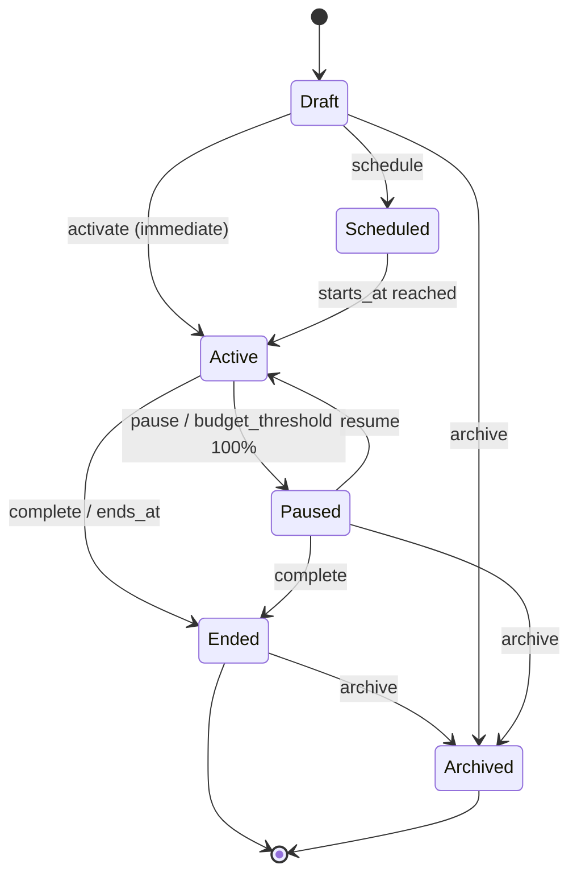
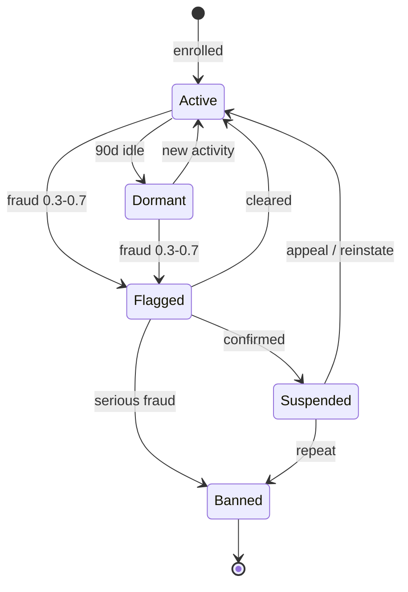
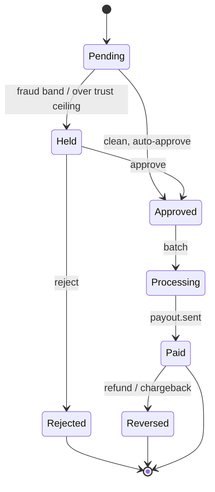
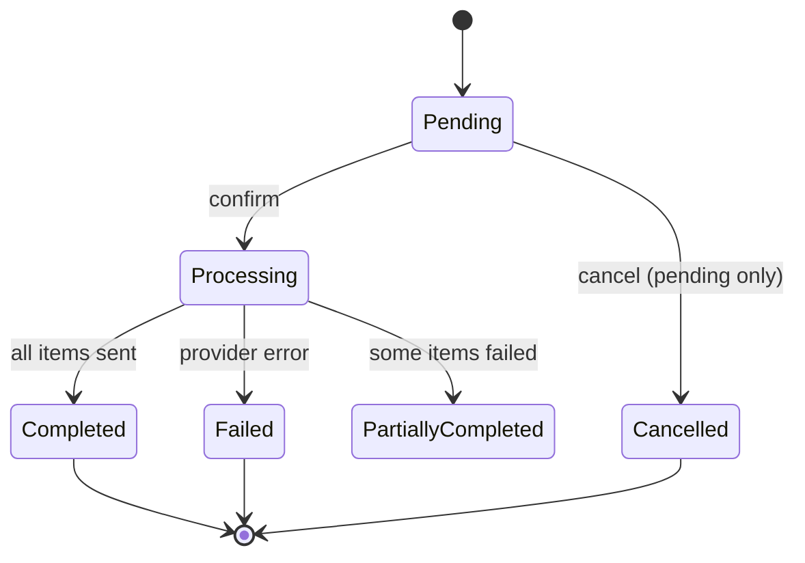

# ReferralAI — Public API Contract (v1.3)

*Markdown rendering of the API Contract for Claude Code. Source of truth is the HTML; state machines are rendered as Mermaid.*

**Version:** 1.3 **Status:** Implementation-Ready Specification **Last Updated:** June 2026 **Companion:** Product & Domain Spec v4, Product Spec v3.2

---

## Document Purpose

This document defines the complete public API contract for the ReferralAI platform. This API is the single integration surface — the dashboard UI, the JS SDK, and customer backends all consume the same endpoints. Privilege separation is handled through authentication mechanisms and Ory Keto permission checks, not through separate API surfaces.

## Key Constraints

1. **REST-based** — No GraphQL. Widest compatibility for diverse client bases.
2. **Versioned** — `/v1` prefix. Additive changes only within a version.
3. **Idempotent** — All mutations support idempotency via headers or domain keys.
4. **GDPR-compliant** — Consent as event metadata, erasure endpoint, EU-first data residency.
5. **API keys for ingestion only** — All configuration endpoints require OAuth2 JWT.
6. **Ory Keto for authorization (source of truth)** — Permissions live as Keto relation tuples. **Resolved permissions are cached in short-lived JWTs at issuance** so downstream services enforce coarse-grained checks without a per-request Keto call; high-risk actions (payouts, reward approval, key management) re-check Keto live.
7. **Selective enrollment only** — referrers are enrolled by the client (API, bulk, CSV, CRM); there is no open/self-enrollment. The widget renders only for users who are already enrolled.
8. **Referrers never access the platform** — no account, no login, no platform-hosted page (not even a tokenized portal). All referrer-visible data flows via the embedded widget and via emails/links.

---

# 1. API Design Principles

## Resource Naming Conventions

All resource paths use **lowercase plural nouns**. Resources are nested only when the relationship is strict composition (a child cannot exist without its parent). Otherwise, the resource is top-level with filter parameters.

**Path Structure**

- **Strict composition (nested)** `/v1/programs/{program_id}/campaigns` `/v1/campaigns/{campaign_id}/variants`
- **Association (top-level + filters)** `/v1/referrals?campaign_id=xxx` `/v1/rewards?referrer_id=xxx`
- **SDK surface (publishable key)** `/v1/sdk/widget-config` `/v1/sdk/resolve-link` `/v1/sdk/attribution`

Nesting depth never exceeds three segments after the version prefix. Resource identifiers are **opaque ULIDs** — time-ordered, lexicographically sortable, 26-character Crockford Base32 strings.

**Naming rules:** plural nouns for collections, verb sub-resources for actions (`/activate`, `/approve`), `snake_case` for all fields, query parameters, and enum values.

## Versioning

URL path prefix: `/v1`. Additive changes only within a version. Deprecation: 6-month grace period with `deprecated: true` flag.

## Idempotency Strategy

| Concern | `/v1/events` (Ingestion) | All other `POST` endpoints |
| --- | --- | --- |
| **Idempotency key** | `external_id` field in body (mandatory) | `Idempotency-Key` HTTP header (mandatory) |
| **Scope** | Per tenant | Per tenant + per key |
| **Dedup window** | 90 days | 24 hours |
| **Secondary dedup** | `referral_code + session_id + 5min_bucket` | None |
| **Duplicate response** | `202 Accepted` with `processing_status: "duplicate"` and the original event id | Absorbs the retry; never errors (see §5.3) |
| **In-flight collision** | Accepted (event bus handles) | `409 Conflict` + `Retry-After` |
| **Why different?** | Domain-level dedup (same business event never recorded twice) | Request-level dedup (same HTTP request never creates two resources) |

`PATCH` uses JSON Merge Patch (RFC 7396) and requires `Idempotency-Key`. `PUT` and `DELETE` are naturally idempotent.

## Pagination & Filtering

All list endpoints use **cursor-based pagination**. No offset pagination.

| Parameter | Type | Description |
| --- | --- | --- |
| `limit` | integer | Items per page. Default: 25. Max: 100. |
| `starting_after` | string | Cursor: return items after this ID (forward) |
| `ending_before` | string | Cursor: return items before this ID (backward) |

**Filtering:** equality (`?status=active`), range (`?created_at.gte=...`), multi-value OR (`?status=active,paused`). **Sorting:** `?sort=-created_at`. **Expansion:** `?expand=campaign,variant` (one level deep).

**Response envelope:**

```json
{
  "data": [ ... ],
  "has_more": true,
  "next_cursor": "obj_xxx",
  "prev_cursor": "obj_yyy"
}
```

## Error Model

```json
{
  "error": {
    "type": "invalid_request",
    "code": "segment_rule_invalid",
    "message": "Segment rule references undefined attribute 'plan_tier'.",
    "param": "segment.rules[0].attribute",
    "request_id": "req_abc123",
    "doc_url": "https://docs.referralai.com/errors/segment_rule_invalid"
  }
}
```

| Type | HTTP Status | Meaning |
| --- | --- | --- |
| `invalid_request` | 400 | Malformed request, validation failure |
| `authentication_error` | 401 | Missing or invalid credentials |
| `authorization_error` | 403 | Keto permission denied or wrong key type |
| `not_found` | 404 | Resource does not exist for this tenant |
| `conflict` | 409 | State conflict or idempotency key collision |
| `gone` | 410 | Resource archived, campaign ended, link expired |
| `unprocessable` | 422 | Semantically invalid (unknown campaign, not yet active) |
| `rate_limit` | 429 | Rate limit exceeded |
| `internal_error` | 500 | Platform fault — retry safe |

`request_id` is returned on every response (also as `X-Request-Id` header).

## Timestamps & Currency

**Timestamps:** ISO 8601, UTC, millisecond precision: `2026-02-06T14:30:00.000Z`. Timezone offsets rejected.

**Currency:** Integers in minor units (cents). Always paired with ISO 4217 `currency` field.

---

# 2. Authentication & Authorization

## Authentication Model Overview

Three authentication mechanisms, all resolving to the same internal JWT for identity. **Ory Keto is the authorization source of truth** (relation-based access control, inspired by Google Zanzibar). To avoid a Keto round-trip on every request, the gateway **resolves the caller's permissions from Keto at token issuance and embeds them as a snapshot claim (`perms`) in a short-lived internal JWT**. Downstream services enforce coarse-grained permissions directly from the JWT; **high-risk or fine-grained actions (payouts, reward approval, clawbacks, key management, object-scoped checks) re-query Keto live**. Short JWT TTLs bound how stale a cached permission can be.

**Authentication & Authorization Flow**

- **API Keys** `rai_live_` · `rai_pub_` Event ingestion + SDK
- **Dashboard Sessions** Ory Kratos All config endpoints
- **Internal JWT** `{ tenant_id, user_id, source, key_type, perms[] }` Identity + resolved permission snapshot
- **Keto (source of truth)** `keto.check(user, relation, object)` Live check for high-risk / object-scoped only

| Mechanism | Who Uses It | Endpoints | How It Works |
| --- | --- | --- | --- |
| **API Keys** | Client backends, JS SDK, inbound webhooks | `/v1/events`, `/v1/sdk/*` | Gateway validates key → mints internal JWT (no `perms` — keys are key-gated to ingestion, never Keto subjects) → forwards |
| **OAuth2 JWT** | Dashboard UI | All non-ingestion endpoints | Ory Kratos session → gateway resolves perms from Keto → mints short-lived JWT with `perms[]` → downstream enforces from JWT (live Keto only for high-risk) |
| **Client Credentials** | Internal batch processors, cron jobs | Internal service mesh | Machine-to-machine auth for scheduled jobs. Not exposed externally. |

## API Keys (Ingestion & SDK Only)

API keys authenticate event ingestion and SDK-facing endpoints. They **cannot** access Programs, Campaigns, Rewards, or any configuration resource.

| Key Type | Prefix | Purpose | Allowed Endpoints |
| --- | --- | --- | --- |
| **Secret** | `rai_live_` | Client backend → event ingestion | `POST /v1/events`, `POST /v1/events/batch` |
| **Publishable** | `rai_pub_` | JS SDK, browser widgets | `POST /v1/events` (touch only), `/v1/sdk/*` |

**Key exchange at gateway:** Auth Guard validates key → resolves `tenant_id`, `key_type` → mints short-lived internal JWT with `{ tenant_id, source: "api_key", key_type, key_id }` → forwards to downstream service. Downstream services only see a JWT — no API key knowledge.

**Key management** (`/v1/api-keys`) requires OAuth2 JWT + Keto `api_keys:manage` permission.

## OAuth2 JWT (Dashboard & Configuration)

All non-ingestion, non-SDK endpoints require OAuth2 JWT. The JWT carries identity **plus a resolved permission snapshot** taken from Keto at issuance:

```json
{
  "tenant_id": "tenant_xyz",
  "user_id": "user_nizar",
  "source": "dashboard",       // "dashboard" | "api_key" | "client_credentials"
  "key_type": null,            // "secret" | "publishable" | null
  "perms": [                   // resolved from Keto at issuance (arch §13.1 names this claim "scopes")
    "campaigns:read", "campaigns:write", "campaigns:activate",
    "rewards:read", "analytics:read"
  ],
  "iat": 1706190600,
  "exp": 1706194200            // short TTL (≤15 min) bounds permission staleness
}
```

**Enforcement split.** Downstream guards authorize coarse-grained operations directly against `perms` — no Keto call. **High-risk and object-scoped operations always re-check Keto live** (a stale token must never authorize a payout): `rewards:approve`, `rewards:reject`, `rewards:clawback`, `payouts:write/confirm`, `api_keys:manage`, and any "can user X act on object Y" check. If a permission is revoked mid-session, the live-checked actions deny immediately; coarse actions deny on the next token refresh.

## Ory Keto Permission Model

Ory Keto is the **source of truth**, storing permissions as **relation tuples** following the Zanzibar model: `(subject, relation, object)`. The gateway resolves a caller's tuples into the JWT `perms` snapshot at issuance; downstream guards read that snapshot, and call `keto.check()` only for the high-risk / object-scoped cases above.

### Keto Namespace & Relations

| Namespace | Relations | Description |
| --- | --- | --- |
| `programs` | `read`, `write`, `archive` | Program lifecycle management |
| `campaigns` | `read`, `write`, `activate`, `pause`, `complete` | Campaign lifecycle + state transitions |
| `variants` | `read`, `write` | Variant configuration |
| `segments` | `read`, `write`, `delete` | Segment management |
| `referrers` | `read`, `write`, `block` | Referrer management |
| `referrals` | `read`, `reject` | Referral viewing + manual rejection |
| `rewards` | `read`, `approve`, `reject`, `clawback` | Reward lifecycle actions |
| `analytics` | `read` | KPIs, dashboards, attribution |
| `webhooks` | `read`, `write`, `delete` | Webhook configuration |
| `payouts` | `read`, `write`, `confirm` | Payout batch management |
| `api_keys` | `manage` | Create, list, revoke API keys |

### Actor Types → Authorization

Maps every actor (Product Spec v4 §4) to its credential, its Keto subject form, and how it is authorized. Referrers and Referees are deliberately absent — they hold no credential and are never Keto subjects.

| Actor (v4 §4) | Credential | Keto subject | Authorization |
| --- | --- | --- | --- |
| **Account Owner** (= Program Admin) | OAuth2 JWT (Kratos) | `user:{id}` via `role:owner` | All namespaces; `perms` snapshot + live Keto on money/keys |
| **Admin** | OAuth2 JWT | `user:{id}` via `role:admin` | All except billing; snapshot + live on money |
| **Campaign Manager** (= Marketer/Operator) | OAuth2 JWT | `user:{id}` via `role:operator` | Campaign/variant/segment/referrer R-W, reward approve/reject (live Keto) |
| **Viewer / Analyst** | OAuth2 JWT | `user:{id}` via `role:viewer` | Read-only namespaces from `perms` |
| **Client backend** (system) | Secret API key `rai_live_` | not a Keto subject | Key-gated to ingestion only; no Keto, no config access |
| **JS SDK / browser** (system) | Publishable key `rai_pub_` + client-signed user JWT | not a Keto subject | Key-gated to SDK + touch ingestion only |
| **Partner / integration** (system) | OAuth2 client-credentials or connector token | `service:{name}` | Narrow service relations (e.g. `payouts:confirm@service:payout-worker`), live Keto |
| **Internal worker** (cron, Temporal) | Client credentials (mesh) | `service:{name}` | Machine-to-machine; live Keto on money transitions |
| **Referrer / Participant** | *none* | *never a subject* | No platform access — widget + emails/links only |
| **Referee** | *none* | *never a subject* | No platform access — interacts with client's product only |

### Relation Tuple Examples

```json
# User "nizar" can write campaigns in tenant "acme"
campaigns:tenant_acme#write@user_nizar

# Role "operator" can read and write campaigns (role-based)
campaigns:tenant_acme#write@role:operator#member

# User "alice" (viewer role) can only read analytics
analytics:tenant_acme#read@user_alice

# Service "payout-worker" can confirm payouts (machine-to-machine)
payouts:tenant_acme#confirm@service:payout-worker
```

### Permission Check Flow

**Authorization Flow**

- Request arrives with JWT → extract `user_id`, `tenant_id`, `perms[]`
- Auth Guard determines required permission from route: e.g., `campaigns:write`
  - **Coarse perm in `perms[]`** → authorize from JWT (no Keto call)
  - **High-risk / object-scoped** → live `keto.check()`
  - **Allowed** → forward to service
  - **Denied** → 403 authorization_error

### Role → Permission Mapping

Roles are defined in Ory Keto as group memberships. Typical tenant roles:

| Role | Permissions |
| --- | --- |
| **Owner** | All namespaces: all relations. Billing, API key management. |
| **Admin** | All namespaces except billing. Full CRUD on programs, campaigns, rewards, segments. |
| **Operator** | `campaigns:read/write/activate/pause`, `variants:read/write`, `segments:read/write`, `referrers:read/write`, `rewards:read/approve/reject`, `analytics:read` |
| **Viewer** | `campaigns:read`, `referrals:read`, `rewards:read`, `analytics:read` |

> **Why hybrid (perms in JWT + Keto as source of truth)?** A pure per-request Keto check adds a network hop to every call; pure static JWT scopes go stale and can't express object-level rules. The hybrid keeps Keto authoritative while caching the *resolved* permissions in a short-lived JWT so the hot path (reads, list, ordinary writes) needs no Keto round-trip. The cost is bounded staleness — capped by the token TTL — which is why money- and key-touching actions still re-check Keto live and object-scoped rules ("user X can manage only Campaign Y") are never cached. This matches the application architecture (§13.1): a uniform internal token carries resolved permissions, and live Keto guards sit on the money/config endpoints.

## Tenant Isolation

Every authentication mechanism resolves to a `tenant_id`. All queries are implicitly scoped. Accessing a resource from a different tenant returns `404`, not `403` — the resource is treated as nonexistent to prevent enumeration.

## Authentication Summary by Endpoint Group

| Endpoint Group | API Key (secret) | API Key (pub) | OAuth2 JWT | Keto Permission |
| --- | --- | --- | --- | --- |
| `POST /v1/events` | ✅ All types | ✅ Touch only | ❌ | *N/A (key-gated)* |
| `POST /v1/events/batch` | ✅ | ❌ | ❌ | *N/A (key-gated)* |
| `/v1/sdk/*` | ❌ | ✅ | ❌ | *N/A (key-gated)* |
| Programs | ❌ | ❌ | ✅ | `programs:read/write` |
| Campaigns, Variants | ❌ | ❌ | ✅ | `campaigns:read/write/activate…` |
| Referrers, Referrals | ❌ | ❌ | ✅ | `referrers:read/write`, `referrals:read` |
| Rewards | ❌ | ❌ | ✅ | `rewards:read/approve/clawback` |
| Analytics, Attribution | ❌ | ❌ | ✅ | `analytics:read` |
| Payouts | ❌ | ❌ | ✅ | `payouts:read/write/confirm` |
| Webhooks, Segments | ❌ | ❌ | ✅ | `webhooks:*`, `segments:*` |
| API Key management | ❌ | ❌ | ✅ | `api_keys:manage` |

---

# 3. Core Resources & Endpoints

**Most** endpoints in this section are configuration/runtime/analytics and require **OAuth2 JWT**: downstream guards authorize from the JWT `perms` snapshot and re-check Ory Keto live for high-risk actions (§2). The exceptions are **event ingestion** (§3.7, §5 — authenticated by *API key*, not JWT) and the **SDK endpoints** (§4 — *publishable key*). Each resource table states its auth where it differs from the JWT default.

## 3.1 Program

Top-level organizational container. One per client (typically). Groups Campaigns, carries default attribution model. Branding is an **account-level** concern — not on the Program resource.

**Lifecycle:** No state machine. Soft-delete only (`archived_at`). Cascades to all child Campaigns.

| Method | Path | Summary | Auth / Permission |
| --- | --- | --- | --- |
| POST | `/v1/programs` | Create a new Program | `programs:write` |
| GET | `/v1/programs` | List all Programs | `programs:read` |
| GET | `/v1/programs/{id}` | Retrieve a Program | `programs:read` |
| PATCH | `/v1/programs/{id}` | Update Program config | `programs:write` |
| POST | `/v1/programs/{id}/archive` | Soft-delete + cascade | `programs:archive` |
| GET | `/v1/programs/{id}/health` | Health Score (0–100) | `analytics:read` |

**Request body (`POST /v1/programs`):**

```json
{
  "name": "Acme Referral Program",          // required
  "description": "Customer referral program",
  "default_attribution_model": "last_touch", // first_touch | last_touch | linear | ai_weighted
  "default_attribution_window_days": 30,
  "metadata": { "team": "growth" }
}
```

**Response:** `id`, `created_at`, `updated_at`, `archived_at` (null), `health_score` (null until computed).

## 3.2 Campaign

Time-bound execution unit. Selects a Pulse (immutable workflow type), defines enrollment strategy, manages shared budget, and transitions through a state machine.

### Key Design Decisions

1. **Selective enrollment only.** Referrers must be enrolled by the client before they can refer; there is no open/self-enrollment. The widget renders only for enrolled users (otherwise `hidden`).
2. **Default Variant** auto-created on Campaign creation. Acts as catch-all fallback.
3. **Variant resolution at enrollment time**, not referee click. Referrer knows their reward when sharing.
4. **Budget** is shared across all variants. Campaign auto-pauses at 100%.

### State Machine

**Campaign States & Transitions**


> Internal state value is `ended`; the public lifecycle event is `campaign.completed`.

> Terminal states: `Ended` and `Archived`. `Active ⇄ Paused` is the only reversible loop; `budget_threshold` at 100% auto-transitions Active → Paused. **Internal/public split (per DB R-note):** the state value is `ended`; the public lifecycle event surfaced to clients is `campaign.completed` (§6.1). The `/complete` action verb drives the campaign to `ended`.

| Method | Path | Summary | Auth / Permission |
| --- | --- | --- | --- |
| POST | `/v1/programs/{program_id}/campaigns` | Create Campaign (draft) | `campaigns:write` |
| GET | `/v1/programs/{program_id}/campaigns` | List Campaigns | `campaigns:read` |
| GET | `/v1/campaigns/{id}` | Retrieve Campaign | `campaigns:read` |
| PATCH | `/v1/campaigns/{id}` | Update (draft/paused only) | `campaigns:write` |
| POST | `/v1/campaigns/{id}/schedule` | Schedule activation | `campaigns:activate` |
| POST | `/v1/campaigns/{id}/activate` | Activate immediately | `campaigns:activate` |
| POST | `/v1/campaigns/{id}/pause` | Pause active | `campaigns:pause` |
| POST | `/v1/campaigns/{id}/resume` | Resume paused | `campaigns:activate` |
| POST | `/v1/campaigns/{id}/complete` | End the campaign → internal state `ended`, emits `campaign.completed` | `campaigns:complete` |
| POST | `/v1/campaigns/{id}/archive` | Archive | `campaigns:write` |
| GET | `/v1/campaigns/{id}/stats` | Campaign KPIs | `analytics:read` |

**Request body (`POST /v1/programs/{program_id}/campaigns`):**

```json
{
  "name": "Q3 Conversion Pulse",            // required
  "pulse": "conversion_pulse",              // required, immutable
  "budget": { "total_amount": 1000000, "currency": "EUR" },  // minor units
  "starts_at": "2026-07-01T00:00:00Z",
  "ends_at": "2026-09-30T23:59:59Z",
  "attribution_window_days": 30,
  "metadata": { "region": "EU" }
}
```

Campaigns are **selective-enrollment only** — there is no `enrollment_model` field. A Default Variant is auto-created.

**Budget auto-pause:** When `spent_amount` ≥ `total_amount`, the Campaign auto-transitions Active → Paused (`campaign.budget_threshold`). Pipeline referrals still process; new clicks are blocked.

## 3.3 Campaign Variant

Core configuration unit: binds a Segment (who), Reward Config (what incentive), messaging (what they see), and allocation weight (traffic proportion).

### Variant ↔ Segment

**Variant references Segment**

### Variant Resolution at Enrollment

**Resolution Fallback Chain**

- Referrer enrolled with attributes
- Evaluate against each variant's segment (priority order)
  - One match → assign
  - Multiple → highest priority wins
  - No match → default variant
  - No default → ineligible

| Method | Path | Summary | Auth / Permission |
| --- | --- | --- | --- |
| POST | `/v1/campaigns/{campaign_id}/variants` | Create Variant | `variants:write` |
| GET | `/v1/campaigns/{campaign_id}/variants` | List Variants | `variants:read` |
| GET | `/v1/variants/{id}` | Retrieve Variant | `variants:read` |
| PATCH | `/v1/variants/{id}` | Update config | `variants:write` |
| POST | `/v1/variants/{id}/enable` | Enable (receives traffic) | `variants:write` |
| POST | `/v1/variants/{id}/disable` | Disable | `variants:write` |
| GET | `/v1/variants/{id}/stats` | Variant KPIs + significance | `analytics:read` |

**Request body (`POST /v1/campaigns/{campaign_id}/variants`):**

```json
{
  "name": "Enterprise tier",
  "is_default": false,
  "priority": 10,                           // higher wins on multi-match
  "allocation_weight": 50,
  "segment": { "segment_id": "seg_01J9..." },  // by ref, or inline definition
  "reward_config": {
    "referrer": { "reward_type": "cash", "reward_structure": "fixed", "amount": 5000, "currency": "EUR" },
    "referee":  { "reward_type": "discount_code", "reward_structure": "percentage", "value": 20 }
  },
  "messaging": { "headline": "Give 20%, get €50" },
  "eligibility_rules": { "min_plan": "pro" },
  "enabled": true,
  "metadata": {}
}
```

`reward_config` uses the **two-axis** model from Product Spec §8 / DB Model: `reward_type` ∈ {`cash`, `gift_card`, `account_credit`, `feature_unlock`, `extended_trial`, `discount_code`, `custom`} × `reward_structure` ∈ {`fixed`, `percentage`, `tiered`, `recurring`, `milestone`, `capped`}. Type and structure are independent (e.g. a percentage discount = `discount_code` × `percentage`); there is no single conflated reward enum.

## 3.4 Segment

Reusable audience definition. Segmentation is the **sole allocation mechanism** — no separate experimentation framework.

| Type | Description | Evaluation |
| --- | --- | --- |
| `rule_based` | Manual attribute rules | Real-time |
| `behavioral` | Action-history based | Batch / real-time |
| `temporal` | Time-attribute based | Real-time |
| `composite` | AND/OR combinations | Real-time |
| `random` | Hash-based deterministic allocation | Real-time |
| `ai_generated` | ML-detected patterns (read-only) | Batch (daily) |

| Method | Path | Summary | Auth / Permission |
| --- | --- | --- | --- |
| POST | `/v1/segments` | Create Segment | `segments:write` |
| GET | `/v1/segments` | List Segments | `segments:read` |
| GET | `/v1/segments/{id}` | Retrieve | `segments:read` |
| PATCH | `/v1/segments/{id}` | Update | `segments:write` |
| DELETE | `/v1/segments/{id}` | Delete (if not in use) | `segments:delete` |
| GET | `/v1/segments/{id}/estimate` | Audience size estimate | `segments:read` |

## 3.5 Referrer

External actor. **No platform account, no dashboard, no login, no platform-hosted page of any kind.** Interacts only via the embedded widget (inside the client's product) and via emails/links. Per v4, payout method is collected **in the widget** or on the **payout partner's hosted page** (linked from email) — never on a platform-hosted page; the platform stores only a provider reference, never raw bank data.

### Enrollment Methods

All enrollment is **selective** — initiated by the client, never by the referrer. The most common path is a client enrolling one of its own end-users as a referrer, including a **customer who originally arrived as a referee** (was referred, signed up, and is now invited to refer others).

| Method | Endpoint | Phase |
| --- | --- | --- |
| API Single | `POST /v1/referrers` | MVP |
| Referee → Referrer | `POST /v1/referrers` — client enrolls a converted referee (now a customer) as a referrer | MVP |
| API Bulk | `POST /v1/referrers/batch` (up to 1000) | MVP |
| CSV Import | Dashboard upload | Lot 1 |
| CRM Connector | HubSpot / Salesforce | Lot 1 |

### Operational State & Trust Level

Per Product Spec v4 §2 these are **two independent axes** and must not be collapsed. **Operational state** (owned by the Participant domain) answers "can they act right now?"; **trust level** (owned by the Trust model, Lot 1) answers "how much financial exposure do we allow?". A third axis — journey stage (Anonymous→…→Advocate) — is an analytics projection (§3.13), not a stored referrer field.

**Operational State Machine**



> Suspended is reversible (appeal); **Banned is terminal** (rewards forfeited). Suspended/Banned drive the comms changes in §8.2.1. Dormant can still refer and earn.

| Operational state | Can refer? | Can earn? | Comms effect |
| --- | --- | --- | --- |
| **Active** | Yes | Yes | Normal widget & links |
| **Dormant** | Yes | Yes | Normal; re-engagement nudge eligible (90d+ idle) |
| **Flagged** | Yes | Held | Rewards forced to `Held`, manual approval; links still active |
| **Suspended** | No | Held | Links → `410`, widget `hidden`, payouts held (§8.2.1) |
| **Banned** | No | Forfeited | Same as Suspended; terminal, not reversible |

> **On state breadth:** the operational axis is exactly these **five**. `candidate` is a client-side journey stage, never a platform state (v4 Appendix A), and `reactivated` is the Dormant→Active *transition*, not a distinct state. Event Model §5.3 / DB enumerate seven by folding those two in — they should drop to the canonical five to match this axis.

**Trust level** (score 0–100, scoped per participant × program, tenant-isolated) scales financial exposure — it never blocks an individual event:

| Trust level | Score | Monthly payout cap | Hold | Approval mode |
| --- | --- | --- | --- | --- |
| **New** | 0–25 | €100 | 14d | Manual review |
| **Established** | 26–50 | €500 | 7d | Auto < €50 |
| **Trusted** | 51–75 | €2,000 | 3d | Auto < €200 |
| **Advocate** | 76–100 | €10,000 | Instant | Auto-approve all |

> MVP override (v4 §7): trust scoring is bypassed — all rewards manual review, 7-day hold, €1,000/mo cap for everyone.

| Method | Path | Summary | Auth / Permission |
| --- | --- | --- | --- |
| POST | `/v1/referrers` | Register single referrer | `referrers:write` |
| POST | `/v1/referrers/batch` | Register up to 1000 | `referrers:write` |
| GET | `/v1/referrers` | List referrers | `referrers:read` |
| GET | `/v1/referrers/{id}` | Retrieve referrer | `referrers:read` |
| PATCH | `/v1/referrers/{id}` | Update metadata, tags | `referrers:write` |
| POST | `/v1/referrers/{id}/block` | Block (disables all links) | `referrers:block` |
| POST | `/v1/referrers/{id}/unblock` | Unblock | `referrers:block` |
| POST | `/v1/referrers/{id}/links` | Generate referral link | `referrers:write` |
| GET | `/v1/referrers/{id}/links` | List active links | `referrers:read` |
| GET | `/v1/referrers/{id}/stats` | Referrer KPIs | `analytics:read` |
| GET | `/v1/referrers/{id}/rewards` | List earned rewards | `rewards:read` |

**Request body (`POST /v1/referrers`):**

```json
{
  "email": "alice@example.com",             // required
  "name": "Alice Martin",
  "external_id": "user_8842",               // client's own user id
  "campaign_id": "camp_01J9...",            // enroll into campaign + resolve variant + generate link
  "tags": ["beta", "eu"],
  "attributes": { "plan": "enterprise", "country": "DE" },  // for segment evaluation
  "metadata": {}
}
```

Idempotent by `email` / `external_id` per tenant. Returns the referrer plus the generated referral link for the named campaign.

## 3.6 Referral

Runtime workflow instance (Temporal). Created on touch event or explicitly via API.

**Referral State Machine**

- `PENDING` → referral created (touch recorded or API)
- `QUALIFIED` → eligibility passed
- `CONVERTED` → qualifying action completed
- `REWARDED` → reward issued
- `REJECTED` Fraud or eligibility failure
- `EXPIRED` Attribution window passed

> Per Product Spec §2 and Event Model §5.1, the referral has **no `clawed_back` state**. A refund / chargeback / fraud reversal is modelled at the **reward** level as `reward.reversed` (§3.8), not as a referral transition. States: `Pending → Qualified → Converted → Rewarded | Expired | Rejected`.

| Method | Path | Summary | Auth / Permission |
| --- | --- | --- | --- |
| POST | `/v1/referrals` | Create explicitly (server-side) | `referrers:write` |
| GET | `/v1/referrals` | List referrals | `referrals:read` |
| GET | `/v1/referrals/{id}` | Retrieve with workflow state | `referrals:read` |
| POST | `/v1/referrals/{id}/reject` | Manually reject | `referrals:reject` |
| GET | `/v1/referrals/{id}/touches` | List touch events | `referrals:read` |
| GET | `/v1/referrals/{id}/attribution` | Attribution computation | `analytics:read` |
| GET | `/v1/referrals/{id}/rewards` | Associated rewards | `rewards:read` |

## 3.7 Event

Immutable, timestamped records. Ingestion via API key (Section 5). Read via OAuth2 JWT.

| Method | Path | Summary | Auth / Permission |
| --- | --- | --- | --- |
| POST | `/v1/events` |  | API Key *Key-gated* |
| POST | `/v1/events/batch` |  | API Key (secret) *Key-gated* |
| GET | `/v1/events` |  | OAuth2 JWT `analytics:read` |
| GET | `/v1/events/{id}` |  | OAuth2 JWT `analytics:read` |

## 3.8 Reward

Runtime instance. Canonical lifecycle (Product Spec v4 §8): `Pending → Held → Approved → Processing → Paid`. Terminal off-ramps: `Rejected` (fraud/ineligible) and `Reversed` (refund, chargeback, or fraud after payout). `Held` fires when the fraud score is in the review band or the amount exceeds the trust ceiling.

**Reward States & Transitions**



> `approve`/`reject` are Keto-gated (`rewards:approve`/`rewards:reject`, live check). Hold windows by trust tier (§3.5) exist so a reversal can land before `Processing` releases funds.

| Method | Path | Summary | Auth / Permission |
| --- | --- | --- | --- |
| GET | `/v1/rewards` | List rewards | `rewards:read` |
| GET | `/v1/rewards/{id}` | Retrieve reward | `rewards:read` |
| POST | `/v1/rewards/{id}/approve` | Approve pending | `rewards:approve` |
| POST | `/v1/rewards/{id}/reject` | Reject pending | `rewards:reject` |
| POST | `/v1/rewards/{id}/clawback` | Reverse fulfilled | `rewards:clawback` |

**Request body (`POST /v1/rewards/{id}/clawback`):**

```json
{
  "reason": "chargeback_received",          // required (audit trail)
  "amount": 2500                            // optional — minor units, for partial clawback
}
```

## 3.9 Attribution (Read-Only)

| Method | Path | Summary | Auth / Permission |
| --- | --- | --- | --- |
| GET | `/v1/attributions` |  | `analytics:read` |
| GET | `/v1/attributions/{id}` |  | `analytics:read` |

Fields: `model_used`, `touches` (with `credit_weight`), `total_attributed_revenue`, `confidence` (AI-weighted only).

## 3.10 Payout

Batched disbursements with a deliberate two-step (create then confirm) so money never moves on a single call.

**Payout Batch States & Transitions**



> Provider callbacks (§6.5) drive Processing → Completed/Failed per item; `payout.sent`/`payout.failed` webhooks fire accordingly. Confirm requires `payouts:confirm` (live Keto).

| Method | Path | Summary | Auth / Permission |
| --- | --- | --- | --- |
| GET | `/v1/payouts` | List batches | `payouts:read` |
| GET | `/v1/payouts/{id}` | Retrieve batch | `payouts:read` |
| POST | `/v1/payouts` | Create batch | `payouts:write` |
| POST | `/v1/payouts/{id}/confirm` | Confirm for processing | `payouts:confirm` |
| POST | `/v1/payouts/{id}/cancel` | Cancel pending | `payouts:write` |
| GET | `/v1/payouts/{id}/items` | List line items | `payouts:read` |

## 3.11 Playbook

| Method | Path | Summary | Auth / Permission |
| --- | --- | --- | --- |
| GET | `/v1/playbooks` | List templates | `campaigns:read` |
| GET | `/v1/playbooks/{id}` | Retrieve full template | `campaigns:read` |
| POST | `/v1/playbooks/{id}/instantiate` | Create Campaign from template | `campaigns:write` |

Instantiate requires `program_id`. Returns a Campaign in `draft` with its Default Variant populated.

## 3.12 AI Recommendations

| Method | Path | Summary | Auth / Permission |
| --- | --- | --- | --- |
| GET | `/v1/recommendations` | List pending | `analytics:read` |
| GET | `/v1/recommendations/{id}` | Retrieve with explanation | `analytics:read` |
| POST | `/v1/recommendations/{id}/accept` | Accept + apply | `campaigns:write` or `rewards:approve` |
| POST | `/v1/recommendations/{id}/dismiss` | Dismiss (AI feedback) | `analytics:read` |

Recommendations are produced by AI-service agents (optimization, segmentation, and the Campaign Creation Assistant §3.14). `accept` is the single human-in-the-loop gate: it **applies** the recommendation by performing the underlying action through the owning service's public API under the operator's permissions — for a `campaign_config` recommendation that means materialising a Campaign (draft) + Variants + Segments + Reward configs via §3.2–§3.4. The AI service never writes those records itself. `accept`/`reject` outcomes and the producing prompt version are retained for audit.

## 3.13 Analytics

Two layers: **fixed report endpoints** (predictable, filterable) and an **AI analytics layer** (natural-language query + proactive insight surfacing). All require `analytics:read`.

### Fixed Reports

| Method | Path | Summary | Auth / Permission |
| --- | --- | --- | --- |
| GET | `/v1/analytics/kpis` | Account-level KPIs |  |
| GET | `/v1/analytics/funnel` | Touches → conversions → rewards |  |
| GET | `/v1/analytics/revenue` | Attributed revenue over time |  |
| GET | `/v1/analytics/referrers/leaderboard` | Top referrers |  |

Common filter params: `period`, `from`, `to`, `program_id`, `campaign_id`, `variant_id`, `channel` (UTM source/medium), `group_by`.

### AI Analytics Layer

| Method | Path | Summary | Auth / Permission |
| --- | --- | --- | --- |
| POST | `/v1/analytics/query` | Natural-language question → AI generates SQL → returns results |  |
| GET | `/v1/analytics/insights` | AI-surfaced top insights (proactive, ranked) |  |

**NL query (`POST /v1/analytics/query`):**

```json
{
  "question": "Which channel drove the most MRR last quarter?",
  "filters": { "program_id": "prog_01J9...", "from": "2026-01-01", "to": "2026-03-31" }
}
```

The AI generates SQL constrained to the tenant's read schema (tenant scope is enforced server-side, never trusted from the model), executes it read-only, and returns `{ sql, columns, rows, explanation }`. The generated `sql` is returned for transparency/audit. Generation never has write access and cannot cross tenant boundaries.

**Insights (`GET /v1/analytics/insights`):** the AI explores the tenant's metrics on a schedule and returns a ranked, capped set (a **max number of insights**, e.g. top 5) — each with a headline, supporting figures, and a plain-language explanation. Surfacing is capped so the dashboard shows the highest-signal findings rather than an unbounded list; lower-ranked insights are dropped, not paginated.

## 3.14 Campaign Creation Assistant (Chatbot)

Conversational agent that interviews an operator across four phases (goal/pulse/trigger → economics/reward → audience/saturation → measure/quality/budget) and proposes **three** candidate campaign configurations — Baseline / Balanced / Aggressive. Endpoint shapes are defined here; the agent's behaviour, prompts, and derivations live in the Creation Assistant specs (Interview Script v2 · Service Placement v2) and the AI service.

> **Boundary — AI proposes, Campaign owns.** This is an `ai-service` surface. The assistant **holds no write tool over the Campaign domain**: it reads analytics/propensity (to derive the CAC ceiling, saturation pacing, targeting, hold/clawback defaults) and emits proposals — it never creates, activates, or budgets a campaign. The three proposals are transient `Recommendation` records in `ai_db` (accept/reject outcome). A campaign is materialised **only** when the operator accepts one via `POST /v1/recommendations/{id}/accept` (§3.12), which applies it through the public Campaign/Variant/Segment APIs (§3.2–§3.4) under the operator's permissions, the campaign state machine, budget controls, and the Pulse×Reward compatibility gate.

**Conversation model — stateless, single-turn.** Each message is an independent invocation; the assistant holds no memory across turns. Conversation state (gathered answers, current phase) is persisted in `ai_db` and replayed on every turn — the client only carries the `conversation_id`. Behaviour is **model-agnostic** (identical across primary / verification / fallback models). Precondition: the client's site is already scraped (vertical, pricing, value props known), so the assistant asks as little as possible.

| Method | Path | Summary | Auth / Permission |
| --- | --- | --- | --- |
| POST | `/v1/ai/campaign-assistant/conversations` | Start a conversation → returns `conversation_id`, `phase`, first question | `campaigns:write` |
| POST | `/v1/ai/campaign-assistant/conversations/{id}/messages` | Submit operator answer → next question, or 3 proposals at the final phase | `campaigns:write` |
| GET | `/v1/ai/campaign-assistant/conversations/{id}` | Retrieve replayed phase, answers, and proposals | `campaigns:read` |
| POST | `/v1/ai/campaign-assistant/conversations/{id}/regenerate` | Re-run generation from current answers (proposals are disposable — zero blast radius) | `campaigns:write` |

**Turn response (`POST …/messages`)** — one of two shapes:

```json
// mid-interview
{
  "conversation_id": "conv_01J9...",
  "phase": "economics_reward",            // goal_pulse | economics_reward | audience_saturation | measure_quality_budget
  "status": "in_progress",
  "question": { "id": "reward_ceiling", "text": "...", "kind": "infer_and_confirm", "inferred": { "cac_payback_ceiling": 4200 } }
}

// final phase — proposals emitted as Recommendation records
{
  "conversation_id": "conv_01J9...",
  "phase": "measure_quality_budget",
  "status": "proposals_ready",
  "proposals": [
    { "recommendation_id": "rec_...A", "profile": "baseline",   "summary": "...", "config_preview": { ... } },
    { "recommendation_id": "rec_...B", "profile": "balanced",   "summary": "...", "config_preview": { ... } },
    { "recommendation_id": "rec_...C", "profile": "aggressive", "summary": "...", "config_preview": { ... } }
  ]
}
```

Accepting a proposal (§3.12) creates the Campaign in `draft` with its Default Variant, referenced Segments, and Reward configs via the Campaign service; the chosen `Recommendation` is marked `accepted` and the other two `rejected`, retained for audit/explainability. The assistant has no path that bypasses this — regenerating or abandoning a conversation never touches a real campaign.

## 3.15 GDPR Erasure

Consent is a field on touch events (captured from CMP by JS SDK), not a standalone resource.

| Method | Path | Summary | Auth / Permission |
| --- | --- | --- | --- |
| POST | `/v1/erasure-requests` | Submit GDPR erasure request | `referrers:write` |
| GET | `/v1/erasure-requests/{id}` | Check status | `referrers:read` |

Processed within 30 days. Data anonymized in-place (PII → hashed tokens). Aggregate analytics preserved.

---

# 4. SDK & Widget Endpoints

Called by the JS SDK in the client's website. Authenticated via **publishable API key** (`rai_pub_`). Latency-sensitive, high concurrency.

> **Deployment note.** These SDK endpoints (§4) and touch ingestion (§5) share the same trust boundary (publishable key, browser-origin, untrusted input), latency target, and stateless read profile, so they are served by the **same publishable-key edge service** — the Event Ingestion Service and its SDK endpoints, per application architecture §12.1/§13.1. That service is stateless (Redis-only): `widget-config` and `resolve-link` read campaign/enrollment state from Redis projections rather than an owned RDS. Secret-key server ingestion (conversion/revenue) terminates at the same service but on a separate key-gated path. Referral-link *generation* is not an SDK concern — it is a server-side, JWT-authenticated operation in the Referral Tracking domain (§3.5).

## 4.1 Widget Configuration

`GET /v1/sdk/widget-config?campaign_id=xxx&token=jwt`

Called on page load after `RefRev.init()`. The `token` is a server-generated JWT from the client's backend (signed with a shared secret). Our backend verifies the signature, extracts user identity, checks enrollment status, and returns widget behavior.

**Widget Response by Status**

- **Enrolled referrer** mode: active_referrer Shows: referral link, simple stats, share tools
- **Not enrolled / blocked** mode: hidden Widget not rendered (enrollment is selective — no self-enroll CTA)

If token is not provided: widget does not render. Console warning logged. Integration health dashboard flags repeated loads without token.

## 4.2 Referral Link Resolution

`GET /v1/sdk/resolve-link?referral_code=ALICE123`

Called when the SDK detects `?ref=` in the URL. Returns campaign context, cookie TTL, and referee reward preview. Invalid/expired/revoked codes return `{ "valid": false, "reason": "..." }`. This is the **read** side of a referral link; **generation** happens server-side at enrollment via `POST /v1/referrers/{id}/links` (§3.5, JWT + `referrers:write`).

## 4.3 Attribution Retrieval

`POST /v1/sdk/attribution`

Returns `ref_code`, `click_id`, `session_id`, `campaign_id` for the current session. Frontend passes this to client's backend, which includes it in server-side conversion events.

---

# 5. Event Ingestion API

Highest-throughput endpoint. **API key only.** Latency SLA: < 100ms.

## 5.1 Event Schema

Every event carries the same envelope and declares one of three `type` values. The `type` sets the trust rules and which extras are required; `event_name` is the specific dot-notation label within that type.

| Type | What it is | Examples (`event_name`) | Who may send |
| --- | --- | --- | --- |
| `touch` | A pre-conversion interaction in the referral journey — anything that signals engagement before the qualifying action | `link.clicked`, `page.viewed`, `link.shared`, `email.opened`, `email.clicked`, `feedback.submitted` | Publishable key (browser) or secret key |
| `conversion` | The qualifying/monetizable action that closes a referral — carries identity + revenue | `signup.completed`, `payment.completed`, `subscription.renewed` | Secret key only (server-side) |
| `custom` | Client-defined events used for segmentation and AI features, not part of the core funnel — all ride the `custom.recorded` schema | `custom.recorded` (client-defined name, e.g. `plan.upgraded`) | Secret key only |

| Field | Type | Required | Description |
| --- | --- | --- | --- |
| `external_id` | string | Yes | Caller-supplied dedup key (see §5.3). Max 256 chars. |
| `type` | enum | Yes | `touch`, `conversion`, `custom` |
| `event_name` | string | Yes | Dot-notation within the type (e.g., `payment.completed`) |
| `occurred_at` | ISO 8601 | Yes | Not future (5min). Not older than 7d (touch) / 30d (conversion). |
| `properties` | object | No | Max 50 keys, 10KB. |

**Touch extras:** `referral_code` (required), `consent_status` (required: `granted`/`denied`/`pending`), `click_id`, `session_id`, `channel`, and **UTM fields** (`utm_source`, `utm_medium`, `utm_campaign`, `utm_content`, `utm_term`). IP/user-agent are **server-derived**, never trusted from the body.

> **Consent field mapping:** `consent_status` is the *raw inbound* field on the request body. On normalization it is stored in the event envelope as `consent.tracking_consent` (Event Model §2.4) — same value, raw-vs-normalized naming.

**Conversion extras** — flat fields per Event Model v3.0 / `_defs#/revenue`; **there is no nested `revenue` object**, and conversion schemas are closed (`unevaluatedProperties: false`), so unknown keys like `product` are rejected. Identity: `referee_email` or `referee_external_id` (one required). Correlation: `referral_code` or `click_id`. Revenue: `revenue_amount` (integer, minor units, required), `revenue_currency` (ISO 4217, required), `revenue_type` (`one_time` | `recurring`, required), `revenue_mrr` (required when `recurring`), `revenue_arr`, `revenue_ltv_estimate`. Plus event-specific props (e.g. `payment_provider`, `plan_id`, `billing_interval`, `is_first_payment`).

## 5.2 UTM Handling

UTMs are **first-class citizens**, not free-form properties. They are parsed from the landing URL by the SDK (touch) and/or echoed by the backend (conversion), then normalized and persisted in dedicated, indexed columns — separate from the `properties` blob.

| Field | Normalization | Notes |
| --- | --- | --- |
| `utm_source` | lower-cased, trimmed, max 100 chars | e.g. `linkedin` |
| `utm_medium` | lower-cased, trimmed | e.g. `referral`, `email`, `social` |
| `utm_campaign` | lower-cased, trimmed | typically the campaign slug |
| `utm_content` | trimmed (case preserved) | e.g. email `template_id` |
| `utm_term` | trimmed (case preserved) | optional keyword/segment marker |

Unknown `utm_*` keys are dropped (not stored). Values exceeding limits are truncated, not rejected — UTM quality never blocks ingestion. Normalized UTMs feed four consumers:

**Channel analytics** per source / medium / campaign rollups **Attribution** channel becomes an attribution dimension on each touch **AI features** channel-level incentive optimization, ROI-per-channel **Fraud features** suspicious concentration of low-quality traffic by source

## 5.3 Deduplication

**Where `external_id` comes from.** It is always *caller-supplied*, never generated by the platform on receipt — that is what makes a retry idempotent. The source depends on who sends the event:

| Sender | `external_id` source | Property |
| --- | --- | --- |
| Backend (conversion / custom) | **Deterministic**, derived from a domain fact — e.g. `payment_{stripe_charge_id}`, `signup_{user_id}` | A retry reproduces the same id → deduplicates instead of double-counting |
| Inbound provider webhook | The provider's native event id (e.g. Stripe `evt_…`), mapped to `external_id` | Provider re-delivery is idempotent |
| SDK (touch) | SDK-generated id from the tracked link / click — typically the `click_id` minted at link resolution | Best-effort; browser conditions can make it imperfect |

**When there is no natural `external_id`** — email opens, link clicks, social shares, invitations — the id is minted by whoever owns the touchpoint, so it still exists:

| Touch | Id strategy |
| --- | --- |
| **Email open / email link click** | The platform embeds a unique tracking token per recipient-send when it generates the email (one token per message); the open/click pixel or redirect carries it back as `external_id` |
| **Link click (referral link)** | Link resolution mints a `click_id`; the subsequent touch uses it as `external_id` |
| **Share action** | SDK mints a client-side id (`session_id` + target + timestamp) |
| **Invitation sent** | The platform assigns an invitation id at send time; that id is the dedup key |

**Primary dedup:** `external_id` per tenant, 90-day window. **Secondary (SDK safety net):** for touches where the browser-supplied id may be unreliable, `referral_code + session_id + 5min_bucket` collapses click-storms even if `external_id` varies. On a duplicate, ingestion returns `202` with the original event's id — duplicates are absorbed, never errored.

## 5.4 Trust Boundaries

**Trust Zones**

## 5.5 Ingestion Event Rules Guard

A synchronous guard that runs **at ingestion**, after dedup and before the event is emitted to the bus — it is not part of the async Temporal workflow. It rejects or buffers events that violate campaign/link state, so poisoned or out-of-window events never enter the pipeline:

| Check | Invalid State | Response |
| --- | --- | --- |
| Campaign exists? | No | `422: "Unknown campaign"` |
| Campaign archived? | Yes | `410: "Campaign archived"` |
| Campaign completed? | Yes | `410: "Campaign completed"` |
| Campaign paused? | Touch events | `202 Accepted` (buffered for resume) |
|  | Conversions for existing referrals | `202 Accepted` |
|  | New referral creation | Blocked |
| Before `starts_at`? | Yes | `422: "Campaign not yet active"` |
| After `ends_at`? | Yes | `410: "Campaign ended"` |
| Link expired/revoked? | Yes | `410` / `403` |

## 5.6 Batching & Throughput

**When to use it.** Batch is a **server-side, secret-key** facility for high-volume producers — historical backfill/migration, replaying a queue after an outage, nightly export of conversions/custom events, or CRM/warehouse syncs that emit many events at once. It is *not* for the browser SDK, which sends single touches in real time (publishable key, single `POST /v1/events`). Use single-event ingestion for live traffic; use batch to amortize HTTP overhead on bulk server workloads.

`POST /v1/events/batch` accepts up to **500 events** per request (secret key only). Each event is validated and deduped independently.

| Concern | Behavior |
| --- | --- |
| **Response code** | `207 Multi-Status` when results are mixed; `202 Accepted` when all accepted |
| **Partial failure** | Per-item `results[]` array: `{ external_id, status: "accepted"\|"duplicate"\|"rejected", error? }`. Accepted items are **not** rolled back on a sibling's failure. |
| **Ordering** | No ordering guarantee within a batch — events are routed to the bus independently. Consumers tolerate out-of-order arrival. |
| **Latency target** | Single `POST /v1/events`: p99 < 100ms to `202`. Batch: p99 < 400ms. |
| **Payload cap** | 2 MB per request; oversized → `413`. |

## 5.7 Processing Pipeline

**Event Flow**

- **Sync (< 100ms)** — Validate → Dedup → Business Guard → Enrich → Emit to SNS/SQS → Return `202 Accepted`
- **Async (Temporal)** — Route to workflow → Variant resolution → Eligibility → Fraud → Conversion → Reward evaluation → Fulfillment

---

# 6. Webhooks (Outbound & Inbound)

Outbound webhooks are the platform's primary push channel to client backends. Inbound webhooks (§6.5) are receivers for third-party providers. All webhook *configuration* endpoints require OAuth2 JWT + `webhooks:read/write/delete` Keto permissions.

## 6.1 Outbound Event Types

| Event Type | Trigger |
| --- | --- |
| `referral.created` | New referral workflow created |
| `referral.qualified` | Passed eligibility checks |
| `conversion.recorded` | Conversion completed |
| `referral.rejected` | Fraud or eligibility failure |
| `referral.expired` | Attribution window passed |
| `reward.calculated` | Reward created (pre-approval) |
| `reward.held` | Held for review (fraud band or over trust ceiling) |
| `reward.approved` | Passed approval |
| `reward.paid` | Payout sent |
| `reward.reversed` | Refund / chargeback / fraud reversal |
| `campaign.activated` | Campaign went live |
| `campaign.paused` | Campaign paused |
| `campaign.completed` | Campaign finished |
| `campaign.budget_threshold` | Spend reached budget; campaign auto-paused |
| `payout.sent` | Payout dispatched to provider |
| `payout.failed` | Payout failed at provider |
| `fraud.flagged` | Fraud signal detected |
| `participant.suspended` | Referrer blocked |
| `participant.trust_changed` | Trust tier moved up or down |
| `recommendation.created` | New AI recommendation available (optional subscription) |

Wildcards by aggregate: `referral.*`, `conversion.*`, `reward.*`, `payout.*`, `participant.*`, `campaign.*`, `fraud.*`, `*`.

## 6.2 Payload Envelope

Every outbound delivery shares a common envelope. The `data` object carries opaque resource references (IDs), never inlined PII; receivers fetch full objects over the API if needed.

```json
{
  "id": "evt_01J9Z...",              // unique delivery id — dedup on this
  "type": "reward.calculated",
  "created_at": "2026-06-02T14:30:00.000Z",
  "tenant_id": "tenant_acme",
  "api_version": "2026-06-01",       // pinned per subscription (§6.4)
  "data": {
    "program_id": "prog_...",
    "campaign_id": "camp_...",
    "variant_id":  "var_...",
    "participant_id": "part_...",   // v4 calls referrers Participants
    "referral_id": "rfl_...",
    "reward_id":   "rwd_...",
    "amount": 5000,                 // minor units (§ Timestamps & Currency)
    "currency": "EUR"
  }
}
```

Only the reference fields relevant to the event type are present. Deliveries are **not** ordered; consumers must not assume `reward.calculated` arrives before `reward.approved`.

## 6.3 Delivery & Retry

**At-least-once**, out-of-order possible. Deduplicate on `id`. Retry: 1min → 5min → 30min → 2h → 12h → 24h (7 total). 50 consecutive failures → auto-disable + notify.

## 6.4 Signing & Verification

Header: `X-ReferralAI-Signature: t={timestamp},v1={hmac_hex}`

Signed payload: `{timestamp}.{raw_body}`, HMAC-SHA256 with the webhook secret. Receivers must verify the signature **and** reject if the timestamp is > 5 minutes stale (replay defense).

**Versioning:** webhook payloads are versioned **independently** of the `/v1` path. A subscription pins an `api_version` that locks its payload schema; existing subscriptions are unaffected by later schema additions.

## 6.5 Inbound Receivers (Provider Callbacks)

The platform exposes dedicated receiver endpoints for third-party providers. These are **not** the public ingestion API — each is provider-specific, verifies the *provider's* signature scheme, and translates the callback into an internal `conversion.recorded` (or payout state). Inbound callbacks are **data, never commands**: a provider payload can move a referral/payout forward but can never alter configuration. Correlation uses v4's **Method B** — the client attaches `refrev_ref_code` to the provider object (e.g. Stripe `customer.metadata`), so the receiver maps the payment back to a referral without a separate conversion call. Receiver paths below are **contract-proposed** (v4 names the mechanism, not the path) — confirm against the Integrations domain before build.

| Source | Provider events (v4) | Translates to | Verification |
| --- | --- | --- | --- |
| **Stripe** | `invoice.payment_succeeded`, `checkout.session.completed` | `conversion.recorded` + revenue (reads `customer.metadata`) | Stripe-Signature (HMAC) |
| **Paddle** | `subscription.created`, `transaction.completed` | `conversion.recorded` + MRR (reads `custom_data`) | Paddle signature header |
| **Chargebee** | `payment_succeeded`, `subscription_created` | `conversion.recorded`; refund → `reward.reversed` path (reads `meta_data`) | Basic auth + IP allowlist |
| **PayPal / Wise** | provider payout status callbacks | `payout.sent` / `payout.failed` state | Provider webhook signature |
| **Gift-card (Tremendous/Tango)** | code-delivery confirmation | `reward.paid` | Shared secret HMAC |
| **CRM (HubSpot/Salesforce)** | contact sync | `participant.enrolled` import (Lot 1) | OAuth-scoped connector token |

**Guarantees:** idempotent by the provider's native event id (mapped to `external_id`); signature failure → `401` and the payload is dropped (not queued); a callback referencing an unknown tenant/connection → `404`. Refund/chargeback callbacks that arrive after payout enter the **reversal** path (negative ledger entry + trust penalty, per v4 §16 saga) rather than reversing inline.

---

# 7. Emails, Links & UTM Tracking

Email and tracked links are part of the communication contract: they are how referrer-visible information flows without a platform-hosted dashboard. Every outbound link carries UTMs that close the loop back into ingestion (§5.2).

## 7.1 Platform-Triggered Emails

Sent server-side, tied to **participant** consent (first-party), distinct from referee browser-cookie consent. Clients may suppress any class and send their own instead, using link/data from API responses.

| Email | Trigger | Primary link target |
| --- | --- | --- |
| **Enrollment** | `participant.enrolled` | Referral link |
| **Reward earned** | `reward.calculated` / `reward.approved` | Client app context ("€50 earned") |
| **Payout sent** | `payout.sent` | Provider-hosted payout setup, or client app |
| **Nudge / re-engagement** | Dormancy rule (Lot 1) | Referral link |

Emails **never** link to any platform-hosted page — there is no referrer dashboard and no tokenized portal. They link only to the referral destination (for referees), to the client's own app (where the client may surface a referrer view from API data), or to the payout provider's hosted setup flow. Referrers never reach a surface we host.

## 7.2 Link Types

| Type | Shape | Who clicks |
| --- | --- | --- |
| **Referral link** | `https://ref.client.com/r/{referral_code}?utm_source=email&utm_medium=referral&utm_campaign={campaign_slug}&utm_content={template_id}` | Referee (prospect) |
| **Link back to client app** | `https://app.client.com/referrals?utm_source=referralai&utm_medium=email&utm_campaign={campaign_slug}` | Referrer |

The referral link's host (`ref.client.com`) is a client-branded redirector that resolves `referral_code` → destination, dropping cookies via the SDK on landing. A **blocked** referrer's links resolve to `410 Gone` and set no cookie (§8.2).

## 7.3 Tracking Loop

**How a click becomes attributable revenue**

- Referee clicks a referral link; lands on client site with `?ref=` + `utm_*` in the URL.
- SDK calls `GET /v1/sdk/resolve-link`, drops attribution cookies (consent-gated), and emits a `touch` event (publishable key) carrying the parsed, normalized UTMs.
- Referee converts. Client backend reads `RefRev.getAttribution()` and sends a **server-side** `conversion` event (secret key) with the same `referral_code`/`click_id` + revenue.
- Attribution joins touch→conversion; UTMs become channel dimensions on the attribution record and feed ROI-per-channel analytics and AI.

Email-open and link-click touches generated by platform-sent emails are first-party/server-side and tied to participant consent — they are not subject to the referee's browser-cookie consent gate.

---

# 8. Security & Abuse

## 8.1 Rate Limiting

| Auth Type | Endpoint | Rate Limit |
| --- | --- | --- |
| API Key (secret) | Event ingestion | 5,000 req/min |
| API Key (secret) | Batch events | 100 req/min |
| API Key (publishable) | Touch events | 10,000 req/min |
| API Key (publishable) | SDK endpoints | 500 req/min |
| OAuth2 JWT | Standard CRUD | 1,000 req/min |
| OAuth2 JWT | Analytics | 200 req/min |

**Business-level:** per referral code (100 touches/hour), per IP (50 touches/min per IP hash), per tenant (plan-based). Sliding window with 2x burst tolerance.

## 8.2 Privilege Separation

| Concern | Enforcement |
| --- | --- |
| Conversion events from browsers | Publishable keys blocked from `type: "conversion"` |
| Configuration changes | OAuth2 JWT + Keto permission required |
| Enrollment | Selective only — client-initiated via JWT + `referrers:write`; no self-enroll path exists |
| Reward approval | Keto `rewards:approve` + variant `approval_mode` config |
| Clawbacks | Keto `rewards:clawback` + `reason` required + audit trail |
| Payouts | Two-step: create (`payouts:write`) + confirm (`payouts:confirm`) |
| API key management | Keto `api_keys:manage`, dashboard session only |
| Referrer surfaces | No credential, no platform-hosted page; widget + emails/links only. Payout setup via provider-hosted flow |
| Blocked referrer comms | Links → `410`, widget hidden, rewards/payouts held (§8.2.1) |

### 8.2.1 Fraud & Trust Effects on Communication

Certain states change communication behavior across every surface. When a referrer is `blocked` (or fraud score crosses the auto-block threshold):

| Surface | Behavior change |
| --- | --- |
| Referral links | Resolve to `410 Gone`; no cookie set; touch events for that code rejected at the guard |
| SDK widget | `widget-config` returns `mode: "hidden"` |
| Rewards / payouts | Held; pending payout items excluded from new batches |
| Webhooks | `participant.suspended` + `fraud.flagged` emitted; reward/payout webhooks suppressed while held |

## 8.3 Data Residency & Retention

EU-only: `eu-central-1` primary, `eu-west-1` failover. Event data: 24 months (configurable 6–36). PII: GDPR erasure anonymizes in-place. API keys: last 4 chars only in logs. Audit trail: tenant lifetime + 12 months, dashboard only.

---

# 9. End-to-End Communication Flows

Three narratives tying the contract together. Focus is on **which credential, which endpoint, which guarantee** — not implementation.

## 9.1 Share → Convert → Reward

*Referrer shares a link on LinkedIn; referee signs up and pays; referrer is rewarded.*

1. Referrer's link (built at enrollment) is posted to LinkedIn with `utm_source=linkedin&utm_medium=social`.
2. Referee clicks; lands on client site. SDK (**publishable key**) calls `GET /v1/sdk/resolve-link`, sets cookies (consent-gated), emits a `touch` with the normalized UTMs. → `202`.
3. Referee signs up, then pays. Client backend (**secret key**) sends a `conversion` event (`payment.completed`) to `POST /v1/events` with `referral_code`/`click_id` + flat revenue fields `revenue_amount`, `revenue_currency`, `revenue_type:"recurring"`, `revenue_mrr`. → `202`.
4. Temporal resolves attribution (touch→conversion), runs fraud + eligibility, creates the reward. Outbound webhooks fire: `conversion.recorded`, then `reward.calculated` (signed, dedup on `id`).
5. Reward approved (auto or human-in-the-loop per trust tier). `reward.approved` webhook + reward-earned email link the referrer to the client's app. `linkedin/social` is now an attributable channel in ROI analytics.

## 9.2 Conversion Pulse Campaign

*Client runs a Conversion Pulse; revenue events arrive from Stripe; rewards are created, webhooks sent, reward emails go out.*

1. Campaign activated (OAuth2 JWT + `campaigns:activate`); `campaign.activated` webhook emitted.
2. Stripe posts `invoice.payment_succeeded` to the inbound receiver. Platform verifies the Stripe signature, idempotent on Stripe's event id, reads `customer.metadata.refrev_ref_code`, and records an internal `conversion.recorded` + revenue (MRR for subscriptions).
3. Attribution matches the conversion to the originating touch/referral. Reward computed against the resolved variant's `reward_config`; budget checked.
   - `reward.calculated` → `reward.approved` webhooks; reward email sent
   - Budget hits 100% → `campaign.budget_threshold`; campaign auto-pauses; in-pipeline referrals still honored
4. Operator batches payouts (two-step `payouts:write` → `payouts:confirm`). Provider confirms via inbound payout receiver → `payout.sent` webhook + payout confirmation email (status only; setup via provider-hosted flow).

## 9.3 Fraud Detected → Referrer Blocked

*A fraud pattern is detected; the referrer is blocked; subsequent ingestion and webhooks behave differently.*

1. Velocity + device-fingerprint signals cross the auto-block threshold during async fraud checks. `fraud.flagged` webhook emitted; referrer moves to `blocked`; `participant.suspended` + `participant.trust_changed` emitted.
2. New `touch` events for that referrer's code are now **rejected at the business-rules guard** (link revoked → `410`); the SDK widget returns `mode: "hidden"`.
3. Pending rewards are held; the referrer's items are excluded from new payout batches; reward/payout webhooks are suppressed while held.
4. A late Stripe refund for an earlier converted referral arrives at the inbound receiver → enters the **clawback** path → `reward.reversed` webhook (not an inline reversal).
5. If a human review later clears the referrer, an unblock restores link resolution and widget visibility; held rewards resume their normal lifecycle.

---

> **Version:** 1.3 · **Date:** June 2026 · **Status:** Living document **Changes from v1.2:** UTM fields as first-class touch citizens + UTM Handling (§5.2); batch semantics & throughput targets (§5.6); outbound webhook payload envelope + resource references (§6.2); inbound provider receivers (§6.5); Emails, Links & UTM Tracking (§7); fraud/trust effects on communication (§8.2.1); end-to-end flows (§9). **v4 alignment pass:** outbound webhook names mapped to the Event Model / Product Spec v4 (`conversion.recorded`, `reward.calculated/held/approved/paid/reversed`, `payout.sent/failed`, `fraud.flagged`, `participant.trust_changed`, `participant.suspended`, `recommendation.created`); payload fields reverted to `amount`/`mrr_value`/`participant_id`; consent enum → `granted/denied/pending`; reward lifecycle → `Pending→Held→Approved→Processing→Paid|Rejected|Reversed` (v4 §8); inbound receivers use v4 Method B provider events + `refrev_ref_code` metadata; companion ref → Product & Domain Spec v4. **Auth & portal revision:** hybrid authorization — Keto remains source of truth but resolved `perms` are cached in short-lived JWTs at issuance, downstream enforces coarse checks from the JWT and re-checks Keto live only for money/config/object-scoped actions (aligns with architecture §13.1); added Actor Types → Authorization mapping (§2); removed the Magic Link Micro-Portal entirely — referrers never access any platform-hosted page, payout-method setup moves to provider-hosted flows; surfaced enrollment model + no-referrer-access in Key Constraints; documented that SDK endpoints (§4) and touch ingestion (§5) share one publishable-key edge service. **Enrollment, schema & diagram pass:** **selective enrollment only** — removed open/self-enrollment, `/v1/sdk/enroll`, §4.2 Self-Enrollment, Auto-Enrollment, and the `enrollment_model` field; added the referee→referrer enrollment path; POST examples reformatted as JSON bodies (Program, Campaign, Variant, Referrer, clawback); fixed §3 chapter intro so ingestion (API key) and SDK (publishable key) auth aren't mislabeled as JWT; added transition diagrams for Campaign, Trust tiers, Reward, and Payout, plus a Trust-tier description table; explained the event type taxonomy (touch/conversion/custom) in §5.1; expanded §5.3 with `external_id` sourcing and no-natural-id cases (email/link/share/invitation); renamed the guard to "Ingestion Event Rules Guard"; added batch use-cases (§5.6); added the AI analytics layer (NL-query → SQL, capped insights) to §3.13; clarified link generation (§3.5, server-side) vs resolution (§4.2, SDK). **v4 coherence & Swagger pass:** corrected the participant model to v4 §2's **two independent axes** — Operational State (Active/Dormant/Flagged/Suspended/Banned, with v4 transitions) and Trust Level (New/Established/Trusted/Advocate with score ranges, caps, holds, approval modes); removed the invented "Ambassador" tier and the conflated single diagram; aligned payout-method collection wording to v4 (widget or partner-hosted page); all REST endpoint tables (15) re-rendered as Swagger-style operation lists with colored method badges, monospace paths, summaries, and auth/permission tags. **Chatbot API & self-enroll sweep:** added **§3.14 Campaign Creation Assistant (Chatbot)** — stateless single-turn conversational endpoints (`/v1/ai/campaign-assistant/conversations…`) aligned to the Creation Assistant Interview Script v2 & Service Placement v2; AI proposes three profiles as transient `Recommendation` records, the operator accepts one via §3.12, and the Campaign is materialised only through the public Campaign API (AI holds no Campaign write tool); model-agnostic; tied §3.12 accept to the apply-via-owning-service path; GDPR bumped to §3.15; verified no self-enrollment endpoint or open-enrollment path remains anywhere in the doc. **Ground-truth field alignment:** flattened conversion `revenue` to match Event Model v3.0 / `_defs#/revenue` and the conversion JSON Schemas — `revenue_amount` / `revenue_currency` / `revenue_type` (`one_time`|`recurring`) / `revenue_mrr` / `revenue_arr` / `revenue_ltv_estimate` (§5.1, §9.1); removed the nested object, the non-schema `product` field, and the invalid `type:"payment"`; corrected event-name examples to real schemas (dropped `invite.sent`, `plan.upgraded`); removed `clawed_back` from the §3.6 referral state machine (states now `Pending→Qualified→Converted→Rewarded | Expired | Rejected` per Product Spec §2), with reversal modelled at the reward level as `reward.reversed` per Event Model §5.1. **Taxonomy, naming & cross-ref pass:** reward config now uses the two-axis `reward_type` × `reward_structure` model (Product Spec §8 / DB) — dropped the non-enum `discount_pct` (§3.3); attribution model name `multi_touch_linear` → `linear` (§3.1, Product Spec §10); Campaign terminal state shown as `Ended` with an explicit internal(`ended`)/public(`campaign.completed`) mapping note (§3.2); resolved the §1↔§5.3 idempotency contradiction (duplicate ingest = `202` everywhere); event-name examples corrected (added `feedback.submitted`, custom rides `custom.recorded` e.g. `plan.upgraded`); documented raw `consent_status` → envelope `consent.tracking_consent` mapping (§5.1); noted the canonical five operational states (`candidate`/`reactivated` are not states, §3.5); fixed stale Product-Spec cross-refs (Actors §14→§4, Rewards §18→§8).