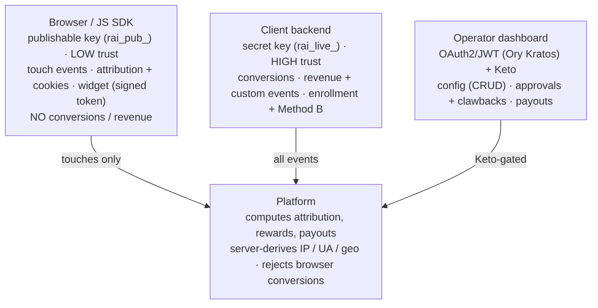
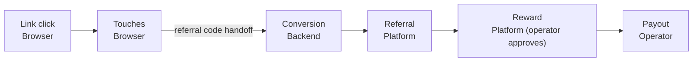

# ReferralAI — SDK vs Backend Responsibility Contract

**Version:** 3.0
**Status:** Draft for review
**Last Updated:** June 2026
**Author:** Platform Engineering — Developer Experience
**Companion:** Product Spec v4 · API Contract v1.3 · Event Model v3.0
**Supersedes:** SDK vs Backend Responsibility Contract v2.0

> **Scope.** This is a behavioural contract, not an API reference. It draws hard boundaries between what the JS SDK must do, what the client backend must do, and what must never be trusted from the browser. It deliberately avoids endpoint paths, request shapes, and field-level schemas; those live in the API Contract and the Event Model. Where this version tightens a rule relative to v2.0 — because the newer ground-truth documents changed — the change is called out in a *Reconciliation* note.
>
> *This Markdown mirrors the canonical HTML deliverable (`referralai_responsibility_contract_v3.html`); the two diagrams are rendered here as Mermaid.*

---

## 0. What Changed Since v2.0 (Read This First)

Version 2.0 was written against API Contract v1.2 and Event Model v2.1. The platform now tracks API Contract v1.3, Event Model v3.0, and Product Spec v4. Four points are load-bearing for this contract — the first three are genuine changes from v2.0, the fourth corrects a model that integrators routinely get wrong:

- **Widget identity is now established by a backend-signed token, not a browser-supplied user identifier.** The browser presents a token minted and signed by the client's backend; the platform verifies that signature server-side before it renders anything personalised. A raw user id asserted by browser code is no longer accepted. This is a security tightening, not a convenience change.
- **Revenue is carried as flat monetary fields, not a nested revenue object.** The substance is unchanged — amount, currency, recurring-revenue figures, and lifetime-value estimate still come from a trusted source — but the model is now flat for analytics and ML reasons.
- **Enrollment is selective-only and backend-owned; there is no self-enrollment and no participant portal.** Participants are enrolled by the client (API, bulk, CSV, CRM) before they can refer; the widget renders only for already-enrolled participants, and no self-enroll path exists. Participants have no platform-hosted page — the magic-link/tokenised portal was removed in v4. The browser cannot enrol anyone.
- **Authorisation uses a Keto-resolved permission snapshot in the JWT, with a live Keto re-check on high-risk actions.** The gateway resolves a dashboard caller's permissions from Ory Keto *at token issuance* and embeds them as a snapshot claim in a short-lived JWT (TTL ≤ 15 min); downstream guards authorise coarse-grained operations straight from that snapshot, while money-moving and object-scoped actions (reward approval, rejection, clawback, payout creation and confirmation, key management) always re-query Keto live so a stale token can never authorise a payout. Keto remains the source of truth. API keys are never Keto subjects — they mint an internal JWT with no permissions, key-gated to ingestion. None of this touches the SDK.

---

## 1. Design Principles

### 1.1 Why the Split Exists

The platform spans two production trust zones with fundamentally different risk profiles, plus a third zone for human operators. The JS SDK runs in the browser — an environment the client does not control, where code can be read, modified, and replayed by any visitor. The client backend runs on infrastructure the client owns, holding secret credentials that never leave server memory. The dashboard is operated by authenticated human users acting on configuration and money.

This split is the load-bearing wall of attribution integrity and revenue protection. Every rule in this contract answers a single question: **if this data were fabricated by a hostile browser, what breaks?** A fabricated touch wastes a little analytics capacity and nothing more. A fabricated conversion moves money, because conversions create rewards and rewards become payouts. That asymmetry — not a frontend/backend org chart — dictates the entire boundary.

**Figure 1 — Responsibility split by trust zone.**

Three authentication mechanisms map onto the three zones, and they are not interchangeable:

- **Publishable keys** (prefix `rai_pub_`) authenticate the JS SDK in the browser. They may submit touch events and call the SDK/widget surface, and nothing else. Trust level **low**.
- **Secret keys** (prefix `rai_live_`) authenticate the client backend and verified billing relays. They may submit every event class — touch, conversion, custom — at **high** trust. They must never appear in browser-reachable code.
- **Dashboard sessions** (OAuth2/JWT via Ory Kratos) authenticate human operators for all configuration, reward, payout, and analytics operations.

A hard boundary sits underneath all three: **API keys of either kind cannot touch configuration resources** — Programs, Campaigns, Variants, Segments, Referrers, Referrals, Rewards, Payouts, Analytics, Webhooks, or key management. Those require a dashboard session and a passing permission check. This is enforced at the gateway, not in application code, and an attempt is refused regardless of how the request is framed.

### 1.2 Threat Model Assumptions

**The browser is hostile territory.** Every value submitted under a publishable key is suspect. Claimed IP addresses, user agents, geos, timestamps, referral codes, and session identifiers carry no authority. For low-trust submissions the platform derives the security-sensitive context — hashed IP, user agent, device, geo — server-side from the request itself and ignores whatever the body claims. The SDK reports what it observed; the platform decides what to believe.

**The backend is trusted but fallible.** Secret-key events are taken at high trust: revenue, conversion signals, and confirmed identity are accepted at face value. The platform still validates schema and enforces deduplication, but it does not second-guess the backend's business data. The risk in this zone is bugs, omissions, and misconfiguration — not malice. The contract therefore optimises the backend path for *correctness and hard-to-misuse defaults*, and the browser path for *containment*.

**Partial integrations are the normal case.** Clients ship the SDK weeks before the backend sends conversions. They pass the referral code on some conversions and forget it on others. They wire up a billing provider but forget the metadata write. The platform must degrade gracefully: attribution may become less precise, but it must **never become silently wrong**. Missing data surfaces as visible coverage gaps in dashboards; it is never back-filled with invented referrals.

**Consent is volatile and per-event.** A referee may grant consent on load and revoke three clicks later. Consent is not a one-time switch; it travels on every tracked event and the platform re-evaluates it independently at processing time. A denied event is still accepted, but processed in restricted mode — no cookies, no fingerprints, no PII linkage, best-effort attribution only.

**Inbound third-party callbacks are data, never commands.** Billing and payout provider webhooks can advance a referral or a payout, but they can never alter configuration, approve a reward, or move money on their own authority. They are verified by the provider's signature scheme and then translated into internal conversion or payout signals.

**Participants have no platform account.** Per Product Spec v4, the external advocate (the Participant, named the Referrer resource in the API) never logs in. Their entire interaction surface is the embedded widget, referral links, platform emails, and QR codes — there is no platform-hosted page or tokenised portal (the magic-link micro-portal was removed in v4), and payout method is collected through the widget or a provider-hosted flow. The SDK renders the widget; the backend owns the participant's lifecycle.

### 1.3 How Keto and the JWT Actually Work (and Why the SDK Never Touches Either)

Authorisation for operators is decoupled from where it is enforced. Ory Keto is the source of truth, storing permissions as Zanzibar-style relation tuples. To avoid a Keto round-trip on every request, the gateway resolves a dashboard caller's permissions from Keto *at token issuance* and embeds them as a snapshot claim in a short-lived internal JWT (TTL ≤ 15 min). Downstream guards authorise coarse-grained operations directly from that snapshot — no Keto call — while high-risk and object-scoped operations (reward approval, rejection, clawback, payout creation and confirmation, key management, and any "can user X act on object Y" check) always re-query Keto live, so a stale token can never authorise a payout. If a permission is revoked mid-session, the live-checked actions deny immediately and the coarse actions deny on the next short-lived token refresh.

> **Note.** The JWT is not identity-only: it carries a Keto-resolved `perms` snapshot taken at issuance, and money-moving or object-scoped actions re-check Keto live on top of it. The short TTL bounds how stale a cached permission can be. This is the v1.3 model and matches the platform architecture — do not assume either a pure per-request Keto lookup or a permission-free token.

Crucially for this contract, **API keys are never Keto subjects.** An ingestion request authenticated by a publishable or secret key mints an internal JWT with no permission claim at all; keys are key-gated to ingestion and the SDK and widget surfaces, and can reach nothing else. So the SDK never holds a permissioned JWT, never participates in a Keto check, and can never reach a Keto-gated resource. Every operation that authorisation protects — approval, rejection, clawback, payout, configuration, erasure — is a backend or operator concern by construction. The browser's lack of these capabilities is not a policy the SDK is trusted to honour; it is a wall the gateway enforces.

### 1.4 The Easy Path Is the Correct Path

If doing the right thing requires a client to memorise a call sequence, coordinate timing across teams, or hand-assemble attribution chains, they will get it wrong. The minimal integration must produce correct attribution on its own. The platform supports two attribution methods, and the smallest correct integration of each must work out of the box:

- **Method A — identity matching (recommended).** The SDK captures the referral code and exposes the current attribution context through `RefRev.getAttribution()`. The frontend hands that context to the backend, and the backend includes the referral code and a confirmed referee identity on the conversion it sends. The platform computes attribution server-side.
- **Method B — payment-provider metadata.** The SDK captures the referral code; the frontend hands it to the backend at customer creation; the backend writes it into the billing provider's customer metadata. The platform reads it from verified billing webhooks and attributes the resulting payments — no explicit conversion call from the client at all.

In both methods the SDK absorbs the messy browser concerns — code extraction, consent gating, cookie and session continuity, URL cleaning — so the client's only real obligation collapses to one sentence: *when a user does something valuable, make sure the referral code travels with it.* The contract is engineered so the lazy integration is also the safe one, and so the insecure shortcut of sending conversions from the browser is not merely discouraged but impossible.

---

## 2. SDK Responsibilities

The JS SDK is the platform's eyes in the browser. It observes what happens before the user is known, preserves referral context across navigation, renders the participant-facing widget, and bridges attribution context from browser to backend. It operates exclusively under a publishable key and is bound by every low-trust constraint above.

### 2.1 Tracking Scope

The SDK's entire event remit is **touch-level signals** — the behaviour that occurs before and around a conversion. Of the platform's tracked event types, the SDK is the legitimate origin for the browser-side touches: a referee clicking a referral link, a participant sharing their link through the widget, a referee viewing a page while a referral session is active, and the participant viewing the widget itself.

The remaining engagement touches — email invitations being opened and email links being clicked — are produced **platform-side** by the email service (tracking pixel and redirect handler), not by the SDK. They arrive at high trust because the platform itself generated them. The SDK **MUST NOT** attempt to synthesise or claim these.

Touch events are the raw material of attribution; they are **not** attribution. The platform's Attribution Engine computes attribution server-side only after a conversion arrives from a trusted source. A flood of touch events with no trusted conversion produces no reward and no attribution — by design. The SDK also produces and maintains the anonymous identifiers — a session identifier and a longer-lived visitor token — that let the platform later stitch anonymous pre-conversion touches to the identified user who converts. Stitching is a platform operation; the SDK's contribution is to emit consistent identifiers that survive navigation, not to perform any linking itself.

### 2.2 Attribution Context Handling

When a visitor arrives on a referral link, the SDK extracts the referral code from the URL, validates it through the SDK link-resolution surface, and — subject to consent — persists it in a first-party attribution cookie on the client's own domain with a local-storage backup. It records the foundational click touch and cleans the referral parameter out of the URL so it does not pollute bookmarks and shares.

The SDK then exposes the current attribution context through `RefRev.getAttribution()`, which returns a **server-validated** snapshot for the frontend to pass to the backend. This single call is the designated bridge across the trust boundary; it exists specifically so the handoff is trivial and hard to get wrong.

The SDK does **not** decide attribution. It does not choose which participant gets credit, evaluate attribution windows, or determine eligibility. It captures and preserves context so the platform can make those decisions when a trusted conversion arrives. The attribution context that situates an event in a referral chain is assembled and progressively enriched server-side, never by browser code.

### 2.3 Widget Rendering

The widget is the participant's primary interaction surface, because participants have no login. On initialisation the SDK presents a **backend-signed identity token** to the widget configuration surface. The platform verifies the signature, extracts the vouched-for identity, checks enrollment, and returns the mode to render: an active-referrer experience (link, sharing tools, stats) for an enrolled participant; otherwise nothing. Under selective enrollment — which is the platform's only enrollment model — a non-enrolled user sees no widget and is given no indication the program exists. A blocked or suspended participant likewise sees nothing.

> **Reconciliation (supersedes v2.0).** v2.0 required a raw user id in SDK initialisation. Product Spec v4 and API Contract v1.3 replace this with a backend-signed token. The widget will not render on a browser-asserted identity. This closes a spoofing gap — a visitor can no longer impersonate another participant by editing an initialisation value — and it is the reason the "missing identity" mistake in §5 is reframed around the token, not the user id.

> **Reconciliation (supersedes v2.0).** v2.0 described open and selective enrollment with browser self-enrollment for open campaigns. Product Spec v4 and API Contract v1.3 remove self-enrollment entirely: enrollment is selective-only, the widget renders only for already-enrolled participants, and no self-enroll path exists. Build to selective; the browser cannot enrol anyone.

Widget interactions that represent real participant behaviour — pressing a share control — are emitted as share touches through the ingestion pipeline like any other touch.

### 2.4 Retry, Buffering, and Delivery

The browser is an unreliable delivery environment, and the SDK must behave as though every request might fail. It **MUST** retry failed submissions with exponential backoff, hold events in a bounded in-memory queue when consent is still pending, and use a page-unload-safe transport so the last events of a session are not lost on navigation. It **MUST** keep a local-storage backup of attribution data as a fallback when cookies are cleared.

Delivery is best-effort by necessity, and the platform is designed to tolerate that. The platform's secondary deduplication — a composite of referral code, session, and a short time bucket — protects touch ingestion even when the SDK cannot guarantee a perfectly stable correlation id under degraded conditions. The SDK should still make its best effort at stable identifiers; it must not rely on the platform's safety net as a substitute for trying.

### 2.5 Consent Handling

The SDK integrates with the client's consent management platform and operates in exactly three modes. In **granted** mode it sets first-party cookies, runs the full widget, and sends touches carrying the granted consent state. In **denied** mode it sets no cookies, stores nothing, and sends nothing; the widget degrades to a generic, stateless experience, and attribution remains possible only through the backend's server-side path. In **pending** mode it sets no cookies and sends nothing yet — events are queued in the bounded in-memory buffer; on a later grant the queue flushes and normal operation begins, and on a later denial the queue is discarded.

> **Reconciliation (terminology).** The SDK's three operational modes — granted, denied, pending — map directly onto the envelope's `tracking_consent` enum, which is exactly granted/denied/pending and is required on every tracked event (domain events inherit it from their triggering tracked event). In pending mode the SDK buffers rather than sending; it does not invent a separate value.

Consent gates three things together — cookie storage, event sending, and the data-collecting behaviour of the widget — and the SDK must treat them as a single live gate, re-checked on every action, not a one-time decision captured at load.

### 2.6 Explicit Boundaries

**The SDK CAN:**
- Extract referral codes and UTM parameters from the landing URL.
- Validate a code through the SDK link-resolution surface and retrieve its campaign context and reward preview.
- Set and read first-party cookies on the client's own domain, with a local-storage backup.
- Generate and maintain session and anonymous-visitor identifiers.
- Emit browser-side touch events (link clicks, shares, page views with active referral context, widget views).
- Render the participant widget per the server-returned mode.
- Expose a server-validated attribution context via `RefRev.getAttribution()`.
- Buffer events during pending consent and retry failed deliveries.
- Clean the referral parameter from the URL after capture.

**The SDK MUST:**
- Present a backend-signed identity token for the widget; if none is supplied, render no widget, log a clear console warning, and continue tracking referee touches.
- Treat consent as a live, per-action gate and attach the current consent state to every tracked event.
- Attach a session identifier to every event to support stitching.
- Persist and validate the referral code at the moment of capture, before relying on it.
- Carry the SDK version on every event for debugging and compatibility.
- Use transport-layer encryption exclusively and respect publishable-key rate limits.
- Fail invisibly from the end user's perspective — an SDK error must never break the client's page.
- Treat attribution as read-only context it reports, never a decision it makes.

**The SDK MUST NOT:**
- Send conversion events of any kind (hard-blocked at the ingestion boundary for publishable keys).
- Send revenue or any monetary value.
- Send custom behavioural events (these require a secret key and originate from the backend).
- Submit batched events.
- Claim or spoof IP, user agent, geo, or device.
- Transmit raw personal data, including raw email addresses, in event payloads.
- Compute, store, or cache any attribution, eligibility, fraud, or reward decision.
- Reach any configuration, reward, payout, or key-management resource.
- Approve, reject, hold, clawback, or otherwise influence a reward or payout.
- Set cookies, store data, or send events while consent is denied.
- Rely on the local browser environment for any security decision.

> *Reconciliation: v2.0 contradicted itself by both permitting and forbidding SDK custom events. They are forbidden — the SDK has no custom-event capability.*

---

## 3. Backend Responsibilities

The client backend is the source of truth for everything that moves money or confirms identity. It authenticates with a secret key for ingestion, and its events are accepted at high trust. That trust is a responsibility: the platform does not second-guess the backend, so the backend must send correct, timely, and complete signals.

### 3.1 Authoritative Events

The backend is the **sole legitimate source** of conversion signals: a completed signup, a completed payment, a subscription renewal, and submitted feedback. Each of these can advance a referral and can ultimately create a reward, which is precisely why none of them may originate in the browser. Each conversion **MUST** carry a confirmed referee identity — an email or the client's own external identifier (at least one of the two) — so the platform can resolve it to the right referral.

The backend is also the only source of custom behavioural events used for segmentation, propensity modelling, and analytics. Custom events do not drive the referral workflow directly; where a custom event matches a running campaign's trigger, the platform itself translates it into an internal conversion signal. That translation is the platform's job, not something the client should attempt to fake by mislabelling a custom event as a conversion.

### 3.2 Revenue and Payment Events

All monetary data originates server-side: payment amount, currency, recurring-revenue figures, and any lifetime-value estimate. These values are expressed as integer minor units (cents) paired with an ISO currency code, and recurring conversions must carry the recurring figure. Refunds and chargebacks are never expressed as negative payments; they flow through the reversal and clawback path, which requires an explicit reason and writes an immutable audit record.

Revenue is the hinge between activity and money. It feeds attribution (revenue attributed to the originating referral), reward computation (percentage and revenue-share structures), analytics, and the AI subsystem's incentive optimisation. A wrong revenue figure does not just distort a dashboard — it changes what gets paid. The backend owns that correctness.

> **Reconciliation (Event Model v3.0).** Monetary data is now carried as flat scalar fields rather than a nested revenue object. The obligation is unchanged — revenue comes from a trusted source in minor units with a currency — but integrations written against the v2.1 nested shape must flatten. (Note: API Contract v1.3 §5.1 still shows the old nested shorthand; the flat scalar form in Event Model v3.0 and the JSON Schemas is canonical.)

### 3.3 Payment-Provider Webhooks (Method B)

For clients on a supported billing provider, the backend can lean on Method B and avoid sending explicit conversions at all. Its single obligation is to **write the referral code (and click identifier) into the provider's customer metadata at customer creation**. Thereafter the platform reads that metadata from verified billing webhooks and attributes every resulting payment automatically. The relayed events arrive at high trust because the platform verifies the provider's signature before processing, and an unverifiable callback is dropped, not queued. These callbacks can advance a referral or payout but can never change configuration.

### 3.4 Participant Enrollment

The backend owns the participant lifecycle. It registers participants — singly or in bulk, and via CSV or CRM connectors — before they can share. At registration the platform resolves the participant's variant for the campaign through the segment-priority fallback chain and binds their link to that variant, so the participant's reward is fixed and known at share time rather than at referee-click time.

Enrollment is selective-only, so this backend-driven registration is the **only** way a participant comes to exist; there is no self-enroll path and the browser cannot enrol anyone. The backend **MUST NOT** delegate the decision of *who is allowed to refer* to the browser.

### 3.5 Fraud-Sensitive and Money-Moving Actions

Every action that affects money or trust is an operator/backend action authenticated by a dashboard session and gated by a Keto permission check — never by an API key. This set includes reward approval and rejection; reward clawback (reason mandatory, immutable audit trail); the two-step creation and confirmation of payouts; manual referral rejection; participant blocking and unblocking; trust-tier and participant-state changes the platform itself drives; and GDPR erasure requests. The reward lifecycle these actions operate on runs **Pending → Held → Approved → Processing → Paid**, with **Rejected** and **Reversed** as terminal off-ramps; a reward enters Held automatically when its fraud score lands in the review band or its amount exceeds the participant's trust ceiling.

The backend may *override* default automated decisions where the campaign permits it — for example, manually approving a reward that auto-approval would have held — but the authority to do so is a Keto permission, re-checked live, not a capability that travels in a token or a key.

### 3.6 Explicit Boundaries

**The backend MUST:**
- Send every conversion event under the secret key (conversions under a publishable key are rejected).
- Include a confirmed referee identity (email or external id) on every conversion.
- Provide a stable, deterministic correlation id on every event so retries deduplicate cleanly.
- Express all revenue as integer minor units with a currency code, and include the recurring figure on recurring conversions.
- Keep the secret key server-side only — never in frontend code, browser logs, or any client-reachable storage.
- Use a dashboard session (with the JWT permission snapshot, plus the live Keto re-check on money/keys) for all configuration, reward, payout, erasure, and key-management operations.
- Own participant enrollment (selective-only).
- For Method B, write the referral code and click identifier into the billing provider's customer metadata at customer creation.

**The backend SHOULD:**
- Forward the referral code obtained from `RefRev.getAttribution()` onto every conversion — the single highest-leverage thing it can do for attribution accuracy.
- Subscribe to outbound webhooks for state changes rather than polling, since ingestion is acknowledged and then processed asynchronously.
- Emit server-side touches for surfaces the browser SDK cannot see, such as native mobile apps and server-rendered pages.
- Enrich conversions with optional dimensions — plan, billing interval, first-payment and trial-conversion flags, lifetime-value estimate — to sharpen analytics and AI.
- Pass participant attributes at enrollment so segment evaluation and variant resolution have what they need.
- Carry its own internal correlation identifiers in the opaque metadata field for end-to-end tracing.

**The backend MUST NOT rely on the SDK for:**
- Conversion signals (the SDK cannot send them).
- Revenue (the SDK cannot include it).
- Custom events (these require a secret key).
- Confirmed identity (the browser only ever holds anonymous or hashed identifiers).
- Any fraud-sensitive or money-moving action — approval, rejection, hold, clawback, payout.
- Attribution, eligibility, or reward decisions (the backend sends facts; the platform decides).
- Configuration of any kind, or enforcement of consent and erasure beyond what the consent platform and SDK handle in the browser.

---

## 4. Shared Responsibilities

A few concerns sit on the boundary itself. Neither side owns them alone; both must participate, and the design is arranged so they can do so without coupling to each other. The contract is what makes the full journey debuggable — and the same journey shows who owns each hop.

**Figure 2 — Who owns each hop, from link click to payout.**

The browser owns observation, the backend owns the money signal, the platform decides (attribution, eligibility, reward computation), and the operator releases funds. Reward sits with the platform because it is *computed* there; an operator's approval — when the lifecycle calls for one — is the Keto-gated action that moves it forward. The only place the chain crosses the browser-to-backend trust boundary is the referral-code handoff, which is exactly why that handoff gets a dedicated SDK call.

### 4.1 Correlation Identifiers and Idempotency

The platform runs two distinct deduplication regimes, and conflating them is a common source of confusion. **Ingestion** deduplicates on a source-supplied correlation id scoped to the tenant over a long window, so the same business event is never recorded twice. **Resource-creating operations** deduplicate on a separate request-level idempotency key over a short window, so the same request never creates two resources. The two never share an identifier and never need to.

The split of labour is clean. The **SDK** supplies correlation ids for the touches it emits; under degraded browser conditions these may be imperfect, which is exactly why the platform layers its short-window secondary deduplication beneath touch ingestion. The **backend** supplies correlation ids for conversions and custom events, and these **MUST** be deterministic — derived from a domain fact such as the signup or the payment — so a retry reproduces the same id and deduplicates instead of double-counting. SDK-generated and backend-generated ids never have to coordinate, because deduplication is scoped per tenant and per id.

### 4.2 Identity Resolution

Identity resolution links anonymous pre-conversion touches to the identified user who converts, and it requires both sides. The **SDK** contributes the anonymous signals — session identifier, longer-lived visitor token, and the referral code itself — on every touch. The **backend** contributes confirmed identity — the email or external id — at conversion, the moment the anonymous referee becomes a known person.

The platform stitches in a strict priority order: **referral code first**, then **session**, then **email**. Code-based linkage is the most reliable and is also how Method B works, since the code lives in the provider metadata. Session linkage is strongest for same-session journeys. Email is the fallback when neither code nor session is available. **Probabilistic stitching is explicitly forbidden** — no device fingerprinting, no IP correlation, no behavioural-similarity guessing without an explicit shared identifier. A small share of unstitched events is an accepted cost; inventing links is not, both for attribution integrity and for GDPR.

The one handoff that matters above all others is getting the referral code to travel from SDK to frontend to backend to the conversion. `RefRev.getAttribution()` exists to make that handoff a single call. Everything else in identity resolution is a fallback for when that handoff did not happen.

### 4.3 Error Recovery

The system is designed to fail **noisily, not silently wrong**. When the SDK misses touches — network failures, consent revocation mid-session, blocked cookies — touch coverage degrades but the pipeline survives, because the platform can still attribute a conversion that arrives with a referral code or a matching identity. Dashboards surface attribution coverage as a quality metric so the gap is visible rather than hidden.

When the backend misses conversions, the consequences are heavier because conversions drive payouts; recovery is built in through generous conversion-side timing windows, bulk backfill via the batch ingestion path, and deduplication that makes resending always safe. When the platform itself stumbles, at-least-once delivery and idempotent processing guarantee that an acknowledged event is eventually processed, and the per-event processing status plus the business-rules guard give immediate, legible feedback when an event is refused for a campaign-level reason rather than being quietly dropped. The throughline: a coverage gap should always be observable, and the platform should never paper over one with a fabricated referral.

### 4.4 Debugging Support

Each zone contributes a different part of the diagnostic trail. The **SDK** contributes the session identifier and its own version, which together let a single visitor's browser journey be reconstructed. The **backend** contributes deterministic correlation ids drawn from its own domain and may stash internal references in the opaque metadata field. The **platform** assigns a time-ordered event id, records operational timestamps, preserves the full source and trust provenance of every event, exposes a processing status, and stamps every response with a request identifier for tracing.

Read end to end (Figure 2), these turn the responsibility split into a debuggable pipeline: a correlation id leads to an event id, which leads to a referral, which leads to an attribution decision, which leads to a reward and finally a payout. The contract's value at debugging time is that each link in that chain has a clearly responsible owner — so when the chain breaks, it is obvious which side to look at.

---

## 5. Common Integration Mistakes

These are the failure patterns the four documents predict, with the underlying misunderstanding and the way the platform's design and this contract defend against each.

### 5.1 Sending Conversions or Revenue from the Browser
The frontend already has the SDK and the signup form, so it is tempting to fire the conversion there. It is wrong because anyone with developer tools could then fabricate conversions and mint rewards. The platform removes the temptation entirely: publishable keys are scoped to touches, and a conversion or any revenue value under a publishable key is hard-rejected at the ingestion boundary. There is no configuration that loosens this.

### 5.2 Not Forwarding the Referral Code to the Backend
The SDK captures the code, but separate frontend and backend teams never bridge it across the boundary, so the conversion arrives without it. Attribution then falls back to email matching, which fails for cross-device journeys, changed emails, and multi-referral cases. The defence is to make the bridge trivial — `RefRev.getAttribution()` is one call — and to surface attribution coverage and repeated code-less conversions as visible warnings rather than silent degradation.

### 5.3 Submitting Revenue in the Wrong Units
A client sends major units where minor units are required, and every revenue figure is off by a factor of one hundred, corrupting revenue attribution, percentage rewards, and financial reporting. The platform validates that amounts are integers, the contract states minor units unambiguously, and revenue-per-referral analytics make a hundred-fold error glaringly obvious almost immediately.

### 5.4 Non-Deterministic or Missing Correlation Ids
A developer treats the correlation id as throwaway and regenerates it on every retry, so retries become duplicates — the same conversion counted twice, the same reward earned twice. The platform requires the id, returns a clear duplicate status when it sees a repeat, and the contract directs the backend to derive the id from a domain fact (the signup, the payment) so retries reproduce it. For touches, the platform's secondary deduplication absorbs the browser's imperfection; for conversions, the deterministic id is the only defence and the backend owns it.

### 5.5 Omitting the Backend-Signed Widget Token
A client copies the SDK snippet, never wires up the backend-signed identity token, and the widget silently never renders even though referee tracking works. The misunderstanding is that the widget identifies users the way analytics tools do, from a value the page supplies. It does not: identity for the widget must be vouched for by the backend, because a browser-asserted identity could be forged to impersonate another participant. The SDK logs an explicit warning naming the missing token, the integration-health view flags repeated tokenless loads, and referee touch tracking keeps working so only the widget is affected. *(This supersedes the v2.0 "missing userId" mistake; the fix is now a backend-signed token, not a raw id.)*

### 5.6 Hard-Coding Consent as Granted
Consent gating feels like friction, so a developer pins consent to granted regardless of the actual choice. This is a direct GDPR violation that also writes a false audit trail the client cannot defend under inquiry. The platform records the consent state on every event and acts on it, the contract makes copy-paste consent-platform integration the path of least resistance, and the pending mode's bounded queue means correct handling loses no events while the user decides — so there is no data-collection reason to cheat.

### 5.7 Assuming Touches Guarantee Attribution
Seeing touches in the dashboard, a client assumes attribution will follow for anyone who later converts. Touches are necessary but not sufficient: attribution also needs a trusted conversion with a linkable identity, arrival within the attribution window, an active campaign, passing eligibility, and no fraud hold. The platform makes the rest of the funnel explicit — referrals can expire, be rejected, or simply never convert — and the business-rules guard gives immediate feedback at ingestion when a touch hits an expired link or an unknown campaign, so the gap is legible rather than mysterious.

### 5.8 Sending Events Long After They Occurred
A backend batches conversions and sends them days later stamped with the send time instead of the occurrence time. Attribution-window evaluation keys off the occurrence time, so a conversion that genuinely fell inside the window can be misclassified as organic, and time-series analytics drift. The platform enforces freshness bounds on the occurrence time and rejects implausible future timestamps, and the event model is explicit that the occurrence time is the business-significant one, distinct from when the platform ingested or processed the event.

### 5.9 Reaching for an API Key to Configure or Pay
A developer carrying over an older mental model tries to manage campaigns, read analytics, or move payouts with a secret key. Under this platform, keys of either kind cannot touch configuration, reward, payout, or analytics resources at all; those require a dashboard session and a permission check. The gateway refuses any such attempt, with a message that points the developer at the right authentication path. *(API keys are never Keto subjects — they are key-gated to ingestion. Configuration, reward, and payout operations need a dashboard JWT carrying a Keto-resolved permission snapshot, with a live Keto re-check on money-moving and object-scoped actions.)*

### 5.10 Forgetting the Method B Metadata Write
A client wires up the billing webhook but never writes the referral code into the provider's customer metadata, so the platform receives payments it cannot attribute — revenue is visible in the billing provider but absent from referral attribution. The webhook side is automatic; the metadata write is the one piece of backend work Method B requires. The platform surfaces unattributed payments from a connected provider as an explicit warning, and the contract names the metadata write as the backend's single Method B obligation so it is hard to overlook.

---

**Version:** 3.0 · **Date:** June 2026 · **Status:** Draft for review · **Author:** Platform Engineering — Developer Experience

**Changes from v2.0:** re-pinned to API Contract v1.3, Event Model v3.0, and Product Spec v4; widget identity moved from a browser user id to a backend-signed token (§2.3, §5.5); self-enrollment removed — enrollment is selective-only and backend-owned, and the participant magic-link portal was removed (§0, §1.2, §2.3, §3.4); revenue flattened to scalar fields (§3.2); authorisation model stated accurately — Keto-resolved permission snapshot in a short-lived JWT with live Keto re-check on money/keys, and API keys are never Keto subjects (§1.3, §5.9); consent enum aligned to granted/denied/pending (§2.5); SDK custom-event contradiction resolved (forbidden, §2.6); reward lifecycle aligned to Pending → Held → Approved → Processing → Paid (§3.5); trust-zone and lifecycle-ownership diagrams added (Figures 1–2). This is a behavioural contract; it carries no endpoint paths, payloads, or field-level schemas.
