<!-- Auto-generated Markdown for Claude Code. Diagrams are Mermaid. Source of truth: referralai_system_application_architecture.html -->

# ReferralAI — System & Application Architecture

**Classification:** Internal — Architecture

**Status:** Implementation-ready architecture specification

**Companion Documents:** Product & Domain Spec, Public API Contract, Formal Event Model, SDK vs Backend Responsibility Contract, Failure & Observability Model

**Target Runtime:** 2-senior-engineer team, EU-hosted, cost-controlled

This specification covers both the **system architecture** — the deployed services, data stores, event bus, and workflows (§1–§9) — and the **application architecture** — how user-visible behaviour flows across them (§10–§15). §1–§9 establish the nine services and their boundaries and responsibilities; §10–§15 show how requests and events traverse them end to end.

---

# 1. High-Level System Overview

The platform is an AI-first, API-first referral marketing SaaS. It is decomposed into exactly nine NestJS microservices on AWS, wired together by a synchronous REST surface and an asynchronous SNS/SQS event bus, with Temporal.io for durable workflows. This section establishes the actors, the service set, and the rationale; §2 details each service's boundaries and responsibilities.

## 1.1 External Actors

Five categories of external actor interact with the platform, each at a distinct trust level:

| Actor | Auth | Trust & surface |
| --- | --- | --- |
| **Client Operators** | Ory Kratos session → OAuth2 JWT | Configure programs, campaigns, variants; review AI recommendations via the dashboard. Human-in-the-loop for medium/high-risk AI decisions. All mutations audited. API keys cannot reach config endpoints. |
| **Client Backends** | Secret API key (`rai_live_`) | Trusted server-side source for money-moving events: conversions, revenue. Restricted to event ingestion. Two attribution methods: Method A (referee_id via conversion events) and Method B (provider metadata via billing webhooks). |
| **Participants & Referees (JS SDK)** | Publishable API key (`rai_pub_`) | Browser actors. Participants (API: `/v1/referrers`) have no platform login and no platform-hosted page — they interact only via referral links, the in-app SDK widget, and emails. The browser never enrolls anyone; the widget renders only for already-enrolled participants. All SDK traffic is untrusted; IP/UA/geo are derived server-side. |
| **Partners** | No platform-hosted page | Elevated participants (the Ambassador → Partner path) with formalized agreements and higher trust. v4 removed the magic-link micro-portal: partners have no tokenized portal; their aggregated performance is surfaced through the same SDK/email channels, or to the client operator via the dashboard. Higher trust, larger fraud-impact surface. |
| **Webhook Consumers** | HMAC-signed deliveries | Client HTTP endpoints receiving outbound notifications. Passive — cannot mutate platform state. |

## 1.2 Internal Services

Exactly nine microservices. Each owns its data, exposes one REST API (OpenAPI/Swagger), and communicates via HTTP (sync) or SNS/SQS (async). There are no shared databases and no hidden internal APIs.

The most notable decomposition decision is the split between the **Event Ingestion Service** and the **Referral Workflow Service**. Ingestion is the most internet-exposed surface — stateless, horizontally scalable, hardened against abuse. The Referral Workflow Service is heavier and stateful, running long-running Temporal workflows and consuming events from the bus rather than from external traffic. The split means ingestion failures (DDoS, spikes, validation bugs) do not affect running workflows, and vice versa.

The **AI Intelligence Service** consumes domain events selectively, not as a blanket stream. Deterministic rules and statistical models run as code with no LLM call; LLM reasoning is reserved for batched, scheduled, or human-triggered work. Other services request AI decisions — they never embed LLM logic. This isolation is the primary control for AI cost, auditability, and safety.

## 1.3 Why This Architecture

**AI-first.** Every referral lifecycle stage has an AI touchpoint (setup, optimization, fraud, health, segmentation). The AI service processes events through three tiers — deterministic rules (zero LLM, real-time), statistical models (zero LLM, batch), and LLM reasoning (expensive, batched/triggered) — producing scored, explainable outputs that feed operational services. AI is a first-class participant, not a bolt-on.

**API-first.** The public REST API is the single integration surface for dashboard, SDK, client backends, and partner portals. Privilege separation is by authentication: API keys for ingestion + SDK, OAuth2 JWT for all CRUD, OAuth2 client-credentials for service-to-service. Identifiers are opaque ULIDs (time-ordered, sortable, 26-char Crockford Base32).

**Event-driven.** The SNS/SQS bus is the nervous system. Services emit domain events on state transitions; downstream services (including AI) consume asynchronously. This decouples lifecycles, enables replay for recovery, and provides the immutable stream AI requires. The event model separates **Tracked Events** (external, ingested via API) from **Domain Events** (internal, produced by services).

**Cost-controlled scaling.** Sized for a 2-engineer team. Service count is capped at nine; AI uses a multi-model strategy (primary, verification, fallback) via LangChain. 95%+ of event-driven AI work runs as deterministic rules and statistical models with zero LLM cost. ClickHouse handles analytics without real-time streaming infrastructure; Redis handles hot-path caching; SQS/SNS and Temporal are managed. The stack deploys on AWS `eu-central-1` with `eu-west-1` failover.

**Tradeoffs accepted:**

- The nine-service cap means most services carry broader responsibilities than pure single-responsibility would dictate (Program/Campaign and Segmentation/Eligibility are each combined). The only split beyond the original eight is Ingestion vs Referral Workflow, justified by opposite scaling profiles and blast-radius isolation.

- REST over GraphQL trades query flexibility for debugging simplicity, caching predictability, and wider client compatibility.

- Multi-model AI adds operational complexity (three keys, three cost dashboards, routing config) but removes single-vendor dependency and enables validation on high-stakes decisions.

- A single AI service scales vertically per model, not horizontally per domain — acceptable at projected volume; revisit near ~10k inferences/minute.

- ClickHouse analytics is eventually consistent (seconds, not milliseconds); Redis counters bridge real-time dashboards.

---

# 2. Service Decomposition (9 Services)

Each service is given with its name, responsibilities, what it **owns**, what it explicitly **does not own**, its database, sync APIs, and the events it publishes and consumes. The "does not own" rows are the load-bearing boundaries — they are what keep the nine services from leaking into each other.

## 2.1 Tenant Service

- **Service** — `tenant-service`
- **Responsibilities** — Authentication (Ory Kratos), authorization (Ory Keto), tenant isolation, role management (Owner/Admin/Operator/Viewer), API-key lifecycle, session management, OAuth2 token issuance (Ory Hydra), three-tier auth resolution (keys → internal JWT at the gateway)
- **Owns** — User accounts, roles, API keys, tenant records, OAuth2 clients, session tokens
- **Does NOT own** — Participant identity (Referral Workflow Service); program/campaign permissions (derived from roles per request)
- **Database** — RDS PostgreSQL — `tenant_db` (user profiles, key hashes, role assignments, tenant metadata)
- **Sync APIs** — `POST /v1/api-keys`, `DELETE /v1/api-keys/{id}`, `GET /v1/users/me`, `PUT /v1/users/{id}/roles`; internal `GET /internal/validate-token` (resolves keys and JWTs to a uniform internal JWT)
- **Publishes** — `user.registered`, `user.logged_in`, `user.role_changed`, `api_key.created`, `api_key.revoked`
- **Consumes** — None. It is a dependency of other services (token validation), not an event reactor.

Ory Kratos handles identity and self-service flows; Ory Keto provides relationship-based access control (membership, roles, resource permissions as relation tuples); Ory Hydra issues OAuth2 tokens. API keys are bcrypt-hashed; the full value is shown once at creation. Keys — secret or publishable — cannot reach CRUD endpoints (`403 authorization_error`). Company verification runs as the `account_verification` Temporal workflow (`unverified → pending_review → verified → rejected`) with a 7-day SLA, gating payout capability.

## 2.2 Program & Campaign Service

- **Service** — `campaign-service`
- **Responsibilities** — Program CRUD; Campaign lifecycle (Draft → Scheduled → Active → Paused → Ended → Archived); Variant configuration (incl. Default Variant); Pulse selection; Playbook instantiation; scheduling; enrollment-model management (`open`/`selective`); variant resolution at enrollment time
- **Owns** — Programs, Campaigns, Variants (incl. Reward Configuration, `is_default`, `priority`, `allocation_weight`), Pulses, Playbook templates
- **Does NOT own** — Runtime Referrals (Referral Workflow Service), Reward instances (Reward Service), Segments (Segmentation Service), AI recommendations (AI Service)
- **Database** — RDS PostgreSQL — `campaign_db`
- **Sync APIs** — CRUD on `/v1/programs`, `/programs/{id}/campaigns`, `/campaigns/{id}/variants`; actions `/campaigns/{id}/activate|pause|complete`; `GET /v1/playbooks`
- **Publishes** — `program.created`, `campaign.activated|paused|completed|archived`, `variant.created|updated`
- **Consumes** — `ai.recommendation_generated` (store proposals), `analytics.goal_reached` (auto-complete)

The Campaign State Machine is enforced as a finite state machine in the service layer; invalid transitions return `409`. `campaign.activated` tells Ingestion to begin accepting referrals (via its availability cache) and Referral to begin processing. Variant resolution happens at enrollment (link-generation) time, not at referee click, so a participant's reward is fixed and known when they share.

## 2.3 Segmentation & Eligibility Service

This service is the platform's single **Policy Decision Point (PDP)** for eligibility. It owns the rule *definitions* and the rule *evaluation*; it does not own the moments where rules are enforced — those are distributed as **checkpoints** across Campaign, Referral, and Reward (the Policy Enforcement Points). Centralize the judgment, distribute the moment. See §13.5 for the checkpoint chain and the call contract.

- **Service** — `segmentation-service`
- **Responsibilities** — Segment definition (rule-based, AI-generated, random, behavioral, temporal, composite); segment evaluation (real-time and batch); the **6-step eligibility rule engine** and the five-checkpoint Eligibility Chain definitions; hash-based A/B variant assignment; audience computation. Three operations are exposed and kept semantically distinct: **resolve-variant** (fails open → Default Variant), **check-eligibility** (fail-closed gate), **assign-ab** (deterministic).
- **Owns** — Segment definitions, membership records, eligibility rule sets (incl. `rule_version`), A/B allocation state
- **Does NOT own** — Actor profiles (derived from events); campaign/variant definitions (Campaign); **cap counters** (Reward); **fraud scores** (AI); **trust tier / consent** (Referral). These are *pushed in* by the calling checkpoint (§13.5), never read by this service — otherwise it becomes a god-service.
- **Database** — RDS PostgreSQL — `segmentation_db`; Redis for real-time eligibility, stable-decision caching, and hash-based assignment
- **Sync APIs** — `POST /v1/segments`, `GET /v1/segments`, `GET /v1/segments/{id}/members`; internal `POST /internal/eligibility/evaluate` (the PDP entry point; takes a versioned `EligibilityContext`, returns a decision)
- **Publishes** — `segment.member_added|removed`, `eligibility.evaluated` (carries `decision`, `denied_reasons[]`, `rule_version`, `decision_id`; denial is an outcome field, not a separate event)
- **Consumes** — `custom.recorded` (behavioral signals), `referral.*`, `participant.*` (membership updates); `campaign.*` / `participant.*` also invalidate cached decisions

Because eligibility is a synchronous hard dependency on four lifecycle paths (§13.5), this service receives the same availability treatment as Event Ingestion: 3+ replicas across ≥2 AZs, a PodDisruptionBudget, per-caller circuit breakers (open → reject, never proceed), and Redis caching of stable decisions (membership) with event-driven invalidation.

## 2.4 Event Ingestion Service

- **Service** — `ingestion-service`
- **Responsibilities** — Receive touch/conversion events from SDK and backends; schema validation; rate limiting; campaign-availability check; deduplication; consent gating; server-side context derivation; publish validated events to SNS
- **Owns** — Nothing persistent. Stateless gateway. Redis only — dedup cache + rate-limit counters + campaign-availability cache.
- **Does NOT own** — Referral records, participant profiles, links (Referral Workflow Service); campaign config (Campaign Service); eligibility decisions (Segmentation Service)
- **Database** — No RDS. Redis (ElastiCache) only.
- **Sync APIs** — `POST /v1/events`; SDK endpoints `GET /v1/sdk/widget-config`, `GET /v1/sdk/resolve-link`, `POST /v1/sdk/attribution` (publishable-key only). No SDK enroll endpoint — enrollment is selective-only and backend-owned; the browser cannot enroll anyone.
- **Publishes** — `touch.recorded` (typed subtypes), `conversion.recorded`, `custom.recorded`
- **Consumes** — `campaign.activated|paused|completed` (availability cache)

The most internet-exposed surface. Stateless and horizontally scalable (5+ replicas). If Redis is unavailable it falls back to accepting events without dedup (consumers are idempotent) and without rate limiting (SQS absorbs the burst). The validation pipeline is detailed in §12.1; its blast radius is isolated from referral workflows.

## 2.5 Referral Workflow Service

- **Service** — `referral-service`
- **Responsibilities** — Link generation; referral workflow instantiation (Temporal); referral state machine; variant resolution; identity stitching (code → session → email); participant/referee profiles; participant lifecycle & trust-tier tracking; **attribution computation** (6 models); Method B billing-webhook attribution
- **Owns** — Referral links, Referral records (Temporal instances), Participant profiles (trust tier), Referee profiles, tracking sessions, identity-stitching state, immutable **Attribution records**
- **Does NOT own** — Event ingestion (Ingestion), campaign config (Campaign), segment evaluation (Segmentation), reward creation (Reward)
- **Database** — RDS PostgreSQL — `referral_db`; Redis for hot referral state
- **Sync APIs** — `GET /v1/referrals`, `GET /v1/referrals/{id}`, `POST /v1/referral-links/generate`, `GET /v1/referrers/{id}`, `POST /v1/referrers/{id}/block`, `POST /v1/referrers/enroll` (backend-owned enrollment). No participant-facing portal — removed in v4.
- **Publishes** — `referral.created|qualified|converted|expired|rejected`, `attribution.computed`, `participant.enrolled|state_changed|trust_tier_changed`
- **Consumes** — `touch.recorded`, `conversion.recorded`, `campaign.*`, `consent.granted|revoked`, `eligibility.evaluated`, `fraud.signal_raised`

The operational core for referral lifecycle. It consumes validated events from the bus (never raw HTTP) and orchestrates each Referral as a Temporal workflow. Identity stitching is deterministic (code → session → email); probabilistic stitching is explicitly not performed. Attribution is computed inside the workflow, between conversion validation and reward creation — first/last-touch from `referral_db` (<100ms), multi-touch via a targeted point-query to ClickHouse (1–5s) — never competing with dashboard aggregations.

## 2.6 Reward & Payout Service

- **Service** — `reward-service`
- **Responsibilities** — Reward instance creation (from a Variant's Reward Configuration); approval workflows (auto/manual/AI); cap enforcement (per-referrer, -campaign, -program); fulfillment orchestration; clawback processing; payout batching
- **Owns** — Reward records (Pending → Held → Approved → Processing → Paid | Rejected | Reversed), payout batches, cap ledgers, clawback records
- **Does NOT own** — Reward Configuration (lives on the Variant in Campaign), referral lifecycle (Referral Workflow Service), fraud verdicts (AI Service)
- **Database** — RDS PostgreSQL — `reward_db`
- **Sync APIs** — `GET /v1/rewards`, `GET /v1/rewards/{id}`, `POST /v1/rewards/{id}/approve|reject|clawback`, `POST /v1/payouts`, `POST /v1/payouts/{id}/confirm`
- **Publishes** — `reward.earned|held|approved|rejected|fulfilled|reversed`, `payout.created|confirmed`
- **Consumes** — `referral.converted` (create reward), `fraud.signal_raised` (hold), `eligibility.evaluated` (gate approval)

Clawbacks are immutable corrections, not deletions. Payouts are two-step: `POST /v1/payouts` creates the batch; `/confirm` disburses. Cap enforcement is atomic via a PostgreSQL advisory lock so concurrent conversions cannot over-pay.

## 2.7 Analytics Service

- **Service** — `analytics-service`
- **Responsibilities** — Funnel analytics; KPI computation (Business → Program → Campaign → Variant → Participant); variant comparison; statistical significance testing; dashboard data; revenue analytics (MRR/ARR/LTV); read-only attribution serving
- **Owns** — Computed KPIs, funnel data, experiment results, ClickHouse materialized views. Does *not* own attribution records (owned by Referral Workflow Service, replicated to ClickHouse for reporting).
- **Does NOT own** — Raw events (consumed via SNS/SQS), campaign config (Campaign), AI models (AI)
- **Database** — ClickHouse (primary OLAP), RDS PostgreSQL — `analytics_db` (KPI snapshots), Redis (real-time counters)
- **Sync APIs** — `GET /v1/analytics/programs/{id}/kpis`, `/campaigns/{id}/funnel`, `/campaigns/{id}/variants/compare`, `/referrers/{id}/performance`, `GET /v1/attributions`
- **Publishes** — `kpi.computed`, `analytics.goal_reached`, `analytics.anomaly_detected`
- **Consumes** — All reporting-relevant events into ClickHouse (touch, referral, reward, attribution)

A pure reporting and aggregation engine. It does **not** compute attribution. ClickHouse ingestion is via a dedicated batch consumer (every 5s), introducing 5–30s analytics lag — fine for dashboards, never used for real-time eligibility (Redis counters serve that).

## 2.8 Notification & Webhook Service

- **Service** — `notification-service`
- **Responsibilities** — Outbound webhook delivery; transactional email; in-app dispatch; webhook signing (HMAC-SHA256); retry with backoff; endpoint health monitoring; per-config event filtering; **provider-specific inbound receivers** (Method B)
- **Owns** — Webhook endpoint configs, delivery logs, notification templates, delivery state
- **Does NOT own** — Event content (consumed from SNS), user preferences (Tenant Service)
- **Database** — RDS PostgreSQL — `notification_db`
- **Sync APIs** — `POST/GET/PUT/DELETE /v1/webhooks`, `GET /v1/webhooks/{id}/deliveries`
- **Publishes** — `webhook.delivered|failed`, `notification.sent`
- **Consumes** — All domain events (filtered SQS), per webhook configuration

Signing: `HMAC-SHA256(secret, "{timestamp}.{body}")`. Retry: 1m → 5m → 30m → 2h → 12h → 24h (7 attempts); 50 consecutive failures auto-disables the endpoint with owner notification. Webhook payloads are pinned to the subscription's `api_version`. Email via AWS SES. The inbound receivers verify each provider's own signature and translate callbacks to internal conversions (data, never commands).

## 2.9 AI Intelligence Service

- **Service** — `ai-service`
- **Responsibilities** — All LLM reasoning and agent orchestration; fraud scoring (rules + ML); propensity scoring; campaign optimization; incentive optimization; segmentation suggestions; program health score; insight generation
- **Owns** — AI decision logs, versioned prompt templates, agent configs, fraud/propensity models, the Tool Registry, recommendation records (with accept/reject outcomes)
- **Does NOT own** — Operational data (read via tools), campaign/reward/referral state (owned by their services)
- **Database** — RDS PostgreSQL — `ai_db`; Redis for inference caching
- **Sync APIs** — internal `POST /internal/ai/fraud-score`, `/recommendations/{type}`, `/health-score`; `GET /v1/ai/recommendations`, `POST /v1/ai/recommendations/{id}/accept|reject`, `GET /v1/ai/insights/{program_id}`
- **Publishes** — `ai.recommendation_generated`, `ai.fraud_score_updated`, `ai.health_score_computed`, `ai.insight_generated`, `fraud.signal_raised`
- **Consumes** — Selective, filtered SQS — not a blanket subscriber (see §4 for the tiered routing)

---

# 3. Communication Flows

## 3.1 Synchronous (HTTP)

Synchronous calls are used only when the caller needs the response before it can proceed. The platform minimizes them to reduce coupling and latency chains.

| Caller → Callee | Path | Purpose |
| --- | --- | --- |
| All → Tenant | `GET /internal/validate-token` | Authentication on every inbound request (gateway). |
| Campaign → Segmentation | `POST /internal/eligibility/evaluate` | Entry checkpoint at enrollment (gate + variant resolution + A/B). |
| Referral → Segmentation | `POST /internal/eligibility/evaluate` | Referral & Conversion checkpoints (blocking gate). |
| Reward → Segmentation | `POST /internal/eligibility/evaluate` | Reward & Payout checkpoints (gate; called inside Temporal). |
| Reward → Campaign | `GET /internal/variants/{id}/reward-config` | Blocking read of reward config at reward creation. |
| Referral → AI | `POST /internal/ai/fraud-score` | Semi-blocking Tier A score (no LLM); proceeds with null on timeout. |
| Analytics → AI | `POST /internal/ai/health-score` | Non-critical; failures serve a stale score. |

| Call | Timeout | Retries | Circuit breaker / fallback |
| --- | --- | --- | --- |
| Token validation | 500ms | 1 (100ms) | Open after 5 fails/10s → reject (fail-closed) |
| Eligibility — interactive (Entry, Referral) | 2s | 2 (exp) | **Hard dependency, fail-closed.** Open after 10/30s → reject `eligibility_unavailable`; caller (client backend / referee) retries. |
| Eligibility — in-workflow (Conversion, Reward, Payout) | 3s | activity retry | **Fail-closed → durable retry.** The Temporal activity retries with backoff until the PDP answers — no reward is approved un-checked, and none is lost (delayed, not dropped). |
| Reward config | 1s | 2 (exp) | Open after 5/10s → fail creation, retry via SQS |
| AI fraud score | 3s | 0 | Open after 5/10s → proceed null, queue async re-score |
| AI health score | 5s | 1 | No breaker (non-critical) → serve cached |

Eligibility is a synchronous **must**, not best-effort: every checkpoint either gets a fresh decision or the action does not proceed. On interactive paths that means a `4xx` the caller retries; on workflow paths the Temporal activity retries durably until the PDP responds. The one part of eligibility that is *not* fail-closed is **variant resolution**, which falls through to the Default Variant on a missing-attribute non-match — a rule-evaluation semantic, decided per rule, never a reason to block enrollment (§13.5).

The only sync AI call in the critical path is fraud scoring, and it invokes Tier A deterministic rules — not an LLM — returning in <100ms. LLM-based fraud analysis runs only in daily batch, never in the request path.

## 3.2 Asynchronous (SNS / SQS)

SNS topics are the event bus. Each service publishes to one topic per event category; each consuming service has exactly one inbound FIFO SQS queue named for the destination service. Subscription filters route the right events to the right queue. FIFO guarantees ordering within a message group and exactly-once delivery.

**Event fan-out — one publisher, filtered per-consumer queues**

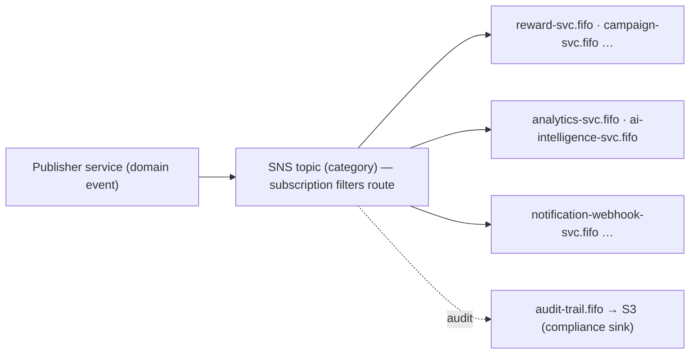

**SNS topics** (publisher → key subscribers): `ingestion-events` (Ingestion → Referral, AI, Analytics, Segmentation); `referral-events` incl. `attribution.computed` (Referral → AI, Analytics, Reward, Segmentation); `participant-events` (Referral → Analytics, Notification, Segmentation, AI); `campaign-events` (Campaign → Ingestion, Referral, AI, Analytics); `reward-events` (Reward → AI, Analytics, Notification); `ai-events` (AI → Campaign, Referral, Reward, Notification); `segmentation-events` (Segmentation → Referral, AI); `analytics-events` (Analytics → Campaign, AI, Notification); `tenant-events` (Tenant → Notification).

**Idempotency.** All consumers are idempotent: Ingestion dedups on `tenant_id + external_id` (90-day Redis window); Referral and Reward on `referral_id + event_type`; AI on `event_id` (24h); Analytics via ClickHouse `ReplacingMergeTree` on `event_id`; Notification on `event_id + webhook_id`. SQS visibility timeout is 6× expected processing time; failed messages move to a DLQ after 5 attempts.

---

# 4. AI & Agentic Architecture

## 4.1 Why AI is isolated, and how LangChain is used

The AI Intelligence Service is the single home for LLM logic for five reasons: **cost control** (one monitoring point, one rate limiter, one budget alarm; the three tiers ensure only high-value reasoning incurs LLM cost), **auditability** (every prompt, response, tool call, and reasoning chain logged in one `ai_db`), **safety** (AI outputs are suggestions; other services decide whether to act), **model management** (prompt versioning, model routing, fallback in one codebase), and **operational simplicity** (one log stream and dashboard set for a 2-engineer team).

LangChain is the abstraction between business logic and providers: `ChatModel` abstracts the provider (primary/verification/fallback by env config); each agent is an `AgentExecutor` with a versioned system prompt and a toolset; tools are `StructuredTool` classes wrapping authenticated HTTP calls; an `OutputParser` enforces typed JSON (one correction retry on failure). Agents are **invoked, not continuously running** — single-turn, stateless per invocation, bounded to a maximum of 5 tool calls. State between invocations is reconstructed from `ai_db`. Prompts are versioned records (one active version per agent type); every decision log references the prompt version used, enabling full reproducibility.

## 4.2 Tool Registry

The Tool Registry is the boundary between what AI can *see* and what it can *do*. Every tool is registered with read/write classification, tenant scope, and audit requirements.

| Read-only tools (the AI can see) | Source service |
| --- | --- |
| `read_programs`, `read_playbooks` | Campaign |
| `read_campaign_kpis`, `read_variant_comparison`, `read_funnel_data`, `read_program_health`, `read_benchmarks` | Analytics |
| `read_referrer_history`, `read_touch_events`, `read_ip_cluster_data`, `read_velocity_metrics` | Referral Workflow |
| `read_reward_costs` | Reward |
| `read_segment_definitions` | Segmentation |

| Write tools (the AI can act — guarded) | Target · risk |
| --- | --- |
| `hold_reward` | Reward · 🟢 reversible, logged |
| `flag_referrer` | Referral Workflow · 🟡 notifies human review |
| `create_segment_suggestion` | Segmentation · 🟡 proposal only |

No write tool exists for banning a referrer, rejecting a referral, clawing back a reward, or modifying fraud rules — 🔴 actions are not exposed as tools at all, so the agent layer cannot reach them. Tool calls are tenant-scoped (mandatory `tenant_id`; cross-tenant → `403`) and rate-limited to 100 calls/min per tenant.

## 4.3 Processing tiers, agents & decision boundaries

Work flows through three cost tiers — this is the primary mechanism keeping LLM cost bounded (95%+ of event-driven work is zero-LLM):

**AI processing tiers**

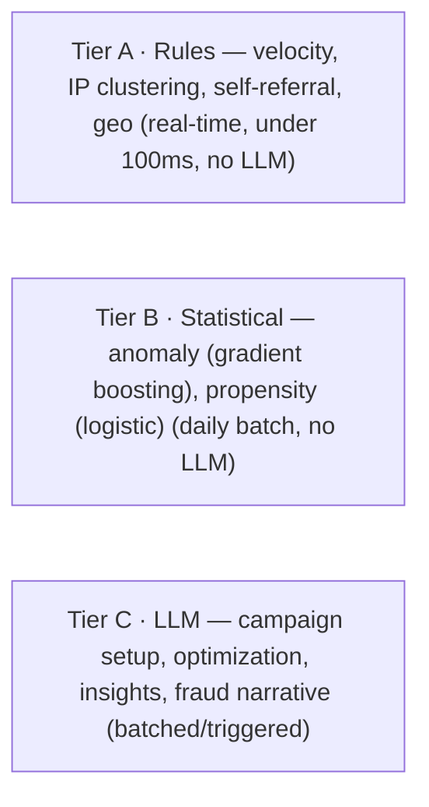

| Agent | Triggered by | Can suggest | Cannot do |
| --- | --- | --- | --- |
| **Campaign Setup** | Dashboard "AI Setup" / Playbook customization | Complete proposals: Pulse, Variants, Segments, Reward Config, schedule | Activate, commit, approve budgets, modify live campaigns |
| **Optimization** | Daily schedule + `analytics.anomaly_detected` | Reward/timing changes, variant promotion, segment refinement, budget reallocation | Modify campaigns directly, change rewards, pause, approve payouts |
| **Fraud Detection** | Tier A real-time · Tier B batch · Tier C on escalation | Fraud scores & signal types; auto-hold rewards (🟢); flag referrers (🟡) | Ban referrers, clawback, auto-reject referrals (🔴 — human only) |
| **Insight Generation** | Daily + health-score threshold crossings | Categorized insights (Anomaly/Opportunity/Quick Win/Benchmark/Risk/Trend) | Anything — purely informational, no write tools |

| Agent | 🟢 Auto-execute | 🟡 Recommend (human review) | 🔴 Cannot do |
| --- | --- | --- | --- |
| Campaign Setup | — | Campaign proposals, Playbook customizations | Activate, approve budgets |
| Optimization | — | Reward adjustments, variant promotion, timing | Modify live campaigns, change rewards, approve payouts |
| Fraud Detection | Hold rewards, create flags, score referrals | Referrer flagging | Ban, clawback, auto-reject |
| Insight Generation | Publish insights | — | Any write action |

---

# 5. Workflows & Temporal.io

Temporal orchestrates all long-running, stateful processes — durable across restarts, network failures, and deploys. Each Pulse maps to a workflow definition; each Referral is a workflow execution. Attribution is a step inside the referral workflow, between conversion validation and reward creation.

| Workflow | AI role |
| --- | --- |
| **Referral Lifecycle** (per Pulse) | Fraud score at create/convert. Advisory — proceeds without a score if AI is down; if score > threshold, transitions to `Held` and waits for a human signal. |
| **Campaign Optimization** (scheduled) | Daily recommendations per active campaign. Purely advisory — published as events, never mutating campaigns. |
| **Reward Approval** | Waits for fraud scoring before auto-approving. `auto` + clean → AI decisive within guardrails; `manual` → always waits for a human signal. |
| **Fraud Review Escalation** | Surfaces evidence + recommendation; human decides approve/reject/ban. 72h reminder, 7d escalate. |
| **Health Score** (scheduled) | Daily Insight Agent per program; informational, no state mutation. |

```text
Reward Approval (trigger: referral.converted)
  1 create_reward_instance(referral_id, variant_reward_config)   -> EARNED/Pending
  2 request_fraud_score(referral_id)                             -> 30s; null on timeout
  decision:
    auto  & score < 0.3   -> auto_approve_reward            -> Approved
    auto  & score >= 0.3  -> hold_reward_for_review         -> Held; wait human (7d escalate)
    manual               -> queue_for_manual_approval        -> Held; wait human (no timeout)
  3 publish reward.approved | reward.rejected
```

```text
Fraud Review (trigger: fraud.signal_raised)
  1 gather_fraud_evidence(referrer_id, signal_type)   (Referral + AI reasoning chain)
  2 create_review_ticket -> notify_operator
  wait operator_decision:  72h -> reminder ;  7d -> escalate_to_owner
    approve -> clear_fraud_flag
    reject  -> reject_pending_rewards
    ban     -> block_referrer        # human-only; AI cannot reach this path
```

---

# 6. Data & Analytics Architecture

**Operational vs analytics.** Operational data lives in per-service PostgreSQL (source of truth for current state; point lookups; ACID). Analytics data lives in ClickHouse (historical aggregation; denormalized; eventual, 5–30s behind). Redis bridges the two with real-time counters for live dashboard indicators.

|  | Operational | Analytics |
| --- | --- | --- |
| Source | Service PostgreSQL | ClickHouse |
| Latency | <50ms (point lookups) | 5–30s (eventual) |
| Query | `WHERE id = X` | `GROUP BY campaign_id, date` |
| Use for | Eligibility, fraud gates | KPIs, funnels, A/B results |
| Consistency | Strong (ACID) | Eventual (Redis bridges) |

All domain events flow into ClickHouse via the Analytics Service's dedicated FIFO queue; a worker batch-inserts (1000 events or 5s). The table is a `ReplacingMergeTree` ordered by `(tenant_id, event_type, occurred_at, event_id)`, deduplicating replays on merge.

```text
events (ReplacingMergeTree, PARTITION BY toYYYYMM(occurred_at), TTL 24 months)
  event_id, external_id, tenant_id, event_type, schema_version, occurred_at, ingested_at,
  actor_type, actor_id, actor_email_hash,
  campaign_id?, variant_id?, referrer_id?, referral_id?,
  revenue_amount?, revenue_currency?, revenue_mrr?, revenue_arr?,   -- flat, minor units
  properties (JSON string), source, trust_level
```

The flat structure is deliberate: ClickHouse performs best on flat columns, and the event model uses flat properties for ML feature extraction. The AI service reads ClickHouse for batch features and Redis for real-time signals. Multi-touch attribution issues a targeted point-query (not a wide aggregation), so it completes in 1–5s even under dashboard load.

---

# 7. Observability & AI Traceability

**Trace propagation.** OpenTelemetry spans every service, queue, and Temporal workflow. `traceparent`/`tracestate` ride HTTP headers and SQS message attributes, so a single trace runs from "SDK touch ingested" through "SQS consumed by AI" through "fraud score" to "reward held." Temporal's OTel interceptor propagates context across workflow and activity executions. All spans export to Grafana Cloud (Tempo traces, Loki logs, dashboards).

**AI decision logs.** Every agent invocation writes an entry in `ai_db` keyed by the trace id, so any dashboard recommendation ties back to the exact prompt, model, inputs, and reasoning that produced it:

```text
decision: decision_id, agent_type, prompt_id, prompt_version,
          model_identifier, model_role (primary|verification|fallback),
          verification_result?, tenant_id, trigger_event_id,
          input_context (sanitized, no raw PII), tool_calls[], parsed_output (incl. reasoning),
          latency_ms, token_count, cost_estimate
```

Grafana dashboards cover AI cost/spend per model per tenant per day, tier distribution, agent latency and token counts, recommendation accept/reject rates, and platform-wide latency/error/throughput.

---

# 8. Security, Privacy & Trust Model

**AI access control.** The Tool Registry is the AI access layer. The AI service authenticates to other services with a service-to-service JWT (`service_id: ai-service`, scope `internal_read`/`internal_write`). Every tool call carries `tenant_id`; cross-tenant access returns `403`. Write tools require `internal_write` and are further gated by risk: 🟢 execute directly, 🟡 execute + notify for review, 🔴 are not exposed as tools. Tool calls are rate-limited to 100/min per tenant.

> **Why this is scope-based and not a Keto check.** §13.1 establishes that *operator* permissions are never baked into a token — every money- or config-touching dashboard request is evaluated live against Ory Keto. The AI service is the deliberate exception, and the distinction is the principal, not the mechanism. Keto answers “may *this user* perform this action on this resource right now?” — a per-subject, per-resource, fast-changing question. The AI service is not a subject with per-resource permissions; it is a fixed internal component whose entire authority is the static, code-reviewed Tool Registry. A coarse `internal_write` scope plus the risk gate (🟢/🟡/🔴) expresses that authority exactly: the set of write tools is what the AI may ever do, and it changes only by a code change, not by a runtime grant. Crucially, no AI write tool reaches a money- or config-mutating endpoint that an operator would need `rewards:approve` / `rewards:reject` / `rewards:clawback` for — the single reversible `hold_reward` pauses money movement without moving or denying it, so the AI path never bypasses the operator's Keto gate. Put differently: Keto governs *who decides*; the Tool Registry governs *what the AI may propose or reversibly stage*, and the irreversible decision still routes through a Keto-gated human.

| Layer | Tenant-isolation mechanism |
| --- | --- |
| API Gateway | API-key/JWT validation extracts `tenant_id`; carried downstream. |
| Service layer | Every query includes `WHERE tenant_id = ?`, enforced by middleware that rejects queries without tenant context. |
| Database | Per-service DBs, row-partitioned by `tenant_id` (no per-tenant DBs at this stage). |
| ClickHouse | `tenant_id` in all WHERE clauses; per-tenant materialized views where needed. |
| SQS/SNS | `tenant_id` in the envelope; consumers filter where applicable. |
| AI service | Tool Registry always passes `tenant_id`; prompts never contain other tenants' data. |
| Redis | Keys prefixed `tenant:{tenant_id}:`; no global keys hold per-tenant data. |

**GDPR & AI.** Data minimization — tools return summaries, not raw streams; raw events are filtered to the specific referrer under investigation. On an erasure request, PII in events and in AI decision logs is replaced with hashed tokens while the decision structure is preserved for audit. **No model training on tenant data** — inference only, via pre-trained models under provider data-processing agreements; the consent gate keeps non-consented referees out of individual-level AI analysis. AI decisions are explainable (the reasoning field) and never fully automated — high-risk actions require human confirmation, and even 🟢 auto-actions are logged, auditable, and reversible.

| Concern | Boundary |
| --- | --- |
| Model training | No. The platform uses pre-trained LLMs via API. Fraud ML models are trained offline on anonymized, aggregated data by engineering — not in production. |
| Fine-tuning | No. Versioned prompt engineering is the customization mechanism. |
| Inference | Yes, inference-only. Tenant data enters the context window for the call duration and is not retained. |
| Statistical-model features | Behavioral (velocity, conversion rate, timing) — no PII features. |
| AI data retention | Decision logs 24 months; prompt versions indefinite; model artifacts versioned in S3. |

---

# 9. Overall Architecture Diagram

The whole platform on one page: external actors enter through the gateway; nine services own their data and exchange domain events on the bus; Temporal, ClickHouse, Redis, and S3 sit beneath; OpenTelemetry feeds Grafana Cloud.

**ReferralAI — system map**

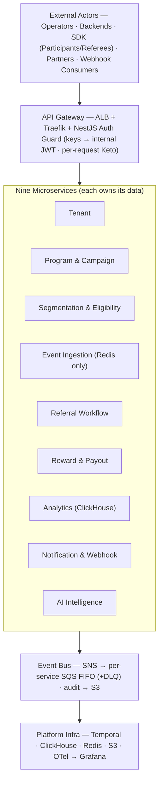

Arrows show the request path top-to-bottom. Every service also publishes to and consumes from the Event Bus, and exports traces/logs/metrics to OpenTelemetry → Grafana Cloud. Colors match the rest of the document: slate = external/entry, dark = core domain services, amber = AI / bus, mint = money & infrastructure, grey = supporting services.

---

# 10. System & Application Architecture Overview

The system is a set of nine NestJS services on AWS. This section separates that into two views that are deliberately not the same diagram: the **system view** (what is deployed and how it is wired) and the **application view** (what a user-visible action does as it crosses the system). The system view is stable and slow-changing; the application view is where product behaviour lives and where most of the reasoning here happens.

## 10.1 Definitions used in this document

**System architecture** means the deployed topology: the nine services, their owned RDS databases, the SNS/SQS event bus, Temporal.io, ElastiCache Redis, ClickHouse, S3, the Ory stack, and the OpenTelemetry → Grafana Cloud pipeline. It answers “what runs, what owns which data, what talks to what.” It is not changed here.

**Application architecture** means the use-case layer: how a concrete user action (“a referee signs up via a link”, “a reward is paid”, “an operator accepts an AI recommendation”) becomes a path through controllers, application services, domain models, Temporal workflows, and events. It answers “what happens, in what order, in which service, with which guarantees.” The application view is an *emergent* property of the system view plus the event and workflow wiring.

The two views meet at three seams: the **HTTP edge** (dashboard, SDK, backend requests), the **event bus** (SNS topics → per-destination FIFO SQS queues), and **Temporal** (durable orchestration of anything that waits, retries, or spans services). Every flow in §11 is described in terms of those three seams.

## 10.2 Use-case → system mapping

This maps the core user journeys to the services they traverse, the Temporal workflows they touch, and where (if anywhere) AI participates. AI involvement is always one of: *none*, *advisory* (recommendation surfaced to a human), or *auto-execute-within-guardrails* (a reversible 🟢 action). No flow lets AI take an irreversible 🔴 action.

| Use-case | Participating services | Temporal workflow(s) | AI involvement |
| --- | --- | --- | --- |
| **Participant enrolled & link generated** | Tenant (auth), Campaign (variant config), Segmentation (variant resolution), Referral (link + profile) | None (synchronous) | None |
| **Referee signs up via link (Method A)** | Ingestion, Referral, Segmentation, Reward, Analytics, Notification, AI | Referral Lifecycle (per Pulse) | Advisory + 🟢 (Tier A fraud score; can auto-hold reward) |
| **Conversion via billing webhook (Method B)** | Notification (inbound receiver), Ingestion, Referral, Reward, Analytics, AI | Referral Lifecycle (resumed on conversion) | Advisory + 🟢 (same fraud path as Method A) |
| **Reward earned → approved → paid** | Reward, Campaign (reward-config read), AI (fraud), Notification, Analytics | Reward Approval; Fraud Review (if held) | 🟢 auto-hold; advisory for approve/reject; 🔴 ban/clawback human-only |
| **Campaign set up / optimized by AI** | AI, Campaign, Segmentation, Analytics, Notification | Campaign Optimization (scheduled) | Advisory only (proposals; no live mutation by AI) |
| **Fraud escalation & review** | AI, Referral, Reward, Notification, Tenant (operator identity) | Fraud Review Escalation | Advisory (evidence + recommendation); human decides |

The rest of this document is a zoom-in on these rows: §11 walks the flows, §12 looks inside the services that carry them, §13 covers the concerns that cut across all rows, and §14 isolates the AI column.

---

# 11. Application Architecture: Core End-to-End Flows

Each flow is given as a narrative, a stepwise table (step → service → events/workflow), and one swimlane. Conventions: `SDK` = browser JS SDK (publishable key); `CB` = client backend (secret key); the nine services use their short names. Events in `code` are SNS-published unless marked *(sync)*. The reward lifecycle runs `Pending → Held → Approved → Processing → Paid`, with `Rejected` and `Reversed` as terminal off-ramps.

How to read the flow diagrams: **solid arrow** = synchronous call · **dashed arrow** = async event · numbered badges = step order · amber = sync gate / human step · mint = money path · rose = error / reversal.

## 11.1 Flow 1 — Referral Signup & Conversion (Method A)

A Participant (Alice) has enrolled and holds a variant-bound link. A referee (Bob) clicks it, browses, signs up, and later pays. Method A means the **client backend sends conversion events** keyed by `referee_external_id` (or `referee_email`) — at least one identity anchor is mandatory, or the conversion is rejected at schema validation.

**What the SDK does:** on link landing it calls `GET /v1/sdk/resolve-link` for campaign context and cookie TTL, sets the attribution cookie, and emits `touch.link_clicked` / `touch.page_viewed` via `POST /v1/events`. The SDK never claims IP/geo/device — those are derived server-side at ingestion. The SDK cannot send conversion or custom events; those are publishable-key-forbidden.

**What the client backend does:** at signup and at payment it calls `POST /v1/events` under the *secret* key with `conversion.signup_completed` then `conversion.payment_completed`, carrying the referee identity anchor, a deterministic `external_id` for dedup, and revenue as flat minor-unit scalars + ISO currency (recurring conversions must include `revenue_mrr`).

**Where attribution is computed:** inside the Referral Lifecycle Temporal workflow, between conversion validation and reward creation — never in Analytics. Attribution uses the campaign’s configured model (`first_touch`, `last_touch`, `linear`, `time_decay`, `position_based`, `ai_weighted`).

**Where fraud & eligibility apply:** eligibility is a blocking sync call to Segmentation at referral creation; fraud is the AI Tier A deterministic score (sync, <100ms, no LLM) at creation and again at conversion. Both degrade gracefully — eligibility failure rejects the referral with `eligibility_unavailable`; fraud-unavailable proceeds with `fraud_score: null` and queues async re-scoring.

| # | Step | Service | Events / Workflow |
| --- | --- | --- | --- |
| 1 | Bob clicks link; SDK resolves link, sets cookie, emits touch | Ingestion | `touch.link_clicked`, `touch.page_viewed` |
| 2 | Ingestion validates, dedups, enforces Business Rules Guard, derives context, publishes | Ingestion | publish to `ingestion-events` |
| 3 | Referral consumes touch, creates Referral (`Pending`), calls eligibility | Referral → Segmentation *(sync)* | `referral.created`; `POST /internal/eligibility/evaluate` |
| 4 | Referral requests Tier A fraud score at creation | Referral → AI *(sync)* | `POST /internal/ai/fraud-score` |
| 5 | Bob signs up; CB sends signup conversion (secret key) | Ingestion | `conversion.recorded` (`signup_completed`) |
| 6 | Referral matches conversion via identity anchor; state → `Qualified` | Referral | `referral.qualified` |
| 7 | Bob pays; CB sends payment conversion with revenue | Ingestion | `conversion.recorded` (`payment_completed`) |
| 8 | Workflow validates conversion, re-scores fraud, computes attribution; state → `Converted` | Referral (Temporal) | Referral Lifecycle WF; `attribution.computed`, `referral.converted` |
| 9 | Reward consumes `referral.converted`, reads variant reward-config, creates reward (`Pending`) | Reward → Campaign *(sync)* | `reward.earned`; `GET /internal/variants/{id}/reward-config` |
| 10 | Reward Approval workflow runs the decision function (see Flow 3) | Reward (Temporal), AI | Reward Approval WF |
| 11 | Analytics ingests every event into ClickHouse (5–30s lag); Notification fires client webhooks | Analytics, Notification | consumes all above; outbound `reward.*` |

**Flow 1 — Method A: click → signup → payment**

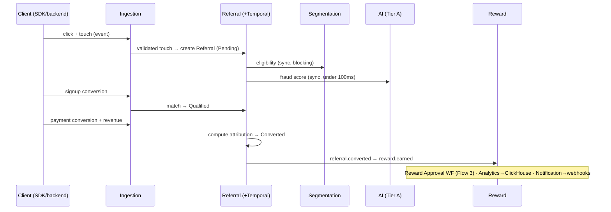

_Then: Reward Approval workflow runs (Flow 3) · Analytics batch-inserts to ClickHouse · Notification fires client webhooks._

**Happens here / never here:** attribution is computed only inside the Referral Lifecycle workflow; it never happens in Analytics or Reward. The conversion→reward link is established only by `referral.converted`; Reward never reads raw conversion events directly.

## 11.2 Flow 2 — Referral Attribution via Billing Webhooks (Method B)

The client never sends conversion events. At customer-creation time the client backend writes `refrev_ref_code` (and optionally a click id) into the billing provider’s customer metadata (Stripe `customer.metadata`, Paddle `custom_data`, Chargebee `meta_data`). Thereafter the provider’s payment webhooks drive attribution automatically. This metadata write is the client backend’s *single* Method B obligation; forgetting it is a high silent-failure-risk case — payments arrive but attribute to nothing.

> **Inbound receivers.** Method B does not enter through `POST /v1/events`. The Notification & Webhook Service hosts **provider-specific inbound receivers** that verify the provider’s own signature scheme, then translate the callback into an internal `conversion.recorded` (+ revenue) or a payout-state transition. The public ingestion API trusts platform keys and a uniform schema; provider callbacks use foreign signatures and payloads, so they need a dedicated, hardened translation surface. **Inbound callbacks are data, never commands** — a payload can advance a referral or payout but can never change configuration.

**Guarantees:** idempotent by the provider’s native event id, mapped onto the platform `external_id`; a signature failure returns `401` and the payload is *dropped, not queued*; a callback for an unknown tenant/connection returns `404`. A refund or chargeback that arrives *after* payout does not reverse inline — it enters the reversal/clawback path (negative ledger entry + trust penalty) and emits `reward.reversed`.

| # | Step | Service | Events / Workflow |
| --- | --- | --- | --- |
| 1 | Click + cookie + touch (identical to Method A steps 1–4) | Ingestion, Referral, Segmentation, AI | `touch.*`, `referral.created` |
| 2 | Client backend creates the billing customer with `refrev_ref_code` in metadata | (client side) | none on platform |
| 3 | Provider sends payment webhook to the platform inbound receiver | Notification (inbound receiver) | verify provider signature |
| 4 | Receiver reads `refrev_ref_code`, maps native event id → `external_id`, translates | Notification → Ingestion path | internal `conversion.recorded` + revenue |
| 5 | Referral resumes the Lifecycle workflow on the synthesized conversion; computes attribution | Referral (Temporal) | `attribution.computed`, `referral.converted` |
| 6 | Reward / Analytics / Notification proceed exactly as Method A from `referral.converted` onward | Reward, Analytics, Notification | `reward.earned` → Approval WF |
| 7 | Late refund/chargeback callback → reversal path | Notification → Reward | `reward.reversed` (+ trust penalty) |

**Flow 2 — Method B: provider webhook → attribution**

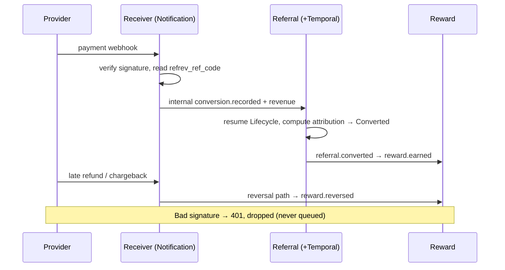

_Prerequisite: the client backend has written refrev_ref_code into the provider's customer metadata. A bad signature → 401, dropped (never queued)._

**Happens here / never here:** attribution still happens only in the Referral Lifecycle workflow — Method B changes *how the conversion enters*, not where it is computed. The AI fraud path is identical to Method A. A provider payload with a bad signature is never queued and never reaches the bus.

---

## 11.3 Flow 3 — Reward Earned → Approved → Paid

From `referral.converted` to a paid reward. The Reward Approval workflow is where the **approval decision function** runs. It joins three already-known inputs: the AI fraud score, the Participant trust tier, and the reward amount versus the trust ceiling and remaining budget. `Held` is a first-class state: it fires when the fraud score lands in the review band or the amount exceeds the trust ceiling.

**Reward Lifecycle**

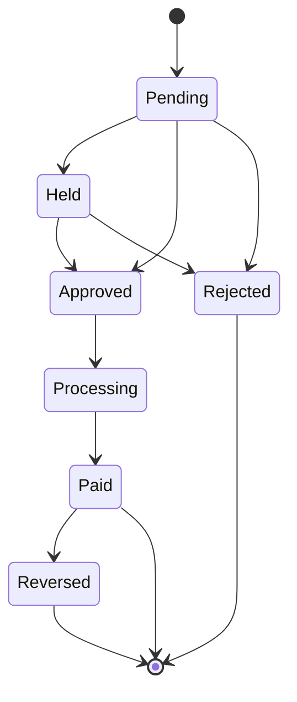

Internal event mapping: `reward.earned` on creation (→ `Pending`), `reward.held`, `reward.approved`, `reward.fulfilled` (→ `Paid`), `reward.reversed` (clawback/refund). Outbound webhooks carry the names `reward.calculated/held/approved/paid/reversed`.

The decision function is deterministic and auditable:

```text
approve(reward):
  if   fraud_score > checkpoint_block_threshold   -> BLOCK + fraud alert      (reversible)
  elif fraud_score in [0.3, 0.7]                  -> HELD  (human review)
  elif amount > trust.auto_approve_ceiling        -> HELD  (human review)
  elif budget_remaining < amount                  -> BLOCK ("budget depleted")
  elif trust == Advocate                          -> APPROVED (instant)
  else                                            -> APPROVED then hold-period timer
  # MVP override: ALL rewards -> HELD + manual review + 7d hold + EUR1000/mo cap
```

| # | Step | Service | Events / Workflow |
| --- | --- | --- | --- |
| 1 | `referral.converted` triggers Reward Approval workflow | Reward (Temporal) | Reward Approval WF start |
| 2 | Create reward from variant reward-config; cap check under advisory lock | Reward → Campaign *(sync)* | `reward.earned` (`Pending`) |
| 3 | Request fraud score (30s timeout; null on timeout) | Reward → AI *(sync)* | `POST /internal/ai/fraud-score` |
| 4 | Run decision function (fraud band, trust ceiling, budget) | Reward (Temporal) | — |
| 5a | *Clean + under ceiling + Advocate* → auto-approve | Reward | `reward.approved` |
| 5b | *Fraud in [0.3,0.7] or amount over ceiling* → hold, wait for human signal (7d → escalate) | Reward (Temporal) | `reward.held`; signal `human_decision` |
| 5c | *Fraud over block threshold* → block + fraud alert (reversible) | Reward, AI | `fraud.signal_raised` (→ Flow 5) |
| 6 | On Approved → Processing → payout batching → Paid | Reward (Temporal) | `reward.fulfilled`; `payout.created/confirmed` |
| 7 | Notification delivers reward + payout webhooks; Analytics records the ledger | Notification, Analytics | outbound `reward.*`, `payout.sent` |

**Flow 3 — Reward approval, then one of three outcomes**

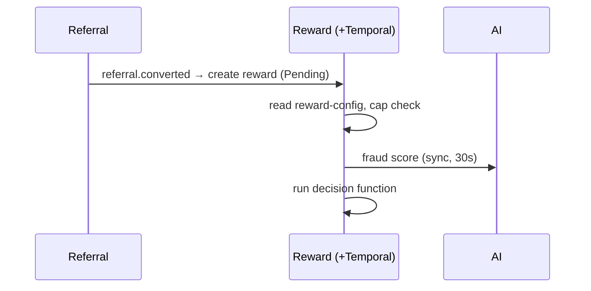

**Happens here / never here:** AI can move a reward to `Held` (🟢, reversible) but can never move it to `Paid`, `Rejected`, or `Reversed` — those require either the deterministic auto-approve path or a Keto-gated human action (`rewards:approve` / `rewards:reject` / `rewards:clawback`). Payout is two-step (`POST /v1/payouts` then `/confirm`); funds never move on a single call.

## 11.4 Flow 4 — Campaign Setup & Optimization via AI

Two related sub-flows: **setup** (operator clicks “AI Setup”, synchronous, Campaign Setup Agent) and **optimization** (scheduled daily, Optimization Agent). Both are **advisory only**: the AI service produces a structured recommendation; nothing in the campaign changes until an operator accepts it. The AI service holds no write tool over Campaign.

**Setup:** the dashboard calls `POST /internal/ai/recommendations/campaign-setup`. The Campaign Setup Agent (Tier C, LLM) reads only: the client’s existing programs, the Playbook library, anonymized cross-client benchmarks, and vertical defaults — all via read-only tools. It returns a complete proposal (Pulse, Variants, Segments, Reward Configuration, schedule) as structured JSON attached to the program and rendered in the dashboard. It **cannot** activate, commit, or approve a budget.

**Optimization:** the `campaign_optimization` Temporal schedule (daily 02:00 UTC) lists active campaigns, reads each campaign’s KPIs from Analytics, invokes the Optimization Agent, persists recommendations, and publishes `ai.recommendation_generated`. The same agent is triggered on `analytics.anomaly_detected` for off-cycle review. Recommendations carry `risk_level` (🟢/🟡/🔴), `confidence_score`, `expected_impact`, and a `reasoning_chain`.

**Acceptance propagation:** when an operator accepts via `POST /v1/ai/recommendations/{id}/accept`, the change is applied by the *owning* service through its normal API — reward-amount and variant changes land in Campaign, segment refinements land in Segmentation, and the effect later shows up in Analytics. The accept endpoint records the outcome back onto the recommendation for the AI feedback loop.

| # | Step | Service | Events / Workflow |
| --- | --- | --- | --- |
| 1 | Daily schedule lists active campaigns | AI (Temporal) | `campaign_optimization` WF |
| 2 | Fetch KPIs / variant comparison / funnel / reward costs (read tools) | AI → Analytics *(sync)* | read-only tool calls |
| 3 | Optimization Agent (Tier C) generates typed recommendations; verification model on incentive items | AI | persist recommendation records |
| 4 | Publish recommendations; Campaign stores proposals; operator notified | AI, Campaign, Notification | `ai.recommendation_generated`; outbound `recommendation.created` |
| 5 | Operator reviews in dashboard, accepts a 🟡 reward-amount change | AI | `POST /v1/ai/recommendations/{id}/accept` |
| 6 | Change applied via the owning service’s API; variant updated | Campaign (or Segmentation) | `variant.updated` |
| 7 | Effect observed downstream; feedback loop tracks accepted-vs-outcome | Analytics, AI | `kpi.computed`; outcome recorded |

**Flow 4 — Daily AI optimization (advisory)**

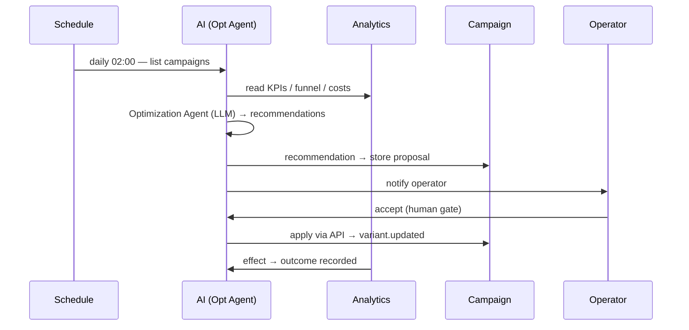

_AI never mutates a campaign directly. The only change path is operator accept → the owning service's API. Setup works the same way: dashboard → Campaign Setup Agent → proposal._

**Happens here / never here:** the Optimization workflow never modifies a campaign directly — it only emits proposals. The only mutation path is operator acceptance → owning-service API. AI proposals to live campaigns require human acceptance even for 🟢-tagged items, because campaign configuration is operator-owned.

## 11.5 Flow 5 — Fraud Escalation & Review

Three tiers feed one human decision. **Tier A** (deterministic rules: velocity, IP clustering, self-referral, geographic impossibility, disposable email) runs real-time on every `touch.recorded` / `referral.created` — no LLM. **Tier B** (ML anomaly detection, gradient boosting) runs daily batch — no LLM. **Tier C** (LLM narrative) runs in batch over aggregate patterns and on-demand when a human escalates a case. The Fraud Detection Agent may auto-hold a reward (🟢, reversible) and flag a referrer for review (🟡); it can **never** ban a referrer or clawback a reward (🔴).

When a score crosses the signal threshold, the agent emits `fraud.signal_raised`, which (a) puts any associated reward on `Held` in the Reward service and (b) starts the `fraud_review` Temporal workflow. The workflow gathers evidence (recent referrals + touch patterns from Referral, full reasoning chain from AI), creates a review ticket, notifies an operator, and waits for a Keto-gated human decision.

| # | Step | Service | Events / Workflow |
| --- | --- | --- | --- |
| 1 | Tier A rule trips on a touch/referral; or Tier B batch flags anomaly | AI | `ai.fraud_score_updated` |
| 2 | Score crosses signal threshold → raise signal | AI | `fraud.signal_raised` |
| 3 | Reward consumes signal → associated reward to `Held` | Reward | `reward.held` |
| 4 | Fraud Review workflow gathers evidence (referrals, touches, reasoning chain) | AI (Temporal) → Referral, AI | `fraud_review` WF |
| 5 | Create review ticket; notify operator (dashboard + email) | AI, Notification | signal wait `operator_decision` |
| 6 | 72h no action → reminder; 7d → escalate to owner | AI (Temporal) | timers |
| 7a | *approve* → clear flag; held reward resumes lifecycle | AI, Referral, Reward | clear fraud flag |
| 7b | *reject* → reject the referrer’s pending rewards | Reward | `reward.rejected` |
| 7c | *ban* → block referrer (human-only code path) | Referral | `participant.state_changed` (Banned), `participant.trust_tier_changed` |

**Flow 5 — Fraud escalation, then a human decision**

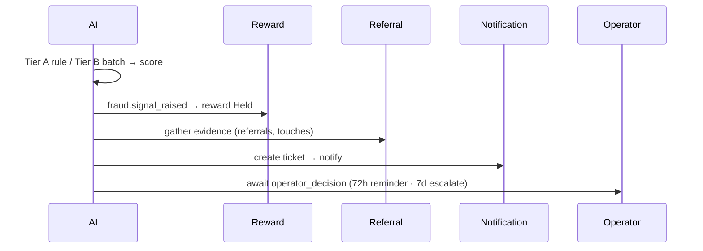

**Happens here / never here:** the ban branch is unreachable by the AI service — only an operator signal can enter it. Tier C LLM analysis is never in the synchronous request path; it runs only in batch or on explicit human escalation.

---

# 12. Service-Internal Application Architecture

Every service follows the same NestJS layering. From edge to core: **middleware/guards** (auth, tenant context, rate limit) → **controllers** (HTTP shape only) → **application services / use-cases** (orchestration, transactions, Temporal client calls) → **domain** (aggregates, entities, invariants) → **repositories** (RDS/Redis) and **integration adapters** (event publishers, sync clients, Temporal activity handlers, SQS consumers). The rule that holds across all four services below: **business rules live in the domain and application layers; integration logic lives in adapters; controllers and consumers are thin.** OpenTelemetry is injected at the edges — controllers, SQS consumers, Temporal activities, and outbound sync/AI clients all open spans; the domain layer stays free of telemetry code.

## 12.1 Event Ingestion Service

Stateless, no RDS, Redis-only. There is no domain aggregate here — the “domain” is the validation pipeline itself. Its job is to turn untrusted inbound HTTP into a trusted, deduplicated, enriched event on SNS, and to return a fast `202`.

**Inside the Event Ingestion Service**

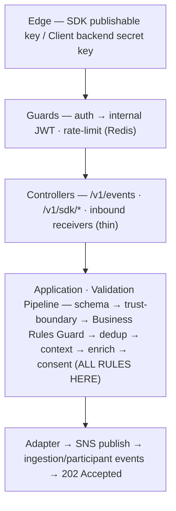

_Read top → bottom: a request enters at the Edge and flows inward; events leave from the Adapters at the bottom. Amber = where business rules live. No referral, reward, or attribution logic lives here — Ingestion classifies and forwards._

**Business rules vs integration:** the trust-boundary check (publishable keys may only send touch events) and the Business Rules Guard (campaign availability, link state) are business rules and live in the pipeline service. SNS publishing, Redis access, and the Tenant token call are integration adapters. The controller does nothing but bind the request and call the pipeline. **Never here:** no referral records, no reward logic, no attribution — ingestion classifies and forwards, it does not decide outcomes.

## 12.2 Referral Workflow Service

The richest domain in the platform and the one place attribution is computed. It owns the Referral aggregate, the Participant and Referee profiles, the participant lifecycle and trust-tier state machines, and the immutable Attribution records. Temporal is called **only from the application layer** — controllers and consumers start or signal workflows through a workflow-client adapter; the domain model never imports Temporal.

**Inside the Referral Workflow Service**

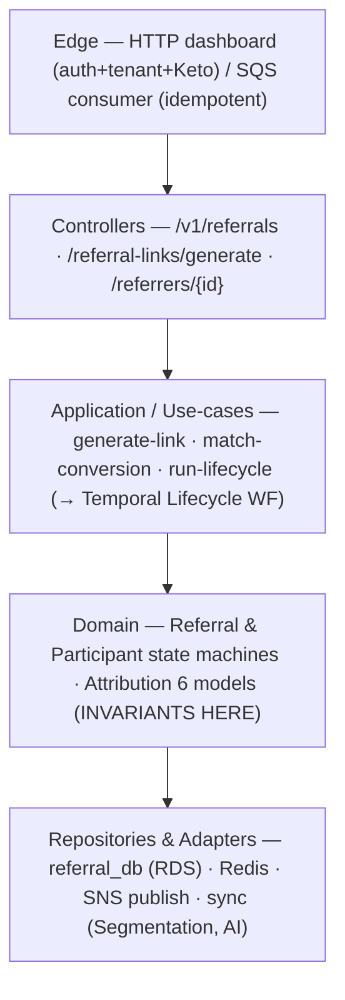

_Read top → bottom: a request enters at the Edge and flows inward; events leave from the Adapters at the bottom. Amber = where business rules live. Temporal is called only from the Application layer — never controllers or domain._

**Where invariants are enforced:** only the domain may transition the Referral or Participant state machine and only the domain computes an Attribution record (which is then immutable). The application layer decides *when* to compute (inside the Temporal workflow, between conversion validation and reward emission); the domain decides *what* the computation yields. **Where Temporal is called from:** the application layer, never the controller directly and never the domain. **Never here:** reward amounts, payout logic, or eligibility rules — those are read from or delegated to Reward, Reward-config, and Segmentation respectively.

## 12.3 AI Intelligence Service

The only service permitted to make LLM calls. Its internal structure mirrors the three processing tiers, with a strict separation between read tools and guarded write tools (the reversible `hold_reward` being the principal one). The agent layer is LangChain `AgentExecutor` instances; the tool layer wraps internal HTTP calls to other services and is the *only* place those calls originate.

**Inside the AI Intelligence Service**

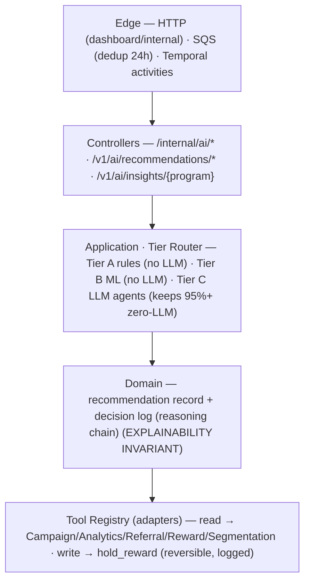

_Read top → bottom: a request enters at the Edge and flows inward; events leave from the Adapters at the bottom. Amber = where business rules live. The only write tool is the reversible hold_reward — no tool exists for a 🔴 action._

**Business rules vs integration:** the tier-routing decision (which keeps 95%+ of work zero-LLM) is a business rule in the application layer; the LangChain tool wrappers are integration adapters and the *only* egress to other services’ data. **Where invariants are enforced:** every Tier C decision must write a decision log with a reasoning chain before its result is allowed to leave the service — explainability is enforced in the domain layer, not bolted on. **Never here:** no operational state is owned or mutated except the single reversible `hold_reward`; the agent layer cannot reach a 🔴 action because no write tool for it exists in the registry.

## 12.4 Reward & Payout Service

Owns the reward lifecycle and the money. Its application layer hosts the Reward Approval workflow client and the cap ledger; its domain enforces the lifecycle state machine and cap atomicity.

**Inside the Reward & Payout Service**

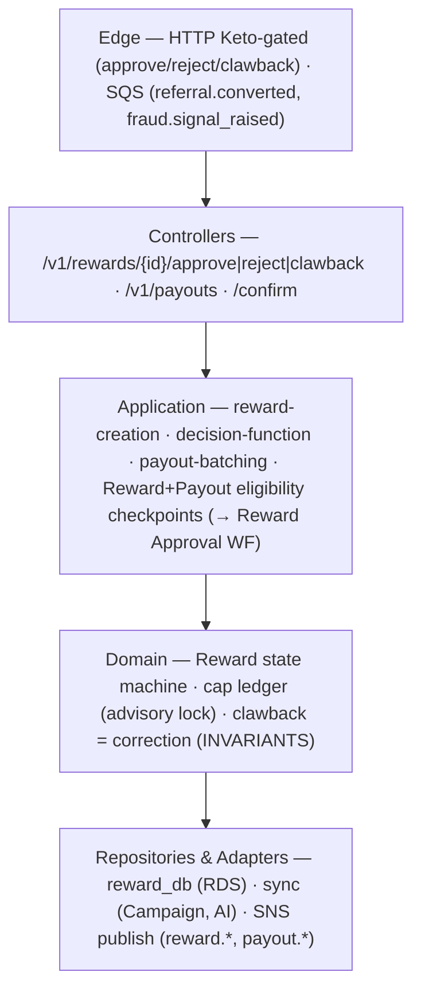

_Read top → bottom: a request enters at the Edge and flows inward; events leave from the Adapters at the bottom. Amber = where business rules live. The decision function runs in Application; the state transition is applied by the Domain._

**Where invariants are enforced:** the lifecycle transitions and cap atomicity (advisory lock on the cap counter) are domain invariants — concurrent conversions for the same participant/campaign cannot over-pay. A clawback is an immutable correction that coexists with the original `reward.earned`; it is never a deletion. **Where the decision function runs:** the application layer, inside the Reward Approval workflow — it reads fraud score, trust ceiling, and budget, but the resulting *transition* is applied by the domain. **Never here:** reward *configuration* (lives on the Variant in Campaign) and fraud *verdicts* (AI) are read, never owned. This service hosts the **Reward and Payout eligibility checkpoints** (§13.5): the application layer makes a synchronous, fail-closed PDP call inside the Temporal workflow before approving or disbursing — pushing caps, fraud score, and trust to the eligibility service rather than letting it read them.

---

# 13. Cross-Cutting Application Concerns

Four concerns are implemented identically across all nine services so that behaviour is predictable regardless of which service a request lands in. Each is a NestJS construct positioned at a specific layer.

## 13.1 Auth & tenant context

Authentication is resolved once, at the edge. The ALB + Traefik + NestJS Auth Guard calls Tenant’s `GET /internal/validate-token`, which resolves either an API key or an OAuth2 JWT into a uniform internal JWT carrying `{ tenant_id, scopes, source, key_type, user_id }`. From that point inward, every service reads tenant context from request scope — a request-scoped provider attaches `tenant_id` so repositories scope every query without the controller passing it explicitly.

**Authorization model.** Permission is not carried in the token and is not an API-key scope. Money- and config-touching endpoints evaluate a **live Keto permission check** in a guard at the controller boundary (`rewards:approve`, `rewards:reject`, `rewards:clawback`, `analytics:read`, …). Permissions change faster than tokens live, and a key must never be able to authorize a payout. **The API-key vs JWT paths diverge by destination:** API keys (publishable or secret) reach *only* the Ingestion Service and its SDK/receiver endpoints; any API-key request to a CRUD, reward, payout, or analytics endpoint returns `403 authorization_error` at the gateway. Dashboard sessions (OAuth2 JWT) reach configuration and money endpoints and there hit the Keto guard. The two paths never cross.

## 13.2 Validation & error handling

Request validation happens at the controller boundary via NestJS validation pipes against the API and event schemas — including the conditional rules (a conversion needs one of `referee_email` / `referee_external_id`; a `recurring` conversion needs `revenue_mrr`). Schema failures return `400` / `422` before any business logic runs. Business-rule failures are raised as typed domain exceptions in the domain/application layer and mapped by a single global exception filter into the contract’s typed error shape (e.g. `409 Conflict` for invalid state-machine transitions, `410 Gone` for archived/expired campaigns or revoked links, `403 authorization_error` for trust-boundary violations). The filter is the one place HTTP status and the contract error body are decided — services never hand-build error responses.

## 13.3 Idempotency

Idempotency is layered. At the controller/consumer edge, the **client-supplied `external_id`** is the deduplication key: Ingestion checks `tenant_id + external_id` in Redis (90-day window) and returns `200` with `processing_status: "duplicate"` on a repeat; for Method B the provider’s native event id is mapped onto `external_id` so provider retries dedup the same way. Downstream consumers add their own composite keys so that SQS at-least-once redelivery is safe even if the edge dedup is bypassed: Referral and Reward use `referral_id + event_type`, AI uses `event_id` (24h), Analytics relies on ClickHouse `ReplacingMergeTree` on `event_id`, Notification uses `event_id + webhook_id`. The dedup logic sits in the consumer/application layer, not the domain — the domain assumes it is only ever called once per logical event.

## 13.4 Observability hooks

OpenTelemetry context is created at every entry edge and propagated everywhere a request or event travels, so a single trace spans the HTTP edge, the SNS/SQS hop, the Temporal workflow, and any AI call:

| Edge | Hook | Span attributes |
| --- | --- | --- |
| HTTP controllers | Interceptor opens a server span per request | `tenant_id`, route, status, latency, `key_type` |
| Sync service-to-service | `traceparent`/`tracestate` headers propagated | caller, callee, latency, circuit-breaker state |
| SQS consumers | Trace context in message attributes; consumer continues the trace | topic, queue, `event_id`, receive count, dedup hit |
| Temporal workflows & activities | Workflow + activity spans linked to the originating trace | workflow type, run id, activity, retry count |
| AI calls (Tier C) | Span per agent run + linked decision log | agent type, tier, model, tokens, cost, `confidence_score` |

Logs and traces share the trace id; the AI decision log is keyed by the same trace id, so a recommendation in the dashboard can be tied back to the exact prompt, model, and inputs that produced it. The domain layer emits no telemetry — observability is an edge concern by construction.

## 13.5 Eligibility — centralized rules, distributed checkpoints

Eligibility follows a Policy Decision Point / Policy Enforcement Point split, the same shape as Keto for authorization. The **rules** are centralized in the Segmentation & Eligibility Service (the PDP, §2.3); the **moments** are distributed as five checkpoints across the services that own each lifecycle stage (the PEPs). You cannot centralize the moment — only Referral knows “a referral is being created,” only Reward knows “a reward is about to be approved.” The PDP answers *whether*; Fraud answers *how risky*; Attribution answers *who gets credit* — three separate questions that never merge.

Each call is synchronous and is a **must**, not best-effort: a checkpoint either receives a fresh decision or the action does not proceed. Three operations are kept semantically distinct because their fail modes are opposite — folding them into one `evaluate` is how a money check eventually inherits a fail-open default:

- **check-eligibility** — the gate. **Fail-closed.** Missing attributes on a gating rule resolve conservatively (deny), per rule.

- **resolve-variant** — segment → variant. **Fails open** → the Default Variant; a missing attribute is a non-match and falls through, never blocking enrollment.

- **assign-ab** — deterministic hash-based bucketing; stable for a given actor.

| Checkpoint | PEP — service · moment | Representative rules | On PDP unavailable |
| --- | --- | --- | --- |
| **Entry** | Campaign · enrollment (backend-owned) | Campaign status; segment match (→ default); dedup (idempotent); participant banned/suspended; participant cap | Fail-closed — reject enroll; client backend retries |
| **Referral** | Referral · referral creation | Campaign still active; participant in good standing; referral cap; link expiry; self-referral (silent block + fraud flag) | Fail-closed — reject `eligibility_unavailable` |
| **Conversion** | Referral · conversion validation | Attribution window; referee dedup (already converted?); fraud-signal flagging | Fail-closed → durable retry (Temporal) |
| **Reward** | Reward · reward calculation / approval | Budget remaining; reward cap (per campaign/period); fraud score > threshold → hold | Fail-closed → durable retry (Temporal) |
| **Payout** | Reward · payout confirm | Payout method set; hold period elapsed; identity verification (high thresholds); tax form (W-9, US ≈ $600) | Fail-closed → durable retry (Temporal) |

**Event Ingestion is deliberately not a checkpoint.** Its Redis campaign-availability check answers “is this campaign accepting events at all,” which is availability, not a per-actor eligibility decision. Ingestion stays thin; checkpoints live only in Campaign, Referral, and Reward.

**Inputs — pushed vs read.** The PDP owns rules, segment definitions, membership, and A/B state, and reads only those. Everything else is pushed in by the calling checkpoint, so the PDP never reaches into caps, fraud, trust, or consent:

| Signal | Source of truth | Delivery |
| --- | --- | --- |
| `tenant_id`, `campaign_id`, actor refs, `trigger`/`event_type`, `occurred_at` | caller | pushed in the request |
| Actor attributes for segment rules | caller / profile | pushed (absent → non-match) |
| `amount`, `currency`, `reward_type` (Reward/Payout) | Reward | pushed |
| Cap counters | Reward | pushed (PDP must not read the ledger) |
| `fraud_score` | AI | pushed by the caller (already obtained) |
| `trust_tier`, `consent` | Referral | pushed |
| Segment membership · rule set · A/B allocation | Segmentation & Eligibility | read locally (its own DB + Redis) |

The contract is one versioned `EligibilityContext` in, one auditable decision out — stamped with `rule_version` and `decision_id` (the same reproducibility discipline as the AI decision logs), so a disputed reward can be explained later:

```text
POST /internal/eligibility/evaluate
  → EligibilityContext {
      checkpoint: entry | referral | conversion | reward | payout,
      operation:  check_eligibility | resolve_variant | assign_ab,
      tenant_id, campaign_id, actor refs, trigger, occurred_at,
      attributes{...}, amount?, currency?, reward_type?,
      caps?{...}, fraud_score?, trust_tier?, consent?        # pushed by the caller
    }
  ← EligibilityDecision {
      eligible: bool, denied_reasons[],
      resolved_variant_id?, ab_bucket?,
      rule_version, decision_id
    }
```

**Distributed enforcement must be provable.** Because the moment is spread across services, ship one shared eligibility-client library so no service hand-rolls the call, and use the `eligibility.evaluated` events to detect a concerned path that did not check. Re-evaluate at money moments: eligibility decided at enrollment does not stay true — fraud flags, cap exhaustion, and consent revocation happen later — so the Conversion, Reward, and Payout checkpoints re-check rather than trusting the Entry decision.

---

# 14. AI Integration in the Application Layer

This section is the AI column of §10.2, expanded. For each agent: which service calls it, what input that caller assembles and from where, how the response is consumed, and whether it is advisory or auto-executing.

| Agent | Called by | Input (fields & source) | Response integration | Advisory vs auto-execute |
| --- | --- | --- | --- | --- |
| **Campaign Setup** | Dashboard → AI (`/internal/ai/recommendations/campaign-setup`) | Client’s programs (Campaign), Playbook library, anonymized benchmarks (Analytics), vertical defaults — read-only tools | Structured proposal attached to the program; rendered for review | Advisory only — cannot activate or commit |
| **Optimization** | Temporal `campaign_optimization` (daily) & on `analytics.anomaly_detected` | Campaign KPIs, variant comparison, funnel, reward costs, referrer performance (Analytics, read tools) | `ai.recommendation_generated` → stored on campaign; surfaced as 🟢/🟡/🔴 | Advisory only — mutation requires operator accept |
| **Fraud Detection** | Referral & Reward (`/internal/ai/fraud-score`, sync); event-driven Tiers A/B | Touch events, referrer history, IP-cluster data, device fingerprints, velocity metrics (read tools) | Numeric score; `fraud.signal_raised` → reward to `Held`; flag for review | 🟢 auto-hold (reversible) & flag; 🔴 ban/clawback human-only |
| **Insight Generation** | Temporal health-score schedule (daily) & threshold crossings | Program health, KPIs, benchmarks, trend data, fraud rates (read tools) | `ai.insight_generated` → dashboard insights (Anomaly/Opportunity/Quick Win/Benchmark/Risk/Trend) | Informational only — no write tools at all |

**When AI is advisory only:** Campaign Setup, Optimization, and Insight Generation never mutate state. Their output is a recommendation or an insight; the only path to a state change is an operator action through an owning service’s API. This holds even for a 🟢-tagged optimization item, because campaign configuration is operator-owned.

**When AI may auto-execute within guardrails:** exactly one case — the Fraud Detection Agent’s `hold_reward` write tool. Holding a reward is reversible, fully logged, and bounded: it pauses money movement without moving or denying it. The agent **cannot** ban a referrer, reject a referral, clawback a reward, or modify fraud rules — those code paths exist only behind a Keto-gated human action.

Human-in-the-loop points are concrete: each gate is a specific UI view, a specific backend endpoint, and (where a workflow is waiting) a specific Temporal signal.

| Gate | UI view | Backend endpoint | Temporal signal |
| --- | --- | --- | --- |
| Accept/reject an AI recommendation | Recommendations panel | `POST /v1/ai/recommendations/{id}/accept\|reject` | none (no workflow waiting) |
| Approve/reject a held reward | Reward approval queue | `POST /v1/rewards/{id}/approve\|reject` (Keto) | `human_decision` → Reward Approval WF |
| Fraud review decision | Fraud review queue | review-decision action (Keto) | `operator_decision` → `fraud_review` WF |
| Ban a participant | Participant detail | `POST /v1/referrers/{id}/block` (Keto) | ban branch of `fraud_review` (human-only) |
| Clawback a paid reward | Reward detail | `POST /v1/rewards/{id}/clawback` (reason required, Keto) | none (correction event) |

---

# 15. Non-Functional System Tradeoffs (System & App Level)

**What we optimize for:** a system two senior engineers can operate; correctness on anything that moves money; bounded LLM cost; EU data residency. **What we intentionally do not do:** no per-tenant databases (shared-schema isolation by `tenant_id` + Keto instead); no multi-region active-active (single EU region, backups + restore); no real-time analytics (ClickHouse lag is accepted); no synchronous LLM calls in any money or request-critical path; no AI authority over irreversible actions. The table ties each choice to its system and application consequences.

| Dimension | Chosen approach | Alternative considered | Rationale |
| --- | --- | --- | --- |
| **Tenant isolation** | Shared RDS per service, row-level scoping by `tenant_id` + Keto | Database-per-tenant | Per-tenant DBs are unoperable for a 2-engineer team at this scale; Keto + scoped repositories give isolation without multiplying migrations and backups. |
| **Regional topology** | Single EU region, automated backups + restore runbook | Multi-region active-active | Active-active doubles operational surface and adds cross-region consistency problems no one is staffed to debug; EU-single satisfies residency and the availability target. |
| **Attribution placement** | Computed in the Referral Lifecycle workflow, pre-reward | Computed in Analytics | Attribution is on the money critical path; it must not compete with dashboard query load on ClickHouse. Analytics stays pure reporting. |
| **Analytics freshness** | Eventual: 5–30s ClickHouse lag via 5s batch inserts | Real-time OLAP ingestion | Dashboards tolerate seconds of lag; real-time eligibility uses Redis counters instead. Real-time OLAP would raise cost and complexity for no product gain. |
| **Fraud scoring latency** | Tier A deterministic, <100ms sync; 3s ceiling then degrade to `null` + async | LLM scoring in the request path | Per-event LLM cost is prohibitive and would blow the referral-creation latency budget; 95%+ of fraud work stays zero-LLM. LLM (Tier C) is batch/on-demand only. |
| **AI authority** | Advisory + one reversible 🟢 action (`hold_reward`) | Auto-execute optimization/fraud decisions | Wrong AI decisions on money are expensive and erode trust; human gates on all 🔴 actions cap the downside while keeping the AI useful. |
| **Inter-service comms** | Async SNS/SQS by default; sync only when the caller cannot proceed without the answer | Sync HTTP everywhere | Sync chains couple availability and stack latency; the five sync calls (token, eligibility, reward-config, fraud, health) are deliberate exceptions, each with a circuit breaker and fallback. |
| **Eligibility model** | Centralized rule engine (PDP) + five distributed checkpoints (PEPs); synchronous, fail-closed — a “must” | Eligibility logic duplicated in each service, or a best-effort async check | One rule brain keeps decisions consistent, versioned, and auditable; the PEPs supply the lifecycle moment. Making it a hard sync dependency means no money moves un-checked — at the cost of putting the eligibility service on four critical paths, so it gets Ingestion-grade HA and durable retry inside workflows. |
| **Workflow durability** | Temporal for anything that waits, retries, or spans services | Cron + ad-hoc state tables | Reward holds, fraud reviews, and optimization span days and survive deploys; rebuilding that durability by hand is exactly the operational load a small team must avoid. |
| **Method B entry point** | Dedicated provider-signed inbound receivers, separate from `POST /v1/events` | Route provider webhooks through public ingestion | Provider payloads use foreign signatures/schemas and must be treated as data-never-commands; a separate hardened surface keeps the public ingestion contract clean. |
